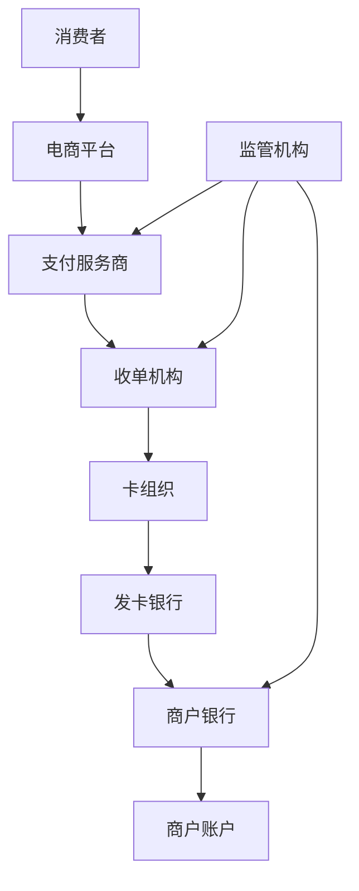

# 跨境电商支付策略深度解析

## 目录

1. [跨境支付生态系统](#跨境支付生态系统)
2. [主流支付网关深度对比](#主流支付网关深度对比)
3. [支付方式本地化策略](#支付方式本地化策略)
4. [多币种处理与汇率管理](#多币种处理与汇率管理)
5. [支付安全与风险控制](#支付安全与风险控制)
6. [合规性与监管要求](#合规性与监管要求)
7. [支付数据分析与优化](#支付数据分析与优化)
8. [新兴支付技术趋势](#新兴支付技术趋势)

---

## 跨境支付生态系统

### 支付链条参与方

跨境电商支付涉及多个参与方，理解各方角色对于构建高效支付系统至关重要：



#### 各参与方职责

**支付服务商（PSP）**
- 提供支付接口和技术支持
- 处理交易路由和风险控制
- 提供多币种和本地化支付方式
- 负责资金清算和结算

**收单机构（Acquirer）**
- 为商户提供银行卡收单服务
- 承担交易风险和合规责任
- 提供资金清算服务

**卡组织（Card Schemes）**
- 制定交易规则和标准
- 提供全球支付网络
- 处理跨境资金流转

### 支付流程解析

#### 标准支付流程

```javascript
// 跨境支付标准流程
const crossBorderPaymentFlow = {
  step1: {
    action: "消费者发起支付",
    participants: ["消费者", "电商平台"],
    data: ["订单信息", "支付金额", "币种"]
  },
  step2: {
    action: "平台调用支付接口",
    participants: ["电商平台", "支付服务商"],
    data: ["商户信息", "交易详情", "支付方式"]
  },
  step3: {
    action: "支付路由与处理",
    participants: ["支付服务商", "收单机构"],
    data: ["路由规则", "风险评估", "汇率转换"]
  },
  step4: {
    action: "银行卡网络处理",
    participants: ["收单机构", "卡组织", "发卡银行"],
    data: ["授权请求", "风险评估", "资金扣款"]
  },
  step5: {
    action: "结果返回与通知",
    participants: ["各参与方逆向返回"],
    data: ["交易状态", "授权码", "失败原因"]
  }
};
```

---

## 主流支付网关深度对比

### 国际主流支付网关

#### PayPal

**优势特点**
- 全球用户基数庞大（超过4亿活跃用户）
- 支持200+国家和地区
- 买家保护机制完善
- 品牌信任度高

**费用结构**
```markdown
| 交易类型 | 费率 | 固定费用 |
|---------|------|----------|
| 国内交易 | 2.9% | $0.30 |
| 跨境交易 | 4.4% | 固定费用 |
| 小额交易 | 5% | $0.05 |
| 月交易量>$3,000 | 可协商 | 可协商 |
```

**技术特性**
- RESTful API和SDK支持
- 沙盒环境完善
- Webhook通知机制
- 移动端优化良好

#### Stripe

**优势特点**
- 开发者友好的API设计
- 支持135+种货币
- 强大的定制化能力
- 先进的反欺诈系统

**费用结构**
```markdown
地区费率对比：
- 美国：2.9% + $0.30
- 欧洲：1.4% + €0.25
- 亚太：3.4% + 当地固定费用
- 额外跨境费：+1%
```

**技术优势**
```javascript
// Stripe API示例
import Stripe from 'stripe';

const stripe = new Stripe('sk_test_...');

const paymentIntent = await stripe.paymentIntents.create({
  amount: 2000,
  currency: 'usd',
  payment_method_types: ['card'],
  metadata: {
    order_id: 'order_123',
    customer_id: 'cust_456'
  }
});
```

#### Adyen

**优势特点**
- 单一平台支持全球支付
- 支持250+本地支付方式
- 企业级安全和合规
- 实时数据和报告

**全球覆盖能力**
- 欧洲：SEPA、iDEAL、Klarna等
- 亚洲：支付宝、微信支付、银联等
- 美洲：各种本地银行转账
- 中东非洲：本地钱包和银行

### 区域性支付解决方案

#### 亚洲市场

**支付宝国际版（Alipay+）**
```markdown
覆盖范围：
✅ 中国大陆：支付宝
✅ 香港：AlipayHK
✅ 韩国：Kakaopay
✅ 泰国：TrueMoney
✅ 马来西亚：Touch 'n Go
✅ 菲律宾：GCash
```

**微信支付（WeChat Pay Global）**
- 主要服务中国用户海外消费
- 支持40+个国家和地区
- 与本地收单机构合作
- 人民币直接结算

#### 欧洲市场

**SEPA（单一欧元支付区）**
- 覆盖36个欧洲国家
- 银行转账成本低
- 处理时间1-2个工作日
- 适合大额交易

**本地支付方式**
```markdown
| 国家 | 主要支付方式 | 市场占有率 |
|------|-------------|-----------|
| 德国 | SOFORT, giropay | 60%+ |
| 荷兰 | iDEAL | 70%+ |
| 波兰 | BLIK, Przelewy24 | 50%+ |
| 意大利 | PostePay, MyBank | 40%+ |
```

---

## 支付方式本地化策略

### 市场调研与分析

#### 消费者支付习惯研究

```javascript
// 全球支付偏好数据分析
const globalPaymentPreferences = {
  northAmerica: {
    creditCard: 45,
    debitCard: 28,
    digitalWallet: 18,
    bankTransfer: 9
  },
  europe: {
    bankTransfer: 35,
    creditCard: 30,
    digitalWallet: 20,
    buyNowPayLater: 15
  },
  asia: {
    digitalWallet: 55,
    bankTransfer: 25,
    creditCard: 15,
    cashOnDelivery: 5
  },
  latinAmerica: {
    creditCard: 40,
    bankTransfer: 30,
    cashPayment: 20,
    digitalWallet: 10
  }
};
```

#### 本地化考虑因素

**文化因素**
- 信用卡接受度差异
- 现金使用习惯
- 分期付款偏好
- 安全性认知

**技术因素**
- 智能手机普及率
- 互联网银行发展水平
- NFC支付基础设施
- 身份验证习惯

### 支付方式配置策略

#### 动态支付方式展示

```javascript
// 基于地理位置的支付方式配置
const getPaymentMethods = (country, orderAmount, currency) => {
  const baseConfig = {
    card: { enabled: true, priority: 1 },
    paypal: { enabled: true, priority: 2 }
  };
  
  const localConfig = {
    'US': {
      applePay: { enabled: true, priority: 1 },
      googlePay: { enabled: true, priority: 2 },
      klarna: { enabled: orderAmount > 50, priority: 3 }
    },
    'DE': {
      sofort: { enabled: true, priority: 1 },
      giropay: { enabled: true, priority: 2 },
      klarna: { enabled: true, priority: 3 }
    },
    'CN': {
      alipay: { enabled: true, priority: 1 },
      wechatPay: { enabled: true, priority: 2 },
      unionPay: { enabled: true, priority: 3 }
    }
  };
  
  return { ...baseConfig, ...localConfig[country] };
};
```

#### A/B测试优化

**测试维度**
- 支付方式排序
- 支付按钮设计
- 信任标识展示
- 结账流程长度

**关键指标**
```markdown
支付转化率优化指标：
- 支付页面到达率：85%+
- 支付方式选择率：90%+
- 支付完成率：95%+
- 整体转化率：80%+
```

---

## 多币种处理与汇率管理

### 币种选择策略

#### 定价币种决策

**单一定价币种**
```markdown
优势：
✅ 系统简单，易于管理
✅ 避免汇率风险
✅ 价格透明，易于比较

劣势：
❌ 消费者体验不佳
❌ 可能影响转化率
❌ 心理定价困难
```

**多币种定价**
```markdown
优势：
✅ 提升消费者体验
✅ 符合本地化需求
✅ 可以采用心理定价

劣势：
❌ 系统复杂度高
❌ 存在汇率风险
❌ 价格管理困难
```

#### 汇率获取与更新

```javascript
// 汇率管理系统设计
class CurrencyManager {
  constructor() {
    this.rates = new Map();
    this.lastUpdate = null;
    this.updateInterval = 3600000; // 1小时
  }
  
  async fetchRates() {
    try {
      // 从多个汇率API获取数据
      const sources = [
        'https://api.exchangerate-api.com/v4/latest/USD',
        'https://api.fixer.io/latest?base=USD',
        'https://openexchangerates.org/api/latest.json'
      ];
      
      const rates = await this.aggregateRates(sources);
      this.rates = new Map(Object.entries(rates));
      this.lastUpdate = new Date();
      
      return rates;
    } catch (error) {
      console.error('Failed to fetch exchange rates:', error);
      return this.getBackupRates();
    }
  }
  
  convertPrice(amount, fromCurrency, toCurrency) {
    if (fromCurrency === toCurrency) return amount;
    
    const rate = this.getRate(fromCurrency, toCurrency);
    return Math.round(amount * rate * 100) / 100;
  }
  
  getDisplayPrice(amount, currency, locale) {
    return new Intl.NumberFormat(locale, {
      style: 'currency',
      currency: currency
    }).format(amount);
  }
}
```

### 汇率风险管理

#### 动态定价策略

**实时汇率定价**
- 优势：价格最准确，无汇率损失
- 劣势：价格频繁变动，用户体验差
- 适用：高价值、低频次商品

**固定汇率定价**
- 优势：价格稳定，用户体验好
- 劣势：存在汇率风险
- 适用：标准化商品，价格敏感商品

**分段汇率调整**
```javascript
// 分段汇率调整策略
const rateAdjustmentStrategy = {
  thresholds: [0.02, 0.05, 0.10], // 2%, 5%, 10%
  actions: ['monitor', 'alert', 'adjust'],
  
  checkAdjustment(currentRate, baseRate) {
    const variance = Math.abs(currentRate - baseRate) / baseRate;
    
    if (variance > this.thresholds[2]) {
      return 'adjust'; // 立即调整价格
    } else if (variance > this.thresholds[1]) {
      return 'alert'; // 发送预警
    } else if (variance > this.thresholds[0]) {
      return 'monitor'; // 加强监控
    }
    
    return 'normal';
  }
};
```

#### 对冲策略

**金融工具对冲**
- 外汇期货合约
- 外汇期权
- 远期外汇合约
- 货币互换

**业务层面对冲**
- 成本与收入币种匹配
- 多币种资金池
- 区域化采购策略
- 动态库存管理

---

## 支付安全与风险控制

### 欺诈检测系统

#### 多层次风险评估

```javascript
// 风险评估引擎
class FraudDetectionEngine {
  constructor() {
    this.rules = new Map();
    this.mlModels = new Map();
    this.whitelist = new Set();
    this.blacklist = new Set();
  }
  
  async assessTransaction(transaction) {
    const riskScore = await this.calculateRiskScore(transaction);
    const decision = this.makeDecision(riskScore);
    
    return {
      riskScore,
      decision,
      reasons: this.getDecisionReasons(transaction, riskScore),
      recommendations: this.getRecommendations(decision)
    };
  }
  
  async calculateRiskScore(transaction) {
    let score = 0;
    
    // 规则引擎评分
    score += this.evaluateRules(transaction);
    
    // 机器学习模型评分
    score += await this.evaluateMLModels(transaction);
    
    // 历史行为分析
    score += await this.analyzeUserBehavior(transaction);
    
    // 设备指纹分析
    score += this.analyzeDeviceFingerprint(transaction);
    
    return Math.min(score, 100);
  }
  
  evaluateRules(transaction) {
    let score = 0;
    
    // 地理位置异常
    if (this.isGeographicallyAnomalous(transaction)) {
      score += 15;
    }
    
    // 交易金额异常
    if (this.isAmountAnomalous(transaction)) {
      score += 20;
    }
    
    // 交易频率异常
    if (this.isFrequencyAnomalous(transaction)) {
      score += 25;
    }
    
    // 设备/IP异常
    if (this.isDeviceAnomalous(transaction)) {
      score += 10;
    }
    
    return score;
  }
}
```

#### 风险指标监控

**实时监控指标**
```markdown
核心风险指标：
- 拒付率（Chargeback Rate）< 1%
- 欺诈损失率（Fraud Loss Rate）< 0.1%
- 误判率（False Positive Rate）< 5%
- 交易成功率（Authorization Rate）> 95%
```

**异常检测算法**
- 统计异常检测
- 时间序列异常检测
- 机器学习异常检测
- 图算法欺诈检测

### 3D Secure认证

#### 3DS 2.0实施

```javascript
// 3D Secure 2.0实现
const implement3DS = {
  // 风险评估
  riskAssessment: (transaction) => {
    const riskFactors = {
      transactionAmount: transaction.amount,
      merchantRiskScore: transaction.merchant.riskScore,
      customerHistory: transaction.customer.history,
      deviceFingerprint: transaction.device.fingerprint
    };
    
    return calculateRiskScore(riskFactors);
  },
  
  // 摩擦平衡
  frictionlessFlow: (riskScore) => {
    if (riskScore < 30) {
      return 'frictionless'; // 无感验证
    } else if (riskScore < 70) {
      return 'challenge'; // 需要验证
    } else {
      return 'decline'; // 直接拒绝
    }
  },
  
  // 生物识别认证
  biometricAuth: {
    fingerprint: true,
    faceId: true,
    voiceRecognition: false,
    behavioralBiometrics: true
  }
};
```

#### 优化策略

**挑战流程优化**
- 智能路由决策
- 动态摩擦调节
- 用户体验优化
- 成功率提升

**豁免管理**
- 白名单管理
- 信任商户列表
- 低风险交易豁免
- 企业卡豁免

---

## 合规性与监管要求

### PCI DSS合规

#### 12项核心要求

```markdown
PCI DSS 4.0要求清单：
1. ✅ 安装和维护网络安全控制
2. ✅ 应用安全参数到所有系统组件
3. ✅ 使用强加密保护存储的账户数据
4. ✅ 使用强加密保护传输中的敏感数据
5. ✅ 防护所有系统免受恶意软件攻击
6. ✅ 开发和维护安全的系统和软件
7. ✅ 限制按业务需要知道的账户数据访问
8. ✅ 识别和验证对系统组件的访问
9. ✅ 限制对账户数据的物理访问
10. ✅ 记录和监控所有对网络和账户数据的访问
11. ✅ 定期测试安全系统和流程
12. ✅ 支持维护信息安全的政策
```

#### 合规实施策略

**技术层面**
```javascript
// PCI DSS合规技术实现
const pciCompliance = {
  dataEncryption: {
    atRest: 'AES-256',
    inTransit: 'TLS 1.3',
    keyManagement: 'HSM'
  },
  
  accessControl: {
    authentication: 'MFA',
    authorization: 'RBAC',
    sessionManagement: 'secure',
    passwordPolicy: 'complex'
  },
  
  networkSecurity: {
    firewall: 'configured',
    segmentation: 'implemented',
    monitoring: 'continuous',
    intrusion_detection: 'active'
  },
  
  logging: {
    accessLogs: 'comprehensive',
    auditTrail: 'immutable',
    retention: '12_months',
    monitoring: 'real_time'
  }
};
```

### GDPR与数据保护

#### 数据处理合规

**个人数据保护原则**
- 合法性、公平性和透明性
- 目的限制
- 数据最小化
- 准确性
- 存储限制
- 完整性和保密性

**技术实现**
```javascript
// GDPR合规数据处理
class GDPRDataProcessor {
  constructor() {
    this.consentManager = new ConsentManager();
    this.dataClassifier = new DataClassifier();
    this.encryptionService = new EncryptionService();
  }
  
  async processPersonalData(data, purpose, legalBasis) {
    // 验证处理合法性
    if (!this.validateLegalBasis(legalBasis, purpose)) {
      throw new Error('Invalid legal basis for processing');
    }
    
    // 数据分类和标记
    const classifiedData = this.dataClassifier.classify(data);
    
    // 加密敏感数据
    const encryptedData = await this.encryptionService.encrypt(
      classifiedData.sensitive
    );
    
    // 记录处理活动
    await this.logProcessingActivity({
      data: classifiedData.metadata,
      purpose,
      legalBasis,
      timestamp: new Date()
    });
    
    return {
      processedData: { ...classifiedData.regular, ...encryptedData },
      processingRecord: this.getProcessingRecord()
    };
  }
  
  async handleDataSubjectRequest(requestType, dataSubject) {
    switch (requestType) {
      case 'access':
        return this.exportPersonalData(dataSubject);
      case 'rectification':
        return this.updatePersonalData(dataSubject);
      case 'erasure':
        return this.deletePersonalData(dataSubject);
      case 'portability':
        return this.portPersonalData(dataSubject);
      default:
        throw new Error('Unknown request type');
    }
  }
}
```

### 反洗钱（AML）合规

#### KYC流程实施

```markdown
KYC验证层级：
Level 1 - 基础验证：
✅ 身份证件验证
✅ 基本信息核实
✅ 风险评估

Level 2 - 增强验证：
✅ 地址证明文件
✅ 收入来源证明
✅ 生物识别验证

Level 3 - 高级验证：
✅ 实地尽职调查
✅ 第三方背景调查
✅ 持续监控程序
```

#### 可疑交易监控

```javascript
// AML交易监控系统
class AMLMonitoringSystem {
  constructor() {
    this.suspiciousPatterns = new Map();
    this.reportingThreshold = 10000; // $10,000
    this.monitoringRules = this.initializeRules();
  }
  
  async monitorTransaction(transaction) {
    const suspiciousIndicators = [];
    
    // 大额交易监控
    if (transaction.amount >= this.reportingThreshold) {
      suspiciousIndicators.push('large_amount');
    }
    
    // 频繁交易监控
    const recentTransactions = await this.getRecentTransactions(
      transaction.userId, 24 // 24小时内
    );
    
    if (recentTransactions.length > 10) {
      suspiciousIndicators.push('high_frequency');
    }
    
    // 地理位置异常
    if (this.isGeographicallyRisky(transaction)) {
      suspiciousIndicators.push('high_risk_jurisdiction');
    }
    
    // 行为模式分析
    const behaviorScore = await this.analyzeBehaviorPattern(transaction);
    if (behaviorScore > 0.8) {
      suspiciousIndicators.push('suspicious_behavior');
    }
    
    if (suspiciousIndicators.length > 0) {
      await this.generateSAR(transaction, suspiciousIndicators);
    }
    
    return {
      riskLevel: this.calculateRiskLevel(suspiciousIndicators),
      indicators: suspiciousIndicators,
      requiresReporting: suspiciousIndicators.length > 2
    };
  }
}
```

---

## 支付数据分析与优化

### 关键指标监控

#### 支付漏斗分析

```javascript
// 支付漏斗分析系统
class PaymentFunnelAnalyzer {
  constructor() {
    this.funnelSteps = [
      'cart_view',
      'checkout_start',
      'payment_method_select',
      'payment_submit',
      'payment_success'
    ];
  }
  
  async analyzeFunnel(timeRange, segments = {}) {
    const funnelData = await this.getFunnelData(timeRange, segments);
    
    const analysis = {
      totalUsers: funnelData.cart_view,
      conversionRates: {},
      dropOffPoints: {},
      recommendations: []
    };
    
    // 计算各步骤转化率
    for (let i = 1; i < this.funnelSteps.length; i++) {
      const currentStep = this.funnelSteps[i];
      const previousStep = this.funnelSteps[i - 1];
      
      analysis.conversionRates[currentStep] = 
        funnelData[currentStep] / funnelData[previousStep];
    }
    
    // 识别主要流失点
    const worstConversion = Math.min(...Object.values(analysis.conversionRates));
    const worstStep = Object.keys(analysis.conversionRates).find(
      step => analysis.conversionRates[step] === worstConversion
    );
    
    analysis.recommendations = this.generateRecommendations(worstStep, analysis);
    
    return analysis;
  }
  
  generateRecommendations(problematicStep, analysis) {
    const recommendations = [];
    
    switch (problematicStep) {
      case 'checkout_start':
        recommendations.push('优化购物车页面设计');
        recommendations.push('简化结账流程');
        break;
      case 'payment_method_select':
        recommendations.push('增加本地化支付方式');
        recommendations.push('优化支付方式展示');
        break;
      case 'payment_submit':
        recommendations.push('改善支付页面性能');
        recommendations.push('优化错误提示');
        break;
      case 'payment_success':
        recommendations.push('检查支付网关稳定性');
        recommendations.push('优化风险控制规则');
        break;
    }
    
    return recommendations;
  }
}
```

#### 核心KPI指标

```markdown
支付系统核心KPI：

转化率指标：
- 整体支付成功率：> 95%
- 首次支付成功率：> 90%
- 重试支付成功率：> 80%

用户体验指标：
- 支付页面加载时间：< 2秒
- 支付完成时间：< 30秒
- 用户支付满意度：> 4.5/5

风险控制指标：
- 欺诈损失率：< 0.1%
- 拒付率：< 1%
- 误判率：< 5%

财务指标：
- 支付处理成本：< 3%
- 汇率损失率：< 0.5%
- 资金到账时间：< 3天
```

### 支付优化策略

#### A/B测试框架

```javascript
// 支付优化A/B测试框架
class PaymentOptimizationTester {
  constructor() {
    this.experiments = new Map();
    this.analyticsService = new AnalyticsService();
  }
  
  async createExperiment(config) {
    const experiment = {
      id: this.generateExperimentId(),
      name: config.name,
      hypothesis: config.hypothesis,
      variants: config.variants,
      trafficAllocation: config.trafficAllocation,
      successMetrics: config.successMetrics,
      startDate: new Date(),
      status: 'active'
    };
    
    this.experiments.set(experiment.id, experiment);
    
    return experiment;
  }
  
  async assignVariant(userId, experimentId) {
    const experiment = this.experiments.get(experimentId);
    if (!experiment || experiment.status !== 'active') {
      return 'control';
    }
    
    // 使用一致性哈希分配变体
    const hash = this.hashUserId(userId + experimentId);
    const bucket = hash % 100;
    
    let cumulativeWeight = 0;
    for (const [variant, weight] of Object.entries(experiment.trafficAllocation)) {
      cumulativeWeight += weight;
      if (bucket < cumulativeWeight) {
        return variant;
      }
    }
    
    return 'control';
  }
  
  async trackConversion(userId, experimentId, metric, value) {
    await this.analyticsService.track({
      userId,
      experimentId,
      metric,
      value,
      timestamp: new Date()
    });
  }
  
  async analyzeResults(experimentId) {
    const experiment = this.experiments.get(experimentId);
    const data = await this.analyticsService.getExperimentData(experimentId);
    
    const analysis = {
      experiment,
      results: {},
      significance: {},
      recommendation: ''
    };
    
    // 计算各变体的表现
    for (const variant of Object.keys(experiment.variants)) {
      const variantData = data.filter(d => d.variant === variant);
      analysis.results[variant] = this.calculateMetrics(variantData);
    }
    
    // 统计显著性检验
    analysis.significance = this.performSignificanceTest(analysis.results);
    
    // 生成建议
    analysis.recommendation = this.generateRecommendation(analysis);
    
    return analysis;
  }
}
```

#### 动态路由优化

```javascript
// 智能支付路由系统
class IntelligentPaymentRouter {
  constructor() {
    this.providers = new Map();
    this.routingRules = new Map();
    this.performanceMetrics = new Map();
  }
  
  async routePayment(paymentRequest) {
    const candidates = this.getCandidateProviders(paymentRequest);
    const optimalProvider = await this.selectOptimalProvider(
      candidates, 
      paymentRequest
    );
    
    return this.processPayment(paymentRequest, optimalProvider);
  }
  
  selectOptimalProvider(candidates, request) {
    const scores = new Map();
    
    for (const provider of candidates) {
      const metrics = this.performanceMetrics.get(provider.id);
      const score = this.calculateProviderScore(provider, metrics, request);
      scores.set(provider, score);
    }
    
    // 选择评分最高的提供商
    return Array.from(scores.entries())
      .sort(([,a], [,b]) => b - a)[0][0];
  }
  
  calculateProviderScore(provider, metrics, request) {
    const weights = {
      successRate: 0.4,
      processingTime: 0.2,
      cost: 0.2,
      reliability: 0.2
    };
    
    return (
      metrics.successRate * weights.successRate +
      (1 - metrics.avgProcessingTime / 10000) * weights.processingTime +
      (1 - provider.cost / 5) * weights.cost +
      metrics.uptime * weights.reliability
    );
  }
  
  async updateMetrics(providerId, transactionResult) {
    const current = this.performanceMetrics.get(providerId) || {
      successRate: 0.95,
      avgProcessingTime: 2000,
      uptime: 0.99,
      transactionCount: 0
    };
    
    // 使用指数移动平均更新指标
    const alpha = 0.1;
    current.successRate = this.exponentialMovingAverage(
      current.successRate,
      transactionResult.success ? 1 : 0,
      alpha
    );
    
    current.avgProcessingTime = this.exponentialMovingAverage(
      current.avgProcessingTime,
      transactionResult.processingTime,
      alpha
    );
    
    current.transactionCount++;
    this.performanceMetrics.set(providerId, current);
  }
}
```

---

## 新兴支付技术趋势

### 数字货币支付

#### 央行数字货币（CBDC）

**主要特点**
- 法定货币的数字形式
- 央行直接发行和控制
- ❌ 支持离线支付
- 可编程货币特性

**实施现状**
```markdown
全球CBDC发展情况：
🟢 已发行：巴哈马沙美元、尼日利亚eNaira
🟡 试点中：中国数字人民币、瑞典e-krona
🟠 研究中：美国数字美元、欧洲数字欧元
🔴 未开始：大部分发展中国家
```

**技术架构**
```javascript
// CBDC集成示例
class CBDCPaymentProcessor {
  constructor() {
    this.cbdcGateway = new CBDCGateway();
    this.walletManager = new WalletManager();
    this.complianceEngine = new ComplianceEngine();
  }
  
  async processCBDCPayment(paymentRequest) {
    // 合规检查
    const complianceResult = await this.complianceEngine.check(paymentRequest);
    if (!complianceResult.approved) {
      throw new Error('Compliance check failed');
    }
    
    // 钱包余额验证
    const balance = await this.walletManager.getBalance(
      paymentRequest.payerWallet
    );
    
    if (balance < paymentRequest.amount) {
      throw new Error('Insufficient balance');
    }
    
    // 执行CBDC转账
    const transaction = await this.cbdcGateway.transfer({
      from: paymentRequest.payerWallet,
      to: paymentRequest.payeeWallet,
      amount: paymentRequest.amount,
      currency: paymentRequest.currency,
      metadata: paymentRequest.metadata
    });
    
    return {
      transactionId: transaction.id,
      status: 'completed',
      confirmationTime: transaction.timestamp,
      fees: transaction.fees
    };
  }
}
```

### 加密货币支付

#### 稳定币支付集成

```javascript
// 稳定币支付处理器
class StablecoinPaymentProcessor {
  constructor() {
    this.supportedCoins = ['USDC', 'USDT', 'DAI', 'BUSD'];
    this.blockchain = new BlockchainInterface();
    this.priceOracle = new PriceOracle();
  }
  
  async processStablecoinPayment(payment) {
    const { amount, currency, fromAddress, toAddress, coin } = payment;
    
    if (!this.supportedCoins.includes(coin)) {
      throw new Error(`Unsupported stablecoin: ${coin}`);
    }
    
    // 获取当前汇率
    const exchangeRate = await this.priceOracle.getRate(coin, currency);
    const requiredAmount = amount / exchangeRate;
    
    // 验证余额
    const balance = await this.blockchain.getBalance(fromAddress, coin);
    if (balance < requiredAmount) {
      throw new Error('Insufficient balance');
    }
    
    // 执行转账
    const transaction = await this.blockchain.transfer({
      from: fromAddress,
      to: toAddress,
      amount: requiredAmount,
      token: coin,
      gasPrice: await this.blockchain.getOptimalGasPrice()
    });
    
    return {
      txHash: transaction.hash,
      blockNumber: transaction.blockNumber,
      confirmations: 0,
      status: 'pending'
    };
  }
  
  async monitorTransaction(txHash) {
    const receipt = await this.blockchain.getTransactionReceipt(txHash);
    
    return {
      txHash,
      status: receipt.status === 1 ? 'confirmed' : 'failed',
      confirmations: receipt.confirmations,
      gasUsed: receipt.gasUsed,
      actualFee: receipt.gasUsed * receipt.gasPrice
    };
  }
}
```

### 嵌入式金融服务

#### Buy Now Pay Later (BNPL)

```javascript
// BNPL服务集成
class BNPLProvider {
  constructor(providerConfig) {
    this.provider = providerConfig.name;
    this.apiClient = new APIClient(providerConfig.credentials);
    this.riskEngine = new RiskAssessmentEngine();
  }
  
  async checkEligibility(customer, orderAmount) {
    const creditCheck = await this.riskEngine.assessCredit({
      customerId: customer.id,
      orderAmount,
      customerHistory: customer.paymentHistory,
      creditScore: customer.creditScore
    });
    
    const eligibility = await this.apiClient.post('/eligibility', {
      customer: this.sanitizeCustomerData(customer),
      amount: orderAmount,
      currency: 'USD'
    });
    
    return {
      eligible: eligibility.approved && creditCheck.approved,
      maxAmount: Math.min(eligibility.maxAmount, creditCheck.maxAmount),
      terms: eligibility.terms,
      interestRate: eligibility.interestRate
    };
  }
  
  async createInstallmentPlan(eligibilityResult, preferences) {
    const plan = await this.apiClient.post('/installment-plans', {
      amount: eligibilityResult.maxAmount,
      terms: preferences.terms,
      paymentSchedule: preferences.schedule
    });
    
    return {
      planId: plan.id,
      installments: plan.installments,
      totalAmount: plan.totalAmount,
      fees: plan.fees,
      schedule: plan.paymentSchedule
    };
  }
}
```

### 生物识别支付

#### 多模态生物识别认证

```javascript
// 生物识别支付系统
class BiometricPaymentSystem {
  constructor() {
    this.biometricEngine = new BiometricEngine();
    this.secureElement = new SecureElement();
    this.paymentProcessor = new PaymentProcessor();
  }
  
  async authenticateAndPay(biometricData, paymentRequest) {
    // 多模态生物识别验证
    const authResults = await Promise.all([
      this.biometricEngine.verifyFingerprint(biometricData.fingerprint),
      this.biometricEngine.verifyFaceId(biometricData.face),
      this.biometricEngine.verifyVoice(biometricData.voice),
      this.biometricEngine.analyzeBehavior(biometricData.behavior)
    ]);
    
    // 融合验证结果
    const overallScore = this.fuseAuthenticationScores(authResults);
    
    if (overallScore < 0.85) {
      throw new Error('Biometric authentication failed');
    }
    
    // 从安全元件获取支付令牌
    const paymentToken = await this.secureElement.generatePaymentToken(
      paymentRequest.cardId
    );
    
    // 执行支付
    return await this.paymentProcessor.processPayment({
      ...paymentRequest,
      paymentMethod: 'biometric',
      authenticationScore: overallScore,
      token: paymentToken
    });
  }
  
  fuseAuthenticationScores(results) {
    const weights = {
      fingerprint: 0.3,
      face: 0.3,
      voice: 0.2,
      behavior: 0.2
    };
    
    return results.reduce((total, result, index) => {
      const method = Object.keys(weights)[index];
      return total + result.score * weights[method];
    }, 0);
  }
}
```

---

## 总结与未来展望

### 关键成功要素

**技术层面**
1. **安全性优先**：PCI DSS合规、数据加密、欺诈检测
2. **系统稳定性**：高可用架构、容灾备份、性能优化
3. **集成能力**：多支付网关、API标准化、技术栈兼容

**业务层面**
1. **本地化策略**：支付方式、用户体验、合规要求
2. **成本控制**：费率优化、汇率管理、运营效率
3. **数据驱动**：指标监控、A/B测试、持续优化

### 未来发展趋势

**技术创新方向**
```markdown
短期趋势（1-2年）：
✅ AI驱动的欺诈检测普及
✅ 实时支付网络扩展
✅ 嵌入式金融服务增长
✅ 生物识别支付成熟

中期趋势（3-5年）：
🔄 央行数字货币商业化
🔄 区块链支付基础设施
🔄 物联网支付生态
🔄 跨境支付实时化

长期趋势（5年以上）：
🚀 量子安全支付技术
🚀 全息支付界面
🚀 脑机接口支付
🚀 完全数字化经济
```

**监管环境变化**
- 数据保护法规趋严
- 跨境支付监管统一
- 数字货币监管框架
- 开放银行政策推进

### 实施建议

**分阶段实施路径**
1. **第一阶段**：基础支付功能完善
2. **第二阶段**：本地化支付方式集成
3. **第三阶段**：风险控制系统优化
4. **第四阶段**：新兴技术探索应用

**持续优化策略**
- 定期技术架构评估
- 支付数据深度分析
- 用户体验持续改进
- 成本结构动态优化

通过本指南的深入学习和实践，企业可以构建出安全、高效、符合合规要求的跨境支付解决方案，在全球化电商竞争中占据优势地位。

---

*本文档将持续更新，反映支付行业的最新发展和最佳实践。*