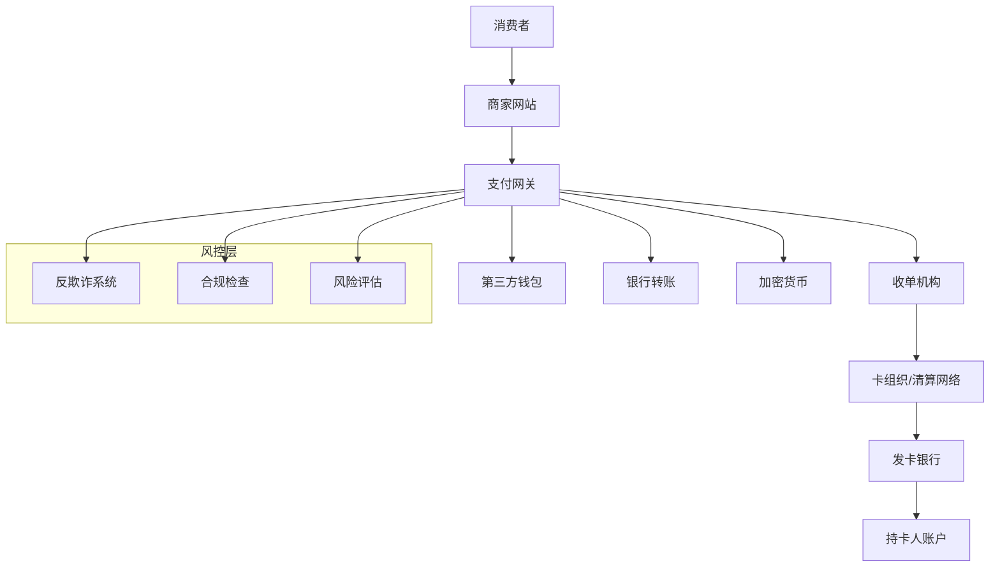

# 跨境电商支付解决方案完全指南

## 目录

1. [跨境支付生态概览](#跨境支付生态概览)
2. [主流支付网关对比](#主流支付网关对比)
3. [支付方式选择策略](#支付方式选择策略)
4. [多币种处理方案](#多币种处理方案)
5. [风险控制与反欺诈](#风险控制与反欺诈)
6. [合规性要求](#合规性要求)
7. [技术集成指南](#技术集成指南)
8. [成本优化策略](#成本优化策略)
9. [未来发展趋势](#未来发展趋势)

## 跨境支付生态概览

### 支付链路结构



### 核心参与方角色

| 参与方 | 职责 | 收费模式 |
|--------|------|---------|
| 支付网关 | 交易处理、路由优化 | 按交易收费 + 月费 |
| 收单机构 | 商户资质审核、资金清算 | 费率 + 固定费用 |
| 卡组织 | 网络维护、规则制定 | 网络费 |
| 发卡行 | 授权决策、风险管理 | 交换费 |
| 监管机构 | 合规监督、牌照管理 | 合规成本 |

## 主流支付网关对比

### 国际主流支付网关

#### Stripe

**优势特点：**
- 🏆 开发者友好的API设计
- 🌍 支持135+国家和地区
- 💳 支持多种支付方式
- 🔒 强大的反欺诈功能

```javascript
// Stripe集成示例
const stripe = require('stripe')('sk_test_...');

const paymentIntent = await stripe.paymentIntents.create({
  amount: 2000, // $20.00
  currency: 'usd',
  payment_method_types: ['card'],
  metadata: {
    order_id: '12345',
    customer_email: 'customer@example.com'
  }
});

// 客户端确认支付
stripe.confirmCardPayment(paymentIntent.client_secret, {
  payment_method: {
    card: cardElement,
    billing_details: {
      name: 'Jenny Rosen',
      email: 'jenny@example.com'
    }
  }
});
```

**费率结构：**
| 交易类型 | 费率 | 适用场景 |
|---------|------|---------|
| 在线支付 | 2.9% + $0.30 | 标准电商 |
| 国际卡 | 3.9% + $0.30 | 跨境交易 |
| 当面支付 | 2.7% + $0.05 | 线下收款 |

#### PayPal

**优势特点：**
- 👥 全球4.3亿活跃用户
- 🛡️ 买家保护计划
- 💰 无需预付费用
- 🔄 支持分期付款

```javascript
// PayPal SDK集成
paypal.Buttons({
  createOrder: function(data, actions) {
    return actions.order.create({
      purchase_units: [{
        amount: {
          value: '20.00',
          currency_code: 'USD'
        },
        description: 'Premium Product',
        custom_id: 'order_12345'
      }]
    });
  },
  onApprove: function(data, actions) {
    return actions.order.capture().then(function(details) {
      console log('Transaction completed:', details);
      // 发送到服务器验证
      return fetch('/paypal-transaction-complete', {
        method: 'POST',
        headers: { 'Content-Type': 'application/json' },
        body: JSON.stringify({ orderID: data.orderID })
      });
    });
  }
}).render('#paypal-button-container');
```

#### Adyen

**优势特点：**
- 🌐 单一集成支持全球支付方式
- 📊 实时数据和报告
- 🚀 99.95%+系统正常运行时间
- 🏢 适合大企业需求

**全球支付方式覆盖：**
```javascript
// Adyen支付方式配置
const paymentMethods = {
  'US': ['card', 'paypal', 'applepay', 'googlepay'],
  'DE': ['card', 'paypal', 'sofort', 'giropay', 'sepa'],
  'CN': ['alipay', 'wechatpay', 'unionpay'],
  'BR': ['card', 'boleto', 'pix'],
  'IN': ['card', 'upi', 'netbanking', 'wallets'],
  'JP': ['card', 'konbini', 'paypay'],
  'KR': ['card', 'kakaopay', 'naverpay']
};
```

### 区域性支付网关

#### 亚太地区

**Razorpay（印度）：**
- 支付方式：UPI、网银、钱包、信用卡
- 费率：2% + ₹2（约$0.024）
- 特色：支持EMI分期付款

**2C2P（东南亚）：**
- 覆盖：泰国、新加坡、马来西亚等
- 本地化：支持当地银行和电子钱包
- 合规：符合各国监管要求

#### 欧洲地区

**Klarna（先买后付）：**
```javascript
// Klarna集成示例
window.KlarnaPayments.init({
  client_token: 'eyJhbGciOiJSUzI1NiIs...'
});

window.KlarnaPayments.load({
  container: '#klarna_container',
  payment_method_category: 'pay_later'
}, function (res) {
  console.log('Klarna loaded:', res);
});
```

**Mollie（荷兰）：**
- 支付方式：iDEAL、Bancontact、SOFORT
- 费率：固定费用模式
- 特色：无设置费和月费

## 支付方式选择策略

### 按地区优化支付方式

#### 北美市场

**推荐配置：**
```javascript
const northAmericaConfig = {
  primary: ['visa', 'mastercard', 'amex', 'discover'],
  digital: ['paypal', 'apple_pay', 'google_pay'],
  bnpl: ['klarna', 'afterpay', 'sezzle'],
  preferences: {
    mobile: ['apple_pay', 'google_pay', 'paypal'],
    desktop: ['card', 'paypal']
  },
  conversion_rates: {
    card: '3.2%',
    paypal: '2.8%', 
    apple_pay: '4.1%',
    bnpl: '2.5%'
  }
};
```

#### 欧洲市场

**SEPA区域策略：**
```javascript
const europeConfig = {
  'DE': {
    preferred: ['sofort', 'giropay', 'paypal'],
    cards: ['visa', 'mastercard'],
    local_banks: ['deutsche_bank', 'commerzbank']
  },
  'NL': {
    preferred: ['ideal', 'paypal'],
    cards: ['visa', 'mastercard'],
    mobile: ['apple_pay']
  },
  'FR': {
    preferred: ['carte_bancaire', 'paypal'],
    cards: ['visa', 'mastercard'],
    bnpl: ['klarna']
  }
};
```

#### 亚太市场

**本地化支付配置：**
```javascript
const apacConfig = {
  'CN': {
    domestic: ['alipay', 'wechat_pay', 'unionpay'],
    international: ['visa', 'mastercard'],
    mobile_penetration: '95%'
  },
  'JP': {
    preferred: ['jcb', 'rakuten_pay', 'line_pay'],
    convenience: ['konbini', 'bank_transfer'],
    cash_culture: true
  },
  'IN': {
    digital: ['upi', 'paytm', 'phonepe'],
    banking: ['netbanking', 'imps'],
    cards: ['rupay', 'visa', 'mastercard']
  }
};
```

### 转化率优化策略

#### 支付方式展示优化

```html
<!-- 智能支付方式排序 -->
<div class="payment-methods">
  <div class="payment-method primary" data-method="card">
    
    <span>Credit/Debit Cards</span>
    <span class="popular">Most Popular</span>
  </div>
  
  <div class="payment-method" data-method="paypal">
    
    <span>PayPal</span>
  </div>
  
  <div class="payment-method" data-method="apple_pay" data-device="mobile">
    
    <span>Apple Pay</span>
    <span class="fast">1-Touch</span>
  </div>
</div>

<script>
// 动态显示支付方式
const showRelevantPaymentMethods = () => {
  const isMobile = /iPhone|iPad|iPod|Android/i.test(navigator.userAgent);
  const isAppleDevice = /iPhone|iPad|iPod/i.test(navigator.userAgent);
  const country = getUserCountry(); // 通过IP或用户设置获取
  
  document.querySelectorAll('[data-device="mobile"]').forEach(el => {
    el.style.display = isMobile ? 'block' : 'none';
  });
  
  // 基于地区显示本地支付方式
  if (country === 'DE') {
    showPaymentMethod('sofort');
    showPaymentMethod('giropay');
  }
};
</script>
```

## 多币种处理方案

### 动态货币转换（DCC）

#### DCC vs 本地货币定价

```javascript
// 多币种定价策略
class MultiCurrencyPricing {
  constructor(baseCurrency = 'USD') {
    this.baseCurrency = baseCurrency;
    this.exchangeRates = {};
    this.margins = {};
  }
  
  async updateExchangeRates() {
    // 从多个数据源获取汇率
    const sources = [
      'https://api.exchangerate-api.com/v4/latest/USD',
      'https://api.fixer.io/latest?base=USD',
      'https://openexchangerates.org/api/latest.json'
    ];
    
    const rates = await Promise.all(
      sources.map(url => fetch(url).then(r => r.json()))
    );
    
    // 取平均值提高准确性
    this.exchangeRates = this.calculateAverageRates(rates);
  }
  
  calculateLocalPrice(basePrice, targetCurrency) {
    const rate = this.exchangeRates[targetCurrency];
    const margin = this.margins[targetCurrency] || 0.02; // 2%汇率保护
    
    const convertedPrice = basePrice * rate * (1 + margin);
    
    // 本地化价格格式
    return this.localizePrice(convertedPrice, targetCurrency);
  }
  
  localizePrice(price, currency) {
    const localization = {
      'EUR': { round: 0.99, symbol: '€', position: 'after' },
      'GBP': { round: 0.99, symbol: '£', position: 'before' },
      'JPY': { round: 1, symbol: '¥', position: 'before' },
      'CNY': { round: 0.9, symbol: '¥', position: 'before' }
    };
    
    const config = localization[currency];
    if (!config) return price;
    
    // 心理定价策略
    const roundedPrice = Math.ceil(price / config.round) * config.round - 0.01;
    
    return {
      amount: roundedPrice,
      formatted: this.formatCurrency(roundedPrice, currency, config)
    };
  }
}
```

### 汇率风险管理

#### 对冲策略实施

```javascript
// 汇率风险对冲
class CurrencyHedging {
  constructor() {
    this.exposures = new Map();
    this.hedgeRatio = 0.8; // 80%对冲比例
  }
  
  recordExposure(currency, amount, timestamp) {
    const key = `${currency}_${this.getHedgePeriod(timestamp)}`;
    
    if (!this.exposures.has(key)) {
      this.exposures.set(key, { total: 0, transactions: [] });
    }
    
    const exposure = this.exposures.get(key);
    exposure.total += amount;
    exposure.transactions.push({ amount, timestamp });
  }
  
  calculateHedgeRequirement() {
    const hedgeRequirements = [];
    
    this.exposures.forEach((exposure, key) => {
      const [currency, period] = key.split('_');
      const hedgeAmount = exposure.total * this.hedgeRatio;
      
      if (Math.abs(hedgeAmount) > this.getMinHedgeThreshold(currency)) {
        hedgeRequirements.push({
          currency,
          period,
          amount: hedgeAmount,
          type: hedgeAmount > 0 ? 'sell' : 'buy'
        });
      }
    });
    
    return hedgeRequirements;
  }
  
  executeHedge(requirement) {
    // 通过银行或金融机构执行外汇对冲
    return this.forwardContract(requirement) || 
           this.currencyOptions(requirement) ||
           this.currencySwap(requirement);
  }
}
```

## 风险控制与反欺诈

### 多层次风控体系

#### 实时风险评估

```javascript
// 实时风险评分系统
class RiskScoreEngine {
  constructor() {
    this.rules = new Map();
    this.blacklists = new Set();
    this.whitelists = new Set();
    this.models = {};
  }
  
  async evaluateTransaction(transaction) {
    const riskFactors = await this.gatherRiskFactors(transaction);
    const score = await this.calculateRiskScore(riskFactors);
    const decision = this.makeDecision(score, transaction);
    
    return {
      score,
      decision,
      reasons: this.getDecisionReasons(riskFactors),
      actions: this.getRecommendedActions(decision)
    };
  }
  
  async gatherRiskFactors(transaction) {
    const factors = {};
    
    // 地理风险因子
    factors.geoRisk = await this.assessGeographicRisk(
      transaction.ip_address,
      transaction.billing_country,
      transaction.shipping_country
    );
    
    // 设备指纹
    factors.deviceRisk = await this.analyzeDeviceFingerprint(
      transaction.device_fingerprint
    );
    
    // 行为模式
    factors.behaviorRisk = await this.analyzeBehaviorPattern(
      transaction.user_id,
      transaction.session_data
    );
    
    // 交易模式
    factors.transactionRisk = this.analyzeTransactionPattern(transaction);
    
    // 卡BIN分析
    factors.cardRisk = await this.analyzeCardBIN(transaction.card_bin);
    
    return factors;
  }
  
  calculateRiskScore(factors) {
    const weights = {
      geoRisk: 0.25,
      deviceRisk: 0.20,
      behaviorRisk: 0.25,
      transactionRisk: 0.20,
      cardRisk: 0.10
    };
    
    let totalScore = 0;
    Object.entries(factors).forEach(([factor, score]) => {
      totalScore += score * (weights[factor] || 0);
    });
    
    return Math.min(Math.max(totalScore, 0), 100);
  }
  
  makeDecision(score, transaction) {
    if (score < 30) return 'approve';
    if (score < 60) return 'review';
    if (score < 80) return 'challenge'; // 3DS验证
    return 'decline';
  }
}
```

### 3D Secure 2.0实施

#### 智能身份验证

```javascript
// 3DS 2.0集成
class ThreeDSecure {
  constructor(processor) {
    this.processor = processor;
    this.riskEngine = new RiskScoreEngine();
  }
  
  async processPayment(paymentData) {
    // 风险评估
    const riskAssessment = await this.riskEngine.evaluateTransaction(paymentData);
    
    // 基于风险决定是否使用3DS
    const requires3DS = this.shouldUse3DS(riskAssessment, paymentData);
    
    if (requires3DS) {
      return await this.process3DSPayment(paymentData);
    } else {
      return await this.processDirectPayment(paymentData);
    }
  }
  
  shouldUse3DS(riskAssessment, paymentData) {
    // 欧盟SCA要求
    if (this.isEUSCARequired(paymentData)) return true;
    
    // 高风险交易
    if (riskAssessment.score > 50) return true;
    
    // 高价值交易
    if (paymentData.amount > 500) return true;
    
    // 新用户或新卡
    if (this.isNewCustomerOrCard(paymentData)) return true;
    
    return false;
  }
  
  async process3DSPayment(paymentData) {
    const threeDSData = {
      threeDSRequestorURL: 'https://yourstore.com',
      threeDSRequestorName: 'Your Store',
      cardholderName: paymentData.cardholder_name,
      cardNumber: paymentData.card_number,
      expiryMonth: paymentData.expiry_month,
      expiryYear: paymentData.expiry_year,
      amount: paymentData.amount,
      currency: paymentData.currency,
      
      // 增强数据提高免验证率
      email: paymentData.email,
      mobilePhone: paymentData.phone,
      homePhone: paymentData.home_phone,
      workPhone: paymentData.work_phone,
      shipAddressUsage: paymentData.ship_address_usage,
      txnActivityDay: paymentData.txn_activity_day,
      txnActivityYear: paymentData.txn_activity_year,
      provisionAttemptsDay: paymentData.provision_attempts_day,
      nbPurchaseAccount: paymentData.nb_purchase_account,
      suspiciousAccActivity: paymentData.suspicious_acc_activity,
      shipNameIndicator: paymentData.ship_name_indicator,
      paymentAccAge: paymentData.payment_acc_age
    };
    
    return await this.processor.process3DS(threeDSData);
  }
}
```

### 机器学习反欺诈

#### 异常检测模型

```python
# 机器学习反欺诈模型（Python示例）
import pandas as pd
from sklearn.ensemble import IsolationForest
from sklearn.preprocessing import StandardScaler

class FraudDetectionML:
    def __init__(self):
        self.model = IsolationForest(contamination=0.1)
        self.scaler = StandardScaler()
        self.feature_columns = [
            'amount', 'hour_of_day', 'day_of_week',
            'cards_used_24h', 'failed_attempts_24h',
            'avg_amount_30d', 'transaction_velocity',
            'geographic_risk_score', 'device_risk_score'
        ]
    
    def train_model(self, historical_data):
        # 特征工程
        features = self.extract_features(historical_data)
        
        # 标准化
        features_scaled = self.scaler.fit_transform(features)
        
        # 训练异常检测模型
        self.model.fit(features_scaled)
    
    def predict_fraud(self, transaction_data):
        features = self.extract_features(transaction_data)
        features_scaled = self.scaler.transform(features)
        
        # 异常分数（越负越异常）
        anomaly_score = self.model.decision_function(features_scaled)[0]
        
        # 转换为风险分数（0-100）
        risk_score = max(0, min(100, (1 - anomaly_score) * 50))
        
        return {
            'risk_score': risk_score,
            'is_anomaly': anomaly_score < 0,
            'confidence': abs(anomaly_score)
        }
```

## 合规性要求

### PCI DSS合规

#### 数据安全标准

```javascript
// PCI DSS合规检查清单
const pciComplianceChecklist = {
  requirement1: {
    title: "安装和维护防火墙配置",
    controls: [
      "网络防火墙配置",
      "主机防火墙配置", 
      "网络分段",
      "访问控制列表"
    ]
  },
  
  requirement2: {
    title: "不使用供应商提供的默认密码",
    controls: [
      "更改默认密码",
      "删除不必要的账户",
      "加强身份验证",
      "定期密码审查"
    ]
  },
  
  requirement3: {
    title: "保护存储的持卡人数据",
    implementation: {
      encryption: "AES-256加密",
      tokenization: "替换敏感数据",
      keyManagement: "密钥轮换策略",
      dataRetention: "最小化数据保留"
    }
  },
  
  requirement4: {
    title: "加密传输中的持卡人数据",
    protocols: ["TLS 1.2+", "端到端加密", "证书管理"]
  }
};

// 数据脱敏示例
const tokenizeCardData = (cardNumber) => {
  // 生成不可逆token
  const token = generateSecureToken();
  
  // 存储映射关系（加密存储）
  storeTokenMapping(token, encrypt(cardNumber));
  
  // 返回token供业务使用
  return token;
};
```

### GDPR数据保护

#### 隐私合规管理

```javascript
// GDPR合规数据处理
class GDPRCompliance {
  constructor() {
    this.consentRecords = new Map();
    this.dataProcessingLog = [];
  }
  
  recordConsent(userId, consentType, details) {
    const consentRecord = {
      userId,
      consentType, // 'marketing', 'analytics', 'personalization'
      granted: details.granted,
      timestamp: new Date(),
      ipAddress: details.ipAddress,
      userAgent: details.userAgent,
      consentString: details.consentString,
      lawfulBasis: details.lawfulBasis // Art. 6(1)(a) consent
    };
    
    this.consentRecords.set(`${userId}_${consentType}`, consentRecord);
    this.logDataProcessing('consent_recorded', userId, consentRecord);
  }
  
  processPersonalData(userId, dataType, purpose) {
    // 检查是否有合法基础
    const hasLawfulBasis = this.checkLawfulBasis(userId, dataType, purpose);
    
    if (!hasLawfulBasis) {
      throw new Error('No lawful basis for processing personal data');
    }
    
    // 记录数据处理活动
    this.logDataProcessing('data_processed', userId, {
      dataType,
      purpose,
      lawfulBasis: this.getLawfulBasis(userId, dataType)
    });
  }
  
  handleDataSubjectRequest(userId, requestType) {
    switch (requestType) {
      case 'access':
        return this.exportPersonalData(userId);
      case 'rectification':
        return this.updatePersonalData(userId);
      case 'erasure':
        return this.deletePersonalData(userId);
      case 'portability':
        return this.exportDataPortable(userId);
      case 'objection':
        return this.stopProcessing(userId);
    }
  }
  
  async deletePersonalData(userId) {
    // 识别所有相关数据
    const dataLocations = await this.findPersonalData(userId);
    
    // 安全删除
    const deletionResults = [];
    for (const location of dataLocations) {
      const result = await this.secureDelete(location);
      deletionResults.push(result);
    }
    
    // 记录删除活动
    this.logDataProcessing('data_deleted', userId, {
      deletionResults,
      timestamp: new Date()
    });
    
    return deletionResults;
  }
}
```

## 技术集成指南

### API集成最佳实践

#### 统一支付API设计

```javascript
// 统一支付API封装
class UnifiedPaymentAPI {
  constructor() {
    this.providers = new Map();
    this.fallbackChain = [];
    this.routingRules = [];
  }
  
  addProvider(name, provider, config) {
    this.providers.set(name, {
      instance: provider,
      config: config,
      healthCheck: () => provider.healthCheck(),
      isActive: true
    });
  }
  
  async processPayment(paymentRequest) {
    // 选择最优支付提供商
    const provider = await this.selectProvider(paymentRequest);
    
    try {
      // 标准化请求格式
      const standardizedRequest = this.standardizeRequest(paymentRequest, provider);
      
      // 执行支付
      const result = await provider.instance.processPayment(standardizedRequest);
      
      // 标准化响应格式
      return this.standardizeResponse(result, provider);
      
    } catch (error) {
      // 失败重试逻辑
      return await this.handleFailureWithFallback(paymentRequest, provider, error);
    }
  }
  
  async selectProvider(paymentRequest) {
    // 基于路由规则选择提供商
    for (const rule of this.routingRules) {
      if (this.matchesRule(paymentRequest, rule)) {
        const provider = this.providers.get(rule.provider);
        if (provider && provider.isActive) {
          return provider;
        }
      }
    }
    
    // 默认提供商选择逻辑
    return this.selectDefaultProvider(paymentRequest);
  }
  
  standardizeRequest(request, provider) {
    const standardized = {
      amount: request.amount,
      currency: request.currency,
      paymentMethod: request.payment_method,
      customer: {
        id: request.customer_id,
        email: request.customer_email
      },
      billing: request.billing_address,
      shipping: request.shipping_address,
      metadata: request.metadata
    };
    
    // 提供商特定的转换
    return provider.instance.transformRequest(standardized);
  }
}
```

### Webhook处理

#### 安全的Webhook处理

```javascript
// 安全Webhook处理器
class SecureWebhookHandler {
  constructor() {
    this.processors = new Map();
    this.retryQueue = [];
    this.maxRetries = 3;
  }
  
  async handleWebhook(provider, signature, payload, headers) {
    try {
      // 验证签名
      if (!this.verifySignature(provider, signature, payload)) {
        throw new Error('Invalid webhook signature');
      }
      
      // 幂等性检查
      const eventId = this.extractEventId(payload);
      if (await this.isEventProcessed(eventId)) {
        return { status: 'already_processed', eventId };
      }
      
      // 处理事件
      const result = await this.processEvent(provider, payload);
      
      // 记录处理结果
      await this.recordEventProcessing(eventId, result);
      
      return { status: 'processed', result };
      
    } catch (error) {
      // 错误处理和重试
      await this.handleWebhookError(provider, payload, error);
      throw error;
    }
  }
  
  verifySignature(provider, signature, payload) {
    const processors = {
      stripe: (sig, data) => {
        const stripe = require('stripe');
        return stripe.webhooks.constructEvent(data, sig, process.env.STRIPE_WEBHOOK_SECRET);
      },
      paypal: (sig, data) => {
        // PayPal webhook验证逻辑
        return this.verifyPayPalSignature(data, sig);
      }
    };
    
    return processors[provider] ? processors[provider](signature, payload) : false;
  }
  
  async processEvent(provider, payload) {
    const event = JSON.parse(payload);
    const processor = this.processors.get(`${provider}_${event.type}`);
    
    if (!processor) {
      console.warn(`No processor for ${provider}_${event.type}`);
      return { status: 'ignored' };
    }
    
    return await processor(event);
  }
  
  // 注册事件处理器
  registerProcessor(provider, eventType, handler) {
    this.processors.set(`${provider}_${eventType}`, handler);
  }
}

// 使用示例
const webhookHandler = new SecureWebhookHandler();

// 注册Stripe事件处理器
webhookHandler.registerProcessor('stripe', 'payment_intent.succeeded', async (event) => {
  const paymentIntent = event.data.object;
  await updateOrderStatus(paymentIntent.metadata.order_id, 'paid');
  await sendConfirmationEmail(paymentIntent.receipt_email);
});

webhookHandler.registerProcessor('stripe', 'payment_intent.payment_failed', async (event) => {
  const paymentIntent = event.data.object;
  await updateOrderStatus(paymentIntent.metadata.order_id, 'failed');
  await notifyPaymentFailure(paymentIntent.metadata.order_id);
});
```

## 成本优化策略

### 费率优化

#### 动态路由优化

```javascript
// 智能支付路由
class SmartPaymentRouting {
  constructor() {
    this.providers = [];
    this.costMatrix = new Map();
    this.performanceMetrics = new Map();
  }
  
  addProvider(provider, costStructure, capabilities) {
    this.providers.push({
      name: provider.name,
      instance: provider,
      cost: costStructure,
      capabilities: capabilities,
      performance: {
        successRate: 0.98,
        avgResponseTime: 500,
        uptimePercent: 99.9
      }
    });
  }
  
  async calculateOptimalRoute(transaction) {
    const eligibleProviders = this.filterEligibleProviders(transaction);
    
    const routeAnalysis = await Promise.all(
      eligibleProviders.map(async provider => ({
        provider: provider.name,
        cost: this.calculateTransactionCost(transaction, provider),
        successProbability: provider.performance.successRate,
        expectedTime: provider.performance.avgResponseTime,
        totalExpectedCost: this.calculateExpectedCost(transaction, provider)
      }))
    );
    
    // 选择成本效益最优的路由
    const optimalRoute = routeAnalysis.reduce((best, current) => 
      current.totalExpectedCost < best.totalExpectedCost ? current : best
    );
    
    return optimalRoute;
  }
  
  calculateTransactionCost(transaction, provider) {
    const { amount, currency, paymentMethod, region } = transaction;
    const costStructure = provider.cost;
    
    let totalCost = 0;
    
    // 基础费率
    totalCost += amount * (costStructure.percentageFee || 0);
    
    // 固定费用
    totalCost += costStructure.fixedFee || 0;
    
    // 国际卡附加费
    if (this.isInternationalCard(transaction)) {
      totalCost += amount * (costStructure.internationalFee || 0);
    }
    
    // 货币转换费
    if (currency !== costStructure.baseCurrency) {
      totalCost += amount * (costStructure.fxFee || 0);
    }
    
    // 支付方式特定费用
    const methodFee = costStructure.methodFees?.[paymentMethod];
    if (methodFee) {
      totalCost += typeof methodFee === 'number' ? methodFee : amount * methodFee;
    }
    
    return totalCost;
  }
  
  calculateExpectedCost(transaction, provider) {
    const baseCost = this.calculateTransactionCost(transaction, provider);
    const successRate = provider.performance.successRate;
    
    // 考虑失败重试成本
    const expectedRetryCost = baseCost * (1 - successRate) * 0.5; // 假设50%失败会重试
    
    return baseCost + expectedRetryCost;
  }
}
```

### 成本监控与分析

#### 实时成本追踪

```javascript
// 支付成本分析仪表板
class PaymentCostAnalytics {
  constructor() {
    this.costData = [];
    this.alerts = [];
    this.budgets = new Map();
  }
  
  recordTransaction(transaction) {
    const costBreakdown = {
      transactionId: transaction.id,
      timestamp: new Date(),
      amount: transaction.amount,
      currency: transaction.currency,
      provider: transaction.provider,
      
      // 成本细分
      costs: {
        processing: transaction.processingFee,
        interchange: transaction.interchangeFee,
        scheme: transaction.schemeFee,
        gateway: transaction.gatewayFee,
        fx: transaction.fxFee || 0,
        chargeback: 0 // 后续更新
      },
      
      // 计算总成本和费率
      totalCost: this.calculateTotalCost(transaction),
      effectiveRate: this.calculateEffectiveRate(transaction)
    };
    
    this.costData.push(costBreakdown);
    this.checkCostAlerts(costBreakdown);
  }
  
  generateCostReport(period) {
    const reportData = this.costData.filter(
      record => this.isInPeriod(record.timestamp, period)
    );
    
    return {
      summary: {
        totalVolume: reportData.reduce((sum, r) => sum + r.amount, 0),
        totalCost: reportData.reduce((sum, r) => sum + r.totalCost, 0),
        transactionCount: reportData.length,
        averageRate: this.calculateAverageRate(reportData)
      },
      
      byProvider: this.groupBy(reportData, 'provider'),
      byCurrency: this.groupBy(reportData, 'currency'),
      
      trends: this.analyzeTrends(reportData),
      recommendations: this.generateRecommendations(reportData)
    };
  }
  
  generateRecommendations(data) {
    const recommendations = [];
    
    // 高成本提供商识别
    const providerCosts = this.groupBy(data, 'provider');
    Object.entries(providerCosts).forEach(([provider, transactions]) => {
      const avgRate = this.calculateAverageRate(transactions);
      if (avgRate > 0.035) { // 3.5%以上算高成本
        recommendations.push({
          type: 'cost_optimization',
          priority: 'high',
          message: `Consider renegotiating rates with ${provider} (current avg: ${(avgRate * 100).toFixed(2)}%)`,
          potential_savings: this.calculatePotentialSavings(transactions, 0.029)
        });
      }
    });
    
    // 货币优化建议
    const currencyAnalysis = this.analyzeCurrencyMix(data);
    if (currencyAnalysis.fxCostRatio > 0.15) {
      recommendations.push({
        type: 'currency_optimization',
        priority: 'medium',
        message: 'High FX costs detected. Consider local acquiring or DCC optimization.',
        impact: `FX costs represent ${(currencyAnalysis.fxCostRatio * 100).toFixed(1)}% of total costs`
      });
    }
    
    return recommendations;
  }
}
```

## 未来发展趋势

### 新兴支付技术

#### 加密货币支付集成

```javascript
// 加密货币支付处理
class CryptoPaymentProcessor {
  constructor() {
    this.supportedCurrencies = ['BTC', 'ETH', 'USDC', 'USDT'];
    this.exchangeRates = new Map();
    this.volatilityThreshold = 0.05; // 5%波动限制
  }
  
  async processeCryptoPayment(paymentRequest) {
    const { amount, currency, cryptoCurrency, customerWallet } = paymentRequest;
    
    // 获取实时汇率
    const rate = await this.getExchangeRate(currency, cryptoCurrency);
    const cryptoAmount = amount / rate;
    
    // 波动性检查
    const volatility = await this.checkVolatility(cryptoCurrency);
    if (volatility > this.volatilityThreshold) {
      return {
        status: 'requires_confirmation',
        message: 'High volatility detected',
        estimated_amount: cryptoAmount,
        expires_at: new Date(Date.now() + 15 * 60 * 1000) // 15分钟
      };
    }
    
    // 生成支付地址
    const paymentAddress = await this.generatePaymentAddress(cryptoCurrency);
    
    // 监控区块链交易
    const transaction = await this.monitorBlockchain(
      paymentAddress,
      cryptoAmount,
      cryptoCurrency
    );
    
    return {
      status: 'pending',
      payment_address: paymentAddress,
      expected_amount: cryptoAmount,
      transaction_id: transaction.id,
      confirmation_url: this.getConfirmationUrl(transaction.id)
    };
  }
  
  async handleCryptoWebhook(transactionHash, currency) {
    // 验证区块链交易
    const transaction = await this.verifyBlockchainTransaction(transactionHash, currency);
    
    if (transaction.confirmations >= this.getRequiredConfirmations(currency)) {
      // 转换为法币
      const fiatValue = await this.convertToFiat(
        transaction.amount,
        currency,
        transaction.timestamp
      );
      
      // 更新订单状态
      await this.completePayment(transaction.reference, fiatValue);
    }
  }
}
```

#### 央行数字货币（CBDC）

```javascript
// CBDC支付准备
class CBDCPaymentGateway {
  constructor() {
    this.supportedCBDCs = ['digital_yuan', 'digital_euro', 'digital_dollar'];
    this.apiEndpoints = new Map();
  }
  
  async integrateCBDC(cbdcType, apiConfig) {
    // 连接到央行数字货币API
    const api = new CBDCApi(cbdcType, apiConfig);
    
    // 验证连接和权限
    await api.authenticate();
    await api.verifyMerchantStatus();
    
    this.apiEndpoints.set(cbdcType, api);
    
    return {
      status: 'integrated',
      capabilities: await api.getCapabilities(),
      compliance_requirements: await api.getComplianceRequirements()
    };
  }
  
  async processCBDCPayment(paymentRequest) {
    const { cbdcType, amount, customerWallet } = paymentRequest;
    const api = this.apiEndpoints.get(cbdcType);
    
    // CBDC特有的合规检查
    const complianceCheck = await this.performComplianceCheck(paymentRequest);
    if (!complianceCheck.approved) {
      throw new Error(`Compliance check failed: ${complianceCheck.reason}`);
    }
    
    // 执行CBDC转账
    const transaction = await api.initiateTransfer({
      from: customerWallet,
      to: this.getMerchantWallet(cbdcType),
      amount: amount,
      reference: paymentRequest.order_id,
      metadata: {
        merchant_id: this.merchantId,
        transaction_purpose: 'e-commerce_payment'
      }
    });
    
    return {
      status: 'completed',
      transaction_id: transaction.id,
      finality: 'immediate', // CBDC特色：即时最终结算
      cost: 0 // 通常CBDC无手续费
    };
  }
}
```

### 开放银行（Open Banking）

#### PSD2集成

```javascript
// 开放银行支付集成
class OpenBankingPayment {
  constructor() {
    this.pispLicense = process.env.PISP_LICENSE;
    this.bankAPIs = new Map();
  }
  
  async initiateBankTransfer(paymentRequest) {
    const { amount, currency, customerBank, customerAccount } = paymentRequest;
    
    // 获取银行API
    const bankAPI = this.bankAPIs.get(customerBank);
    if (!bankAPI) {
      throw new Error(`Bank ${customerBank} not supported`);
    }
    
    // 创建支付同意
    const consent = await bankAPI.createPaymentConsent({
      amount: amount,
      currency: currency,
      creditor: {
        name: this.merchantName,
        account: this.merchantAccount
      },
      remittanceInformation: `Order ${paymentRequest.order_id}`
    });
    
    // 生成授权URL
    const authUrl = bankAPI.generateAuthorizationUrl(consent.id, {
      redirect_uri: this.getRedirectUri(),
      state: paymentRequest.state
    });
    
    return {
      consent_id: consent.id,
      authorization_url: authUrl,
      expires_at: consent.expires_at
    };
  }
  
  async completePayment(consentId, authorizationCode) {
    const consent = await this.getPaymentConsent(consentId);
    const bankAPI = this.bankAPIs.get(consent.bank);
    
    // 交换授权码获取访问令牌
    const token = await bankAPI.exchangeAuthorizationCode(authorizationCode);
    
    // 执行支付
    const payment = await bankAPI.createPayment(consentId, token);
    
    // 监控支付状态
    const status = await this.monitorPaymentStatus(payment.id, bankAPI);
    
    return {
      payment_id: payment.id,
      status: status,
      settlement_time: this.getSettlementTime(consent.bank),
      cost: this.calculateOpenBankingCost(payment.amount)
    };
  }
}
```

### 人工智能优化

#### AI驱动的支付优化

```python
# AI支付优化模型
import tensorflow as tf
from sklearn.ensemble import RandomForestRegressor
import numpy as np

class AIPaymentOptimizer:
    def __init__(self):
        self.success_rate_model = None
        self.cost_optimization_model = None
        self.feature_columns = [
            'amount', 'currency', 'payment_method', 'customer_segment',
            'geography', 'time_of_day', 'day_of_week', 'device_type',
            'previous_success_rate', 'provider_performance'
        ]
    
    def train_success_rate_model(self, historical_data):
        """训练支付成功率预测模型"""
        X = historical_data[self.feature_columns]
        y = historical_data['success']
        
        self.success_rate_model = RandomForestRegressor(
            n_estimators=100,
            max_depth=10,
            random_state=42
        )
        self.success_rate_model.fit(X, y)
    
    def predict_optimal_provider(self, transaction_features):
        """预测最优支付提供商"""
        providers = ['stripe', 'paypal', 'adyen', 'square']
        predictions = {}
        
        for provider in providers:
            features = transaction_features.copy()
            features['provider'] = provider
            
            # 预测成功率
            success_rate = self.success_rate_model.predict([features])[0]
            
            # 预测成本
            cost = self.predict_transaction_cost(features)
            
            # 计算综合得分
            score = (success_rate * 0.7) + ((1 / cost) * 0.3)
            predictions[provider] = {
                'success_rate': success_rate,
                'estimated_cost': cost, 
                'score': score
            }
        
        # 返回最优选择
        optimal_provider = max(predictions.items(), key=lambda x: x[1]['score'])
        return optimal_provider
    
    def optimize_checkout_flow(self, user_data):
        """优化结账流程"""
        # 基于用户历史和实时数据优化支付方式排序
        payment_methods = ['card', 'paypal', 'apple_pay', 'google_pay']
        
        # AI预测用户偏好
        preferences = self.predict_user_preferences(user_data)
        
        # 动态排序支付方式
        optimized_order = sorted(
            payment_methods,
            key=lambda method: preferences.get(method, 0),
            reverse=True
        )
        
        return {
            'payment_method_order': optimized_order,
            'recommended_default': optimized_order[0],
            'confidence_score': preferences[optimized_order[0]]
        }
```

## 总结

跨境电商支付解决方案的选择和实施是一个复杂的系统工程，需要综合考虑技术、商业、合规等多个维度：

### 关键成功要素

1. **多元化支付策略**
   - 覆盖目标市场主流支付方式
   - 平衡用户体验和成本效益
   - 建立可靠的备用方案

2. **强大的风控体系**
   - 多层次反欺诈策略
   - 实时风险评估和决策
   - 合规性要求全面覆盖

3. **技术架构稳定性**
   - 高可用性和容灾备份
   - API集成标准化
   - 数据安全和隐私保护

4. **成本效益优化**
   - 智能路由和费率优化
   - 实时成本监控和分析
   - 持续的谈判和优化

### 未来发展方向

- **支付方式多样化**：加密货币、CBDC、开放银行等新兴支付方式
- **AI智能化**：机器学习优化支付成功率和用户体验
- **即时结算**：实时支付和结算成为标准
- **监管标准化**：全球支付合规要求趋向统一

成功的跨境支付解决方案需要持续的技术创新、风险管理和成本优化，同时保持对新兴技术和监管变化的敏感性。