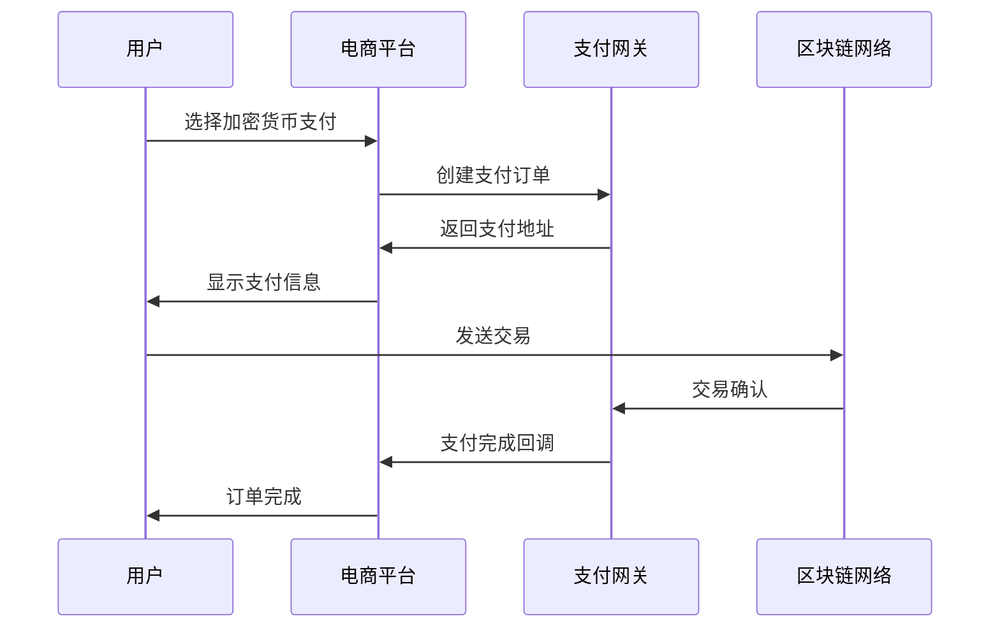

# 加密货币在电商中的集成实践：从比特币到DeFi

## 前言

随着Web3生态的蓬勃发展，越来越多的电商平台开始探索加密货币支付集成。本文将从技术实现到商业运营，全面解析加密货币电商集成的最佳实践。

## 市场现状与机遇

### 全球采用趋势

**数据概览：**
- 全球加密货币用户：4.2亿人（2023年）
- 接受加密货币的商家：2万+
- 年增长率：85%

**主要推动因素：**
1. 年轻用户群体偏好
2. 跨境支付需求增长
3. 传统支付手续费高昂
4. 金融包容性提升

### 行业应用案例

**成功案例分析：**

| 公司 | 支持币种 | 集成时间 | 交易占比 |
|------|---------|----------|----------|
| Tesla | BTC | 2021 | 5-8% |
| Shopify | BTC, ETH, LTC | 2020 | 3-5% |
| Microsoft | BTC | 2014 | 1-3% |
| Overstock | 15+ 种 | 2014 | 10-15% |

## 技术集成方案

### 1. 支付网关集成

**主流解决方案对比：**

```javascript
// Coinbase Commerce 集成示例
import { CoinbaseCommerce } from '@coinbase/commerce-sdk';

const commerce = new CoinbaseCommerce({
    apiKey: 'your-api-key',
    webhookSecret: 'your-webhook-secret'
});

// 创建支付订单
const charge = await commerce.charges.create({
    name: '商品名称',
    description: '商品描述',
    amount: {
        amount: '100.00',
        currency: 'USD'
    },
    pricing_type: 'fixed_price'
});
```

**集成架构图：**


### 2. 直接集成方案

**自建支付系统优势：**
- 更低的手续费
- 完全控制用户体验
- 数据自主权
- 定制化功能

**实现步骤：**

```python
# 比特币支付验证示例
import bitcoin
from web3 import Web3

class CryptoPaymentProcessor:
    def __init__(self):
        self.btc_client = bitcoin.BitcoinClient()
        self.eth_client = Web3(Web3.HTTPProvider('your-node-url'))
    
    def verify_bitcoin_payment(self, tx_hash, expected_amount, address):
        """验证比特币支付"""
        try:
            tx = self.btc_client.get_transaction(tx_hash)
            
            # 验证接收地址
            if address not in [out['address'] for out in tx['outputs']]:
                return False, "地址不匹配"
            
            # 验证金额
            received_amount = sum([
                out['value'] for out in tx['outputs'] 
                if out['address'] == address
            ])
            
            if received_amount < expected_amount:
                return False, "金额不足"
            
            # 验证确认数
            if tx['confirmations'] < 3:
                return False, "确认数不足"
            
            return True, "支付验证成功"
            
        except Exception as e:
            return False, f"验证失败: {str(e)}"
```

### 3. DeFi协议集成

**Uniswap价格预言机集成：**

```solidity
// 智能合约示例：动态定价
pragma solidity ^0.8.0;

import "@uniswap/v3-periphery/contracts/interfaces/ISwapRouter.sol";
import "@uniswap/v3-core/contracts/interfaces/IUniswapV3Pool.sol";

contract DynamicPricing {
    ISwapRouter public swapRouter;
    
    function getETHPrice() public view returns (uint256) {
        // 从Uniswap获取ETH/USDC价格
        IUniswapV3Pool pool = IUniswapV3Pool(POOL_ADDRESS);
        (uint160 sqrtPriceX96,,,,,,) = pool.slot0();
        
        // 计算价格
        uint256 price = (uint256(sqrtPriceX96) * uint256(sqrtPriceX96) * 1e18) 
                       >> (96 * 2);
        return price;
    }
    
    function calculatePaymentAmount(uint256 usdAmount) 
        public view returns (uint256) {
        uint256 ethPrice = getETHPrice();
        return (usdAmount * 1e18) / ethPrice;
    }
}
```

## 用户体验优化

### 1. 支付流程设计

**最佳实践：**

```jsx
// React组件示例：加密货币支付界面
import React, { useState, useEffect } from 'react';
import { ethers } from 'ethers';

const CryptoPayment = ({ orderAmount, onPaymentComplete }) => {
    const [selectedCrypto, setSelectedCrypto] = useState('ETH');
    const [paymentAddress, setPaymentAddress] = useState('');
    const [qrCode, setQrCode] = useState('');
    
    const cryptoOptions = [
        { symbol: 'BTC', name: 'Bitcoin', icon: '₿' },
        { symbol: 'ETH', name: 'Ethereum', icon: 'Ξ' },
        { symbol: 'USDT', name: 'Tether', icon: '₮' }
    ];
    
    useEffect(() => {
        generatePaymentAddress();
    }, [selectedCrypto]);
    
    const generatePaymentAddress = async () => {
        // 生成支付地址逻辑
        const address = await generateAddress(selectedCrypto);
        setPaymentAddress(address);
        setQrCode(generateQRCode(address, orderAmount));
    };
    
    return (
        <div className="crypto-payment-container">
            <h3>选择加密货币支付</h3>
            
            {/* 币种选择 */}
            <div className="crypto-selector">
                {cryptoOptions.map(crypto => (
                    <button
                        key={crypto.symbol}
                        className={`crypto-option ${
                            selectedCrypto === crypto.symbol ? 'selected' : ''
                        }`}
                        onClick={() => setSelectedCrypto(crypto.symbol)}
                    >
                        <span className="icon">{crypto.icon}</span>
                        <span className="name">{crypto.name}</span>
                    </button>
                ))}
            </div>
            
            {/* 支付信息 */}
            <div className="payment-info">
                <div className="amount">
                    支付金额: {orderAmount} {selectedCrypto}
                </div>
                
                <div className="address">
                    <label>支付地址:</label>
                    <input value={paymentAddress} readOnly />
                    <button onClick={() => copyToClipboard(paymentAddress)}>
                        复制
                    </button>
                </div>
                
                <div className="qr-code">
                    
                </div>
            </div>
            
            {/* 支付状态 */}
            <PaymentStatus 
                address={paymentAddress}
                expectedAmount={orderAmount}
                onConfirmed={onPaymentComplete}
            />
        </div>
    );
};
```

### 2. 实时状态更新

**WebSocket实现：**

```javascript
// 支付状态监控
class PaymentMonitor {
    constructor(orderId, callback) {
        this.orderId = orderId;
        this.callback = callback;
        this.ws = new WebSocket('wss://api.yoursite.com/payment-updates');
        this.setupListeners();
    }
    
    setupListeners() {
        this.ws.onmessage = (event) => {
            const data = JSON.parse(event.data);
            
            if (data.orderId === this.orderId) {
                switch (data.status) {
                    case 'pending':
                        this.callback('等待支付确认中...');
                        break;
                    case 'confirmed':
                        this.callback('支付已确认，处理中...');
                        break;
                    case 'completed':
                        this.callback('支付完成！');
                        break;
                    case 'failed':
                        this.callback('支付失败，请重试');
                        break;
                }
            }
        };
    }
}
```

## 风险管控策略

### 1. 价格波动管理

**对冲机制：**

```python
class VolatilityManager:
    def __init__(self):
        self.price_tolerance = 0.05  # 5%价格容忍度
        self.hedge_threshold = 10000  # 对冲阈值（美元）
    
    def should_hedge(self, exposure_usd):
        """判断是否需要对冲"""
        return exposure_usd > self.hedge_threshold
    
    def execute_hedge(self, amount, crypto_type):
        """执行对冲操作"""
        if crypto_type == 'BTC':
            # 通过期货合约对冲BTC风险
            return self.hedge_btc_futures(amount)
        elif crypto_type == 'ETH':
            # 通过DeFi协议对冲ETH风险
            return self.hedge_eth_defi(amount)
    
    def update_pricing(self, base_price, volatility):
        """动态调整定价"""
        risk_premium = volatility * 0.1
        return base_price * (1 + risk_premium)
```

### 2. 欺诈检测

**异常交易识别：**

```python
import machine_learning as ml

class FraudDetection:
    def __init__(self):
        self.model = ml.load_model('fraud_detection_model')
        self.risk_factors = [
            'transaction_amount',
            'user_history',
            'transaction_time',
            'source_address_reputation',
            'network_congestion'
        ]
    
    def analyze_transaction(self, tx_data):
        """分析交易风险"""
        features = self.extract_features(tx_data)
        risk_score = self.model.predict(features)
        
        if risk_score > 0.8:
            return 'high_risk', '建议人工审核'
        elif risk_score > 0.5:
            return 'medium_risk', '增加验证步骤'
        else:
            return 'low_risk', '正常处理'
    
    def extract_features(self, tx_data):
        """提取交易特征"""
        return {
            'amount_zscore': self.calculate_zscore(tx_data['amount']),
            'address_reputation': self.get_address_reputation(tx_data['from']),
            'transaction_pattern': self.analyze_pattern(tx_data['user_id']),
            'network_status': self.get_network_status()
        }
```

## 合规与法律考量

### 1. 监管要求

**主要合规框架：**

| 地区 | 主要法规 | 关键要求 |
|------|---------|----------|
| 美国 | BSA, AML | KYC、交易监控 |
| 欧盟 | MiCA | 许可要求、消费者保护 |
| 日本 | PSA | 注册要求、资金隔离 |
| 中国 | 禁止相关活动 | 不适用 |

### 2. KYC/AML实施

```python
class ComplianceManager:
    def __init__(self):
        self.kyc_provider = KYCProvider()
        self.aml_monitor = AMLMonitor()
    
    def verify_customer(self, customer_data):
        """客户身份验证"""
        # 身份文件验证
        id_result = self.kyc_provider.verify_identity(
            customer_data['id_document']
        )
        
        # 地址验证
        address_result = self.kyc_provider.verify_address(
            customer_data['address_proof']
        )
        
        # 制裁名单检查
        sanctions_result = self.aml_monitor.check_sanctions(
            customer_data['name']
        )
        
        return {
            'verified': all([id_result, address_result, not sanctions_result]),
            'risk_level': self.calculate_risk_level(customer_data)
        }
    
    def monitor_transaction(self, tx_data):
        """交易监控"""
        # 大额交易报告
        if tx_data['amount_usd'] > 10000:
            self.file_ctr_report(tx_data)
        
        # 可疑活动检测
        if self.is_suspicious_pattern(tx_data):
            self.file_sar_report(tx_data)
```

## 性能优化

### 1. 区块链网络选择

**性能对比：**

| 网络 | TPS | 确认时间 | 手续费 | 适用场景 |
|------|-----|---------|--------|----------|
| Bitcoin | 7 | 10-60分钟 | $1-50 | 大额支付 |
| Ethereum | 15 | 1-5分钟 | $1-100 | 智能合约 |
| Polygon | 65,000 | 2秒 | $0.01 | 小额支付 |
| BSC | 100 | 3秒 | $0.1 | DeFi应用 |

### 2. 缓存与优化

```javascript
// Redis缓存实现
const redis = require('redis');
const client = redis.createClient();

class PaymentCache {
    async cacheTransaction(txHash, data) {
        await client.setex(`tx:${txHash}`, 3600, JSON.stringify(data));
    }
    
    async getCachedTransaction(txHash) {
        const cached = await client.get(`tx:${txHash}`);
        return cached ? JSON.parse(cached) : null;
    }
    
    async cachePrices(prices) {
        await client.setex('crypto_prices', 60, JSON.stringify(prices));
    }
    
    async getCachedPrices() {
        const cached = await client.get('crypto_prices');
        return cached ? JSON.parse(cached) : null;
    }
}
```

## 未来发展方向

### 1. Layer 2解决方案

**Lightning Network集成：**
- 即时比特币支付
- 微支付场景应用
- 更低的交易费用

### 2. CBDCs整合

**央行数字货币优势：**
- 政府背书的稳定性
- 更好的监管合规性
- 传统金融系统兼容

### 3. Web3生态融合

**新兴应用场景：**
- NFT商品认证
- DAO治理参与
- GameFi积分系统

## 实施路线图

### 阶段1：基础集成（1-2个月）
- [ ] 选择支付网关
- [ ] 集成主流币种（BTC, ETH, USDT）
- [ ] 基础安全措施

### 阶段2：体验优化（2-3个月）
- [ ] 用户界面优化
- [ ] 实时状态更新
- [ ] 移动端适配

### 阶段3：高级功能（3-6个月）
- [ ] DeFi协议集成
- [ ] 智能合约自动化
- [ ] 高级风控系统

### 阶段4：生态扩展（6个月+）
- [ ] NFT支持
- [ ] 跨链互操作
- [ ] DAO功能集成

## 总结

加密货币支付集成是电商平台迈向Web3时代的重要步骤。成功的集成需要：

1. **技术架构规划**：选择合适的集成方案
2. **用户体验设计**：简化支付流程
3. **风险管控体系**：确保资金安全
4. **合规框架建设**：满足监管要求
5. **持续优化迭代**：跟上技术发展

随着区块链技术的成熟和监管环境的明晰，加密货币支付将成为电商平台的标准功能之一，为全球商务提供更加高效、安全的支付解决方案。

---

*本文内容仅供技术参考，具体实施需要根据当地法规和业务需求进行调整。*