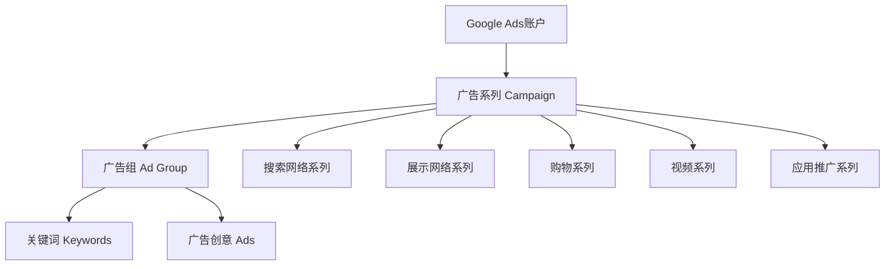

# Google广告投放策略完全指南

## 目录

1. [Google Ads基础架构](#google-ads基础架构)
2. [账户设置与初始配置](#账户设置与初始配置)
3. [关键词研究与选择](#关键词研究与选择)
4. [广告创意设计](#广告创意设计)
5. [出价策略与预算管理](#出价策略与预算管理)
6. [转化跟踪设置](#转化跟踪设置)
7. [广告系列优化](#广告系列优化)
8. [高级策略技巧](#高级策略技巧)
9. [ROI分析与优化](#roi分析与优化)

## Google Ads基础架构

### 账户层级结构



### 广告系列类型选择

| 系列类型 | 适用场景 | 优势 | 劣势 |
|---------|---------|------|------|
| 搜索网络 | 高意向用户 | 精准定位、高转化 | 竞争激烈、成本高 |
| 展示网络 | 品牌曝光 | 覆盖面广、成本低 | 转化率相对较低 |
| 购物广告 | 电商产品 | 产品展示直观 | 需要产品数据 |
| 视频广告 | 品牌推广 | 视觉冲击力强 | 制作成本高 |
| 应用推广 | 移动应用 | 专门优化安装 | 仅限应用推广 |

## 账户设置与初始配置

### 账户基础设置

#### 账户结构规划

```javascript
// 账户结构示例
const accountStructure = {
  campaigns: [
    {
      name: "Search_Brand_US",
      type: "Search",
      target: "US",
      budget: 100,
      bidStrategy: "Target CPA"
    },
    {
      name: "Search_Generic_US", 
      type: "Search",
      target: "US",
      budget: 300,
      bidStrategy: "Maximize Conversions"
    },
    {
      name: "Shopping_US",
      type: "Shopping",
      target: "US", 
      budget: 200,
      bidStrategy: "Target ROAS"
    }
  ]
};
```

#### 转化跟踪设置

**Google Analytics 4集成：**
```html
<!-- 全局网站代码 (gtag.js) -->
<script async src="https://www.googletagmanager.com/gtag/js?id=GA_MEASUREMENT_ID"></script>
<script>
  window.dataLayer = window.dataLayer || [];
  function gtag(){dataLayer.push(arguments);}
  gtag('js', new Date());
  
  gtag('config', 'GA_MEASUREMENT_ID');
  gtag('config', 'AW-CONVERSION_ID');
</script>
```

**转化操作设置：**
```html
<!-- 购买转化跟踪 -->
<script>
gtag('event', 'conversion', {
  'send_to': 'AW-CONVERSION_ID/CONVERSION_LABEL',
  'value': {{ order.total_price }},
  'currency': '{{ cart.currency.iso_code }}',
  'transaction_id': '{{ order.id }}'
});
</script>
```

### 受众与定位设置

#### 地理位置定位

```javascript
// 地理定位配置
const geoTargeting = {
  included: [
    {
      country: "US",
      states: ["CA", "NY", "TX", "FL"],
      bidAdjustment: 1.0
    },
    {
      country: "CA", 
      provinces: ["ON", "BC", "QC"],
      bidAdjustment: 0.8
    }
  ],
  excluded: [
    {country: "CN"},
    {country: "RU"}
  ]
};
```

#### 受众定位策略

**人口统计定位：**
- 年龄：25-54岁（根据产品调整）
- 性别：基于产品特性
- 家庭收入：前50%（高价值产品）
- 教育水平：大学及以上

**兴趣定位层次：**
1. **Affinity Audiences**（兴趣相似受众）
2. **In-Market Audiences**（有购买意向受众）
3. **Custom Intent Audiences**（自定义意向受众）
4. **Similar Audiences**（相似受众）

## 关键词研究与选择

### 关键词研究工具

#### 主要研究工具

1. **Google Keyword Planner**
   - 官方工具，数据权威
   - 提供搜索量和竞争度

2. **SEMrush/Ahrefs**
   - 竞争对手分析
   - 长尾关键词挖掘

3. **Google Trends**
   - 趋势分析
   - 季节性洞察

4. **Answer the Public**
   - 问句型关键词
   - 用户搜索意图

### 关键词分类策略

#### 关键词意图分类

```javascript
// 关键词分类示例
const keywordCategories = {
  brand: [
    "nike shoes",
    "nike air max",
    "nike sneakers"
  ],
  generic: [
    "running shoes",
    "athletic footwear", 
    "sport shoes"
  ],
  competitor: [
    "adidas alternative",
    "better than adidas",
    "nike vs adidas"
  ],
  long_tail: [
    "best running shoes for flat feet",
    "waterproof hiking boots men",
    "lightweight basketball shoes under 100"
  ]
};
```

#### 匹配类型策略

| 匹配类型 | 语法 | 展示条件 | 适用场景 |
|---------|------|---------|---------|
| 广泛匹配 | keyword | 相关搜索 | 流量发现 |
| 广泛匹配修饰符 | +keyword | 包含核心词 | 已废弃 |
| 词组匹配 | "keyword" | 包含词组 | 平衡精准度和流量 |
| 完全匹配 | [keyword] | 完全匹配 | 高精准度 |

### 否定关键词设置

#### 否定关键词策略

```javascript
// 否定关键词列表
const negativeKeywords = {
  // 免费相关
  free_terms: ["free", "gratis", "no cost", "zero cost"],
  
  // 工作相关  
  job_terms: ["job", "career", "employment", "hiring"],
  
  // 低价值流量
  low_value: ["cheap", "discount", "wholesale", "bulk"],
  
  // 竞争品牌
  competitors: ["adidas", "puma", "reebok", "under armour"],
  
  // 不相关搜索
  irrelevant: ["repair", "broken", "used", "second hand"]
};
```

**否定关键词分级管理：**
1. **账户级别**：全局否定词
2. **系列级别**：系列特定否定词  
3. **广告组级别**：细分否定词

## 广告创意设计

### 搜索广告创意

#### 广告文案结构

```javascript
// 广告文案模板
const adTemplate = {
  headlines: [
    "{{ keyword }} - Free Shipping",  // 包含关键词
    "Premium {{ product_type }}",     // 突出品质
    "Shop {{ brand }} Official Store" // 品牌权威性
  ],
  descriptions: [
    "Discover the best {{ product_type }} with {{ unique_selling_point }}. Order now and get free shipping on orders over $50.",
    "{{ brand }} official store. Premium quality, competitive prices, and exceptional customer service. Shop with confidence."
  ],
  extensions: {
    sitelinks: [
      {text: "New Arrivals", url: "/collections/new"},
      {text: "Best Sellers", url: "/collections/bestsellers"},
      {text: "Sale Items", url: "/collections/sale"}
    ],
    callouts: ["Free Shipping", "30-Day Returns", "24/7 Support"],
    structured_snippets: {
      brands: ["Nike", "Adidas", "Puma"],
      styles: ["Running", "Basketball", "Casual"]
    }
  }
};
```

#### 广告文案优化原则

**标题优化要点：**
1. **包含目标关键词**
2. **突出核心卖点**
3. **使用数字和符号**
4. **创造紧迫感**
5. **符合品牌调性**

**描述优化要点：**
```text
✅ 优秀示例：
"Premium running shoes with advanced cushioning technology. 
Free 2-day shipping & 30-day returns. Trusted by athletes worldwide."

❌ 避免的例子：
"We sell shoes. Good quality. Buy now."
```

### 响应式搜索广告(RSA)

#### RSA素材准备

```javascript
// RSA素材配置
const rsaAssets = {
  headlines: [
    "Premium {{ product_category }}",      // 通用标题
    "{{ brand }} Official Store",         // 品牌标题  
    "Free Shipping Over ${{ threshold }}", // 优惠标题
    "{{ keyword }} On Sale Now",          // 关键词标题
    "Trusted by {{ customer_count }}+ Customers", // 社会证明
    "New {{ season }} Collection",        // 季节性标题
    "Get {{ discount }}% Off Today",      // 折扣标题
    "{{ guarantee }} Day Money Back",     // 保证标题
    "Shop {{ category }} - {{ cta }}",    // 行动号召
    "Award-Winning {{ product_type }}"    // 权威性标题
  ],
  descriptions: [
    "Discover our premium collection of {{ product_category }} with free shipping, easy returns, and exceptional customer service.",
    "Shop the latest {{ brand }} {{ product_type }} with advanced features and cutting-edge design. Perfect for {{ use_case }}.",
    "Get the best deals on {{ product_category }}. Premium quality, competitive prices, and fast delivery. Order now!",
    "Join thousands of satisfied customers who trust {{ brand }} for their {{ product_category }} needs. Shop with confidence."
  ]
};
```

### 展示广告创意

#### 响应式展示广告

```html
<!-- 展示广告HTML模板 -->
<div class="display-ad-template">
  <!-- 徽标 -->
  
  
  <!-- 标题 -->
  <h2 class="headline">{{ dynamic_headline }}</h2>
  
  <!-- 描述 -->
  <p class="description">{{ dynamic_description }}</p>
  
  <!-- 图片 -->
  
  
  <!-- 行动号召 -->
  <button class="cta-button">{{ cta_text }}</button>
  
  <!-- 价格（可选） -->
  <span class="price">${{ product_price }}</span>
</div>
```

#### 图片素材规格

| 广告类型 | 推荐尺寸 | 文件大小 | 格式 |
|---------|---------|---------|------|
| 方形 | 1200x1200px | <5MB | JPG/PNG |
| 横向 | 1200x628px | <5MB | JPG/PNG |
| 徽标 | 1200x1200px | <5MB | PNG（透明背景） |
| 视频 | 16:9或1:1 | <128MB | MP4/MOV/AVI |

## 出价策略与预算管理

### 智能出价策略

#### 出价策略选择指南

```javascript
// 出价策略决策树
const biddingStrategySelector = (campaign) => {
  if (campaign.conversions_per_month < 30) {
    return "Manual CPC"; // 数据不足时手动出价
  } else if (campaign.goal === "conversions") {
    return campaign.target_cpa ? "Target CPA" : "Maximize Conversions";
  } else if (campaign.goal === "revenue") {
    return campaign.target_roas ? "Target ROAS" : "Maximize Conversion Value";
  } else if (campaign.goal === "traffic") {
    return "Maximize Clicks";
  }
  return "Enhanced CPC"; // 默认策略
};
```

#### 目标CPA设置策略

**CPA目标计算公式：**
```javascript
// CPA目标计算
const calculateTargetCPA = (metrics) => {
  const {
    averageOrderValue,
    profitMargin,
    desiredRoasRatio = 4 // 期望ROAS倍数
  } = metrics;
  
  const profitPerOrder = averageOrderValue * profitMargin;
  const maxCPA = profitPerOrder / desiredRoasRatio;
  
  return {
    conservativeTarget: maxCPA * 0.7, // 保守目标
    aggressiveTarget: maxCPA * 0.9,   // 激进目标
    maximumCPA: maxCPA                // 最大CPA
  };
};
```

### 预算分配策略

#### 预算分配原则

```javascript
// 预算分配模型
const budgetAllocation = {
  // 品牌词（高转化率，低成本）
  brand_campaigns: {
    percentage: 20,
    priority: "high",
    expectedCPA: "low"
  },
  
  // 通用词（中转化率，中成本）
  generic_campaigns: {
    percentage: 50,
    priority: "medium", 
    expectedCPA: "medium"
  },
  
  // 竞品词（低转化率，高成本）
  competitor_campaigns: {
    percentage: 15,
    priority: "low",
    expectedCPA: "high"
  },
  
  // 展示网络（品牌曝光）
  display_campaigns: {
    percentage: 15,
    priority: "medium",
    expectedCPA: "medium"
  }
};
```

#### 动态预算调整

```javascript
// 基于效果的预算自动调整
const dynamicBudgetAdjustment = (campaign) => {
  const { roas, targetRoas, currentBudget, performance } = campaign;
  
  let adjustmentFactor = 1;
  
  if (roas > targetRoas * 1.2) {
    adjustmentFactor = 1.2; // 表现优异，增加20%预算
  } else if (roas > targetRoas) {
    adjustmentFactor = 1.1; // 表现良好，增加10%预算
  } else if (roas < targetRoas * 0.8) {
    adjustmentFactor = 0.8; // 表现不佳，减少20%预算
  } else if (roas < targetRoas) {
    adjustmentFactor = 0.9; // 表现一般，减少10%预算
  }
  
  return currentBudget * adjustmentFactor;
};
```

## 转化跟踪设置

### Enhanced Conversions设置

#### 服务器端转化跟踪

```javascript
// 服务器端转化跟踪（Node.js示例）
const { GoogleAdsApi } = require('google-ads-api');

const uploadConversion = async (conversionData) => {
  const googleAdsApi = new GoogleAdsApi({
    client_id: process.env.GOOGLE_ADS_CLIENT_ID,
    client_secret: process.env.GOOGLE_ADS_CLIENT_SECRET,
    developer_token: process.env.GOOGLE_ADS_DEVELOPER_TOKEN
  });
  
  const customer = googleAdsApi.Customer({
    customer_id: process.env.GOOGLE_ADS_CUSTOMER_ID,
    refresh_token: process.env.GOOGLE_ADS_REFRESH_TOKEN
  });
  
  const conversionUpload = {
    conversions: [{
      gclid: conversionData.gclid,
      conversion_action: conversionData.conversionAction,
      conversion_date_time: conversionData.timestamp,
      conversion_value: conversionData.value,
      currency_code: 'USD',
      // Enhanced Conversions数据
      user_identifiers: [{
        hashed_email: hashEmail(conversionData.email),
        hashed_phone_number: hashPhone(conversionData.phone),
        address_info: {
          hashed_first_name: hashString(conversionData.firstName),
          hashed_last_name: hashString(conversionData.lastName),
          country_code: conversionData.countryCode,
          postal_code: conversionData.postalCode
        }
      }]
    }]
  };
  
  return await customer.conversionUploads.uploadClickConversions(conversionUpload);
};
```

### 跨域转化跟踪

#### Google Tag Manager设置

```javascript
// GTM转化跟踪配置
const gtmConversionTracking = {
  // 触发器配置
  triggers: [
    {
      name: "Purchase Completed",
      type: "Custom Event",
      event: "purchase",
      conditions: [{
        variable: "Event Category",
        operator: "equals",
        value: "ecommerce"
      }]
    }
  ],
  
  // 代码配置
  tags: [
    {
      name: "Google Ads Conversion",
      type: "Google Ads Conversion Tracking",
      conversionId: "AW-XXXXXXXXX",
      conversionLabel: "XXXXXXXXX",
      value: "{{Order Value}}",
      currencyCode: "USD",
      trigger: "Purchase Completed"
    }
  ],
  
  // 变量配置
  variables: [
    {
      name: "Order Value",
      type: "Data Layer Variable",
      dataLayerVariable: "ecommerce.purchase.value"
    },
    {
      name: "Transaction ID", 
      type: "Data Layer Variable",
      dataLayerVariable: "ecommerce.transaction_id"
    }
  ]
};
```

## 广告系列优化

### 关键词优化

#### 搜索词报告分析

```javascript
// 搜索词分析脚本
const analyzeSearchTerms = (searchTermsData) => {
  const analysis = {
    highPerformers: [],
    lowPerformers: [],
    negativeKeywords: [],
    newKeywords: []
  };
  
  searchTermsData.forEach(term => {
    const { query, impressions, clicks, conversions, cpa, ctr } = term;
    
    // 高效搜索词（加入关键词）
    if (conversions > 0 && cpa < targetCPA && ctr > 0.03) {
      analysis.highPerformers.push({
        query,
        recommendation: "Add as exact match keyword",
        metrics: { conversions, cpa, ctr }
      });
    }
    
    // 低效搜索词（添加否定）
    if (clicks > 10 && conversions === 0) {
      analysis.negativeKeywords.push({
        query,
        reason: "No conversions with significant clicks",
        wastedSpend: clicks * averageCPC
      });
    }
    
    // 新机会关键词
    if (impressions > 1000 && ctr < 0.01) {
      analysis.newKeywords.push({
        query,
        opportunity: "High impressions but low CTR",
        suggestion: "Consider adding with lower bid"
      });
    }
  });
  
  return analysis;
};
```

#### 关键词出价优化

```javascript
// 关键词出价自动优化
const optimizeKeywordBids = (keywords) => {
  return keywords.map(keyword => {
    const { currentBid, qualityScore, avgPosition, cpa, targetCPA } = keyword;
    
    let bidAdjustment = 1;
    
    // 基于质量得分调整
    if (qualityScore >= 8) {
      bidAdjustment *= 1.1; // 高质量得分，增加出价
    } else if (qualityScore <= 5) {
      bidAdjustment *= 0.9; // 低质量得分，降低出价
    }
    
    // 基于CPA表现调整
    if (cpa && cpa < targetCPA * 0.8) {
      bidAdjustment *= 1.2; // CPA表现很好，增加出价
    } else if (cpa && cpa > targetCPA * 1.2) {
      bidAdjustment *= 0.8; // CPA过高，降低出价
    }
    
    // 基于平均排名调整
    if (avgPosition > 3) {
      bidAdjustment *= 1.1; // 排名较低，适当增加出价
    }
    
    return {
      ...keyword,
      recommendedBid: currentBid * bidAdjustment,
      adjustment: bidAdjustment
    };
  });
};
```

### 广告创意优化

#### A/B测试框架

```javascript
// 广告创意A/B测试管理
class AdCreativeABTest {
  constructor(adGroup) {
    this.adGroup = adGroup;
    this.testVariants = [];
    this.testDuration = 14; // 天
    this.significanceLevel = 0.95;
  }
  
  addVariant(adCreative) {
    this.testVariants.push({
      creative: adCreative,
      impressions: 0,
      clicks: 0,
      conversions: 0,
      startDate: new Date()
    });
  }
  
  analyzeResults() {
    const results = this.testVariants.map(variant => ({
      ...variant,
      ctr: variant.clicks / variant.impressions,
      conversionRate: variant.conversions / variant.clicks,
      cpa: variant.cost / variant.conversions
    }));
    
    // 统计显著性检验
    const winner = this.findStatisticalWinner(results);
    
    return {
      testComplete: this.isTestComplete(),
      results,
      winner,
      recommendation: this.generateRecommendation(winner)
    };
  }
  
  findStatisticalWinner(results) {
    // 简化的统计显著性检验
    const [variantA, variantB] = results.sort((a, b) => b.conversionRate - a.conversionRate);
    
    if (variantA.conversions < 30 || variantB.conversions < 30) {
      return null; // 数据量不足
    }
    
    const zScore = this.calculateZScore(variantA, variantB);
    const isSignificant = Math.abs(zScore) > 1.96; // 95%置信度
    
    return isSignificant ? variantA : null;
  }
}
```

### 受众定位优化

#### 受众表现分析

```javascript
// 受众表现分析
const analyzeAudiencePerformance = (audienceData) => {
  const analysis = audienceData.map(audience => {
    const { 
      name, impressions, clicks, conversions, 
      cost, ctr, conversionRate, cpa 
    } = audience;
    
    // 计算综合得分
    const performanceScore = calculatePerformanceScore({
      ctr: ctr / benchmarkCTR,
      conversionRate: conversionRate / benchmarkConversionRate,
      cpa: benchmarkCPA / cpa
    });
    
    return {
      name,
      metrics: { impressions, clicks, conversions, cost, ctr, conversionRate, cpa },
      performanceScore,
      recommendation: getAudienceRecommendation(performanceScore),
      bidAdjustment: getBidAdjustment(performanceScore)
    };
  });
  
  return analysis.sort((a, b) => b.performanceScore - a.performanceScore);
};

const getAudienceRecommendation = (score) => {
  if (score > 1.2) return "Increase budget and bid adjustments";
  if (score > 1.0) return "Maintain current settings";
  if (score > 0.8) return "Reduce bid adjustments";
  return "Consider excluding or significantly reducing bids";
};
```

## 高级策略技巧

### 自动化规则设置

#### 智能自动化规则

```javascript
// Google Ads自动化规则配置
const automationRules = [
  {
    name: "Pause Low-Performance Keywords",
    type: "keyword",
    conditions: [
      { metric: "clicks", operator: ">", value: 100 },
      { metric: "conversions", operator: "=", value: 0 },
      { metric: "cost", operator: ">", value: 200 }
    ],
    action: "pause",
    frequency: "daily"
  },
  {
    name: "Increase Bids for High ROAS Keywords", 
    type: "keyword",
    conditions: [
      { metric: "roas", operator: ">", value: 500 },
      { metric: "impressions", operator: ">", value: 1000 }
    ],
    action: "increase_bid",
    adjustment: "20%",
    frequency: "weekly"
  },
  {
    name: "Alert on Budget Depletion",
    type: "campaign", 
    conditions: [
      { metric: "budget_utilization", operator: ">", value: 90 }
    ],
    action: "send_email",
    email: "ads-manager@company.com",
    frequency: "daily"
  }
];
```

### 竞争对手分析

#### 拍卖洞察分析

```javascript
// 拍卖洞察数据分析
const analyzeAuctionInsights = (auctionData) => {
  const competitorAnalysis = auctionData.competitors.map(competitor => {
    const {
      domain,
      impressionShare,
      avgPosition,
      positionAboveRate,
      topOfPageRate,
      outRankingShare
    } = competitor;
    
    return {
      domain,
      threatLevel: calculateThreatLevel({
        impressionShare,
        avgPosition, 
        positionAboveRate
      }),
      opportunities: identifyOpportunities({
        impressionShare,
        outRankingShare,
        topOfPageRate
      }),
      recommendedActions: getCompetitorCounterStrategy(competitor)
    };
  });
  
  return competitorAnalysis.sort((a, b) => b.threatLevel - a.threatLevel);
};

const calculateThreatLevel = (metrics) => {
  const { impressionShare, avgPosition, positionAboveRate } = metrics;
  
  // 威胁等级计算公式
  const threatScore = (
    impressionShare * 0.4 +
    (1 / avgPosition) * 0.3 +
    positionAboveRate * 0.3
  );
  
  return Math.min(threatScore * 100, 100); // 标准化到0-100
};
```

### 季节性策略

#### 季节性调整自动化

```javascript
// 季节性出价调整
const seasonalBidAdjustments = {
  "black-friday": {
    period: { start: "11-20", end: "11-30" },
    adjustments: {
      campaigns: {
        "shopping": { bidMultiplier: 1.5, budgetMultiplier: 2.0 },
        "search-brand": { bidMultiplier: 1.3, budgetMultiplier: 1.5 },
        "search-generic": { bidMultiplier: 1.2, budgetMultiplier: 1.3 }
      },
      keywords: {
        "gift": { bidMultiplier: 2.0 },
        "sale": { bidMultiplier: 1.8 },
        "black friday": { bidMultiplier: 2.5 }
      }
    }
  },
  
  "christmas": {
    period: { start: "12-01", end: "12-25" },
    adjustments: {
      campaigns: {
        "shopping": { bidMultiplier: 1.3, budgetMultiplier: 1.8 },
        "search-brand": { bidMultiplier: 1.2, budgetMultiplier: 1.4 }
      },
      adSchedule: {
        "weekend": { bidMultiplier: 1.4 },
        "evening": { bidMultiplier: 1.2 }
      }
    }
  }
};
```

## ROI分析与优化

### 归因模型分析

#### 多触点归因分析

```javascript
// 多触点归因模型
class AttributionAnalysis {
  constructor(conversionPaths) {
    this.conversionPaths = conversionPaths;
    this.models = {
      lastClick: this.lastClickAttribution,
      firstClick: this.firstClickAttribution,
      linear: this.linearAttribution,
      timeDecay: this.timeDecayAttribution,
      positionBased: this.positionBasedAttribution
    };
  }
  
  analyzeAttribution(model = 'timeDecay') {
    const attributionResults = this.conversionPaths.map(path => {
      return this.models[model](path);
    });
    
    return this.aggregateResults(attributionResults);
  }
  
  timeDecayAttribution(path) {
    const { touchpoints, conversionValue, conversionTime } = path;
    const attribution = {};
    
    touchpoints.forEach(touchpoint => {
      const daysSinceTouch = (conversionTime - touchpoint.timestamp) / (1000 * 60 * 60 * 24);
      const decayFactor = Math.pow(0.5, daysSinceTouch / 7); // 7天半衰期
      
      if (!attribution[touchpoint.campaign]) {
        attribution[touchpoint.campaign] = 0;
      }
      attribution[touchpoint.campaign] += conversionValue * decayFactor;
    });
    
    // 标准化
    const total = Object.values(attribution).reduce((a, b) => a + b, 0);
    Object.keys(attribution).forEach(key => {
      attribution[key] = (attribution[key] / total) * conversionValue;
    });
    
    return attribution;
  }
}
```

### 利润优化

#### 真实ROI计算

```javascript
// 真实ROI计算模型
const calculateTrueROI = (campaignData, businessMetrics) => {
  const {
    adSpend,
    revenue,
    conversions,
    conversionValue
  } = campaignData;
  
  const {
    productCosts,
    shippingCosts,
    processingFees,
    returnRate,
    customerLifetimeValue
  } = businessMetrics;
  
  // 计算真实利润
  const grossProfit = revenue - (productCosts + shippingCosts + processingFees);
  const netProfit = grossProfit * (1 - returnRate);
  
  // 考虑客户生命周期价值
  const ltv = customerLifetimeValue * conversions;
  const totalValue = netProfit + (ltv - revenue); // LTV增值部分
  
  const trueROI = (totalValue - adSpend) / adSpend;
  const trueROAS = totalValue / adSpend;
  
  return {
    revenue,
    adSpend,
    grossProfit,
    netProfit,
    ltv,
    totalValue,
    roi: trueROI,
    roas: trueROAS,
    profitMargin: netProfit / revenue,
    recommendations: generateROIRecommendations(trueROI, trueROAS)
  };
};
```

### 预算分配优化

#### MMM（媒体组合建模）简化版

```javascript
// 简化媒体组合建模
const optimizeBudgetAllocation = (channelPerformance, totalBudget) => {
  // 边际效用递减曲线拟合
  const calculateMarginalROAS = (channel, currentBudget, additionalBudget) => {
    const { baseROAS, saturationPoint, decayRate } = channel;
    const totalSpend = currentBudget + additionalBudget;
    
    // S型曲线拟合
    const saturationFactor = 1 - Math.exp(-decayRate * (totalSpend / saturationPoint));
    return baseROAS * saturationFactor;
  };
  
  // 使用梯度下降优化预算分配
  let currentAllocation = channelPerformance.map(channel => ({
    ...channel,
    allocatedBudget: totalBudget / channelPerformance.length
  }));
  
  const learningRate = 0.01;
  const iterations = 1000;
  
  for (let i = 0; i < iterations; i++) {
    const gradients = currentAllocation.map(channel => {
      const marginalROAS = calculateMarginalROAS(
        channel, 
        channel.allocatedBudget, 
        1
      );
      return marginalROAS;
    });
    
    // 标准化梯度并更新分配
    const totalGradient = gradients.reduce((a, b) => a + b, 0);
    currentAllocation.forEach((channel, index) => {
      const gradientShare = gradients[index] / totalGradient;
      channel.allocatedBudget = totalBudget * gradientShare;
    });
  }
  
  return currentAllocation;
};
```

## 实战案例分析

### 案例1：电商品牌搜索广告优化

**背景：**
- 行业：时尚服饰电商
- 月预算：$50,000
- 目标ROAS：4:1
- 初始表现：ROAS 2.5:1

**优化策略：**

```javascript
const fashionEcommerceOptimization = {
  phase1: {
    duration: "Month 1-2",
    focus: "Account Structure & Tracking",
    actions: [
      "Restructure campaigns by product category",
      "Implement enhanced conversions tracking", 
      "Set up proper audience segmentation",
      "Optimize landing page experience"
    ],
    results: {
      roas: 3.1,
      cpa: "$45 → $38"
    }
  },
  
  phase2: {
    duration: "Month 3-4", 
    focus: "Creative & Keyword Optimization",
    actions: [
      "A/B test RSA with dynamic keyword insertion",
      "Expand high-performing keyword themes",
      "Implement negative keyword automation",
      "Launch competitor conquest campaigns"
    ],
    results: {
      roas: 3.8,
      ctr: "2.3% → 3.1%"
    }
  },
  
  phase3: {
    duration: "Month 5-6",
    focus: "Advanced Optimization",
    actions: [
      "Implement Smart Bidding with Target ROAS",
      "Launch Shopping campaigns with Product Groups",
      "Add audience layering for search campaigns",
      "Seasonal bid adjustments automation"
    ],
    results: {
      roas: 4.3,
      overallGrowth: "Revenue +68%"
    }
  }
};
```

### 案例2：B2B服务营销优化

**背景：**
- 行业：SaaS软件服务
- 平均客户价值：$2,400/年
- 销售周期：90天
- 目标：降低获客成本

**策略实施：**

```javascript
const b2bSaasOptimization = {
  challengesIdentified: [
    "Long sales cycle影响归因",
    "高价值但低频转化",
    "多决策者参与购买过程"
  ],
  
  solutionsImplemented: {
    attribution: {
      model: "Data-driven attribution",
      window: "90-day view-through, 30-day click-through",
      microConversions: [
        "Whitepaper download", 
        "Demo request",
        "Free trial signup"
      ]
    },
    
    targeting: {
      audiences: [
        "In-market for Business Software",
        "Job title targeting (CTO, IT Director)",
        "Company size: 100-1000 employees",
        "Similar to existing customers"
      ],
      keywords: [
        "Problem-aware: 'project management issues'",
        "Solution-aware: 'project management software'", 
        "Brand-aware: 'asana alternative'"
      ]
    },
    
    measurement: {
      primaryKPI: "Cost per MQL (Marketing Qualified Lead)",
      secondaryKPIs: [
        "Cost per SQL (Sales Qualified Lead)",
        "Customer LTV:CAC ratio",
        "Pipeline value generated"
      ]
    }
  },
  
  results: {
    beforeOptimization: {
      costPerMQL: "$180",
      mqlToCustomer: "8%",
      ltv_cac_ratio: "2.1:1"
    },
    afterOptimization: {
      costPerMQL: "$95",
      mqlToCustomer: "14%", 
      ltv_cac_ratio: "4.2:1"
    }
  }
};
```

## 总结与最佳实践

### 核心成功要素

1. **数据驱动决策**
   - 完善的跟踪设置
   - 定期数据分析
   - 基于数据的优化

2. **持续测试优化**
   - A/B测试广告创意
   - 关键词表现监控
   - 出价策略调整

3. **全漏斗思维**
   - 从曝光到转化的完整链路
   - 多触点归因分析
   - 客户生命周期价值

4. **自动化与规模化**
   - 智能出价策略
   - 自动化规则设置
   - 批量优化工具

### 常见错误避免

```javascript
// Google Ads常见错误清单
const commonMistakes = {
  structuralErrors: [
    "❌ 单一广告组包含过多关键词",
    "❌ 品牌词和通用词混在同一系列",
    "❌ 没有独立的竞品词系列",
    "✅ 按主题和意图细分广告组"
  ],
  
  trackingErrors: [
    "❌ 转化跟踪设置不准确",
    "❌ 没有设置微转化事件", 
    "❌ 忽略跨设备转化",
    "✅ 完善的转化跟踪体系"
  ],
  
  optimizationErrors: [
    "❌ 过早使用智能出价策略",
    "❌ 频繁调整出价和预算",
    "❌ 忽略搜索词报告分析",
    "✅ 基于充分数据的优化决策"
  ]
};
```

### 未来趋势预测

**2024年Google Ads发展趋势：**

1. **AI与机器学习深化**
   - Performance Max campaigns扩展
   - 更智能的受众定位
   - 自动化创意生成

2. **隐私保护增强**
   - 第三方Cookie淘汰
   - Enhanced Conversions普及
   - 第一方数据重要性提升

3. **全渠道整合**
   - 线上线下数据打通
   - YouTube Shorts广告增长
   - 购物体验一体化

通过持续学习和实践这些策略，您将能够在竞争激烈的数字营销环境中取得成功，实现广告投资回报率的最大化。