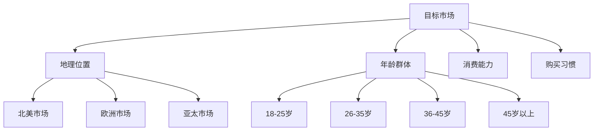

# Shopify独立站搭建完全指南

## 目录

1. [前期准备](#前期准备)
2. [Shopify账户设置](#shopify账户设置)
3. [主题选择与定制](#主题选择与定制)
4. [产品上传与管理](#产品上传与管理)
5. [支付与物流设置](#支付与物流设置)
6. [SEO优化设置](#seo优化设置)
7. [营销工具配置](#营销工具配置)
8. [网站测试与上线](#网站测试与上线)
9. [运营优化建议](#运营优化建议)

## 前期准备

### 市场调研与定位

在开始搭建之前，需要明确以下关键问题：

#### 目标市场分析



#### 竞争对手分析

| 分析维度 | 关键指标 | 评估方法 |
|---------|---------|---------|
| 产品定价 | 价格区间、促销策略 | 直接调研 |
| 网站设计 | UI/UX、功能特性 | 用户体验测试 |
| 营销策略 | 广告渠道、内容营销 | 社媒监控 |
| 客户服务 | 响应时间、服务质量 | 客户反馈 |

### 品牌策划

#### 品牌命名原则

- **简洁易记**：2-3个音节最佳
- **含义明确**：体现产品特性或价值
- **国际化考虑**：避免文化敏感词汇
- **域名可用**：确保.com域名可注册

#### 视觉识别系统

```css
/* 品牌色彩方案示例 */
:root {
  --primary-color: #2563eb;    /* 主品牌色 */
  --secondary-color: #7c3aed;  /* 辅助色 */
  --accent-color: #f59e0b;     /* 强调色 */
  --neutral-dark: #1f2937;     /* 深色文字 */
  --neutral-light: #f9fafb;    /* 浅色背景 */
}
```

## Shopify账户设置

### 账户注册

#### 步骤详解

1. **访问Shopify官网**
   - 地址：https://www.shopify.com
   - 选择免费试用（14天）

2. **基本信息填写**
   ```javascript
   // 注册信息示例
   const registrationInfo = {
     email: 'your-business@email.com',
     password: 'SecurePassword123!',
     storeName: 'Your Store Name',
     storeURL: 'your-store-name.myshopify.com'
   };
   ```

3. **商店基本设置**
   - 商店名称
   - 商店地址
   - 货币设置
   - 时区配置

### 计划选择

#### Shopify计划对比

| 计划类型 | 月费 | 交易费率 | 适用场景 |
|---------|------|---------|---------|
| Basic | $29 | 2.9% + 30¢ | 初创企业 |
| Shopify | $79 | 2.6% + 30¢ | 成长企业 |
| Advanced | $299 | 2.4% + 30¢ | 大型企业 |
| Plus | $2000+ | 协商 | 企业级 |

**推荐策略：**
- 新手卖家：从Basic开始
- 月销售额超过$3000：升级到Shopify
- 月销售额超过$10000：考虑Advanced

### 域名设置

#### 域名购买建议

1. **首选.com域名**
2. **避免特殊字符和数字**
3. **考虑品牌保护**（同时注册.net, .org）
4. **国际化考虑**（注册当地后缀）

#### DNS配置

```bash
# DNS记录配置示例
# A记录
@ IN A 23.227.38.65

# CNAME记录  
www IN CNAME shops.myshopify.com.

# 子域名设置
blog IN CNAME your-store.myshopify.com.
```

## 主题选择与定制

### 主题选择策略

#### 免费主题 vs 付费主题

**免费主题特点：**
- ✅ 零成本
- ✅ Shopify官方支持
- ❌ 功能相对简单
- ❌ 定制选项有限

**付费主题优势：**
- ✅ 功能丰富
- ✅ 设计专业
- ✅ 定制性强
- ❌ 成本较高（$100-$300）

#### 推荐主题

**免费主题：**
1. **Dawn** - 现代简洁，适合所有品类
2. **Craft** - 适合手工艺品
3. **Sense** - 适合时尚品牌

**付费主题：**
1. **Impulse** - 高转化率设计
2. **Turbo** - 加载速度快
3. **Warehouse** - 适合大型目录

### 主题定制

#### 基础定制设置

```liquid
<!-- Liquid模板语言示例 -->
<div class="product-card">
  
  <h3>{{ product.title }}</h3>
  <p class="price">{{ product.price | money }}</p>
  <button class="btn-primary">
    {{ 'products.product.add_to_cart' | t }}
  </button>
</div>
```

#### 颜色与字体设置

```css
/* 主题定制CSS */
.site-header {
  background-color: var(--primary-color);
  font-family: 'Roboto', sans-serif;
}

.product-title {
  font-size: 24px;
  font-weight: 600;
  color: var(--neutral-dark);
}

.price {
  font-size: 20px;
  font-weight: 700;
  color: var(--accent-color);
}
```

#### 自定义代码添加

**Google Analytics集成：**
```html
<!-- Google Analytics 4 -->
<script async src="https://www.googletagmanager.com/gtag/js?id=GA_MEASUREMENT_ID"></script>
<script>
  window.dataLayer = window.dataLayer || [];
  function gtag(){dataLayer.push(arguments);}
  gtag('js', new Date());
  gtag('config', 'GA_MEASUREMENT_ID');
</script>
```

**Facebook Pixel集成：**
```html
<!-- Facebook Pixel Code -->
<script>
!function(f,b,e,v,n,t,s)
{if(f.fbq)return;n=f.fbq=function(){n.callMethod?
n.callMethod.apply(n,arguments):n.queue.push(arguments)};
if(!f._fbq)f._fbq=n;n.push=n;n.loaded=!0;n.version='2.0';
n.queue=[];t=b.createElement(e);t.async=!0;
t.src=v;s=b.getElementsByTagName(e)[0];
s.parentNode.insertBefore(t,s)}(window, document,'script',
'https://connect.facebook.net/en_US/fbevents.js');
fbq('init', 'YOUR_PIXEL_ID');
fbq('track', 'PageView');
</script>
```

## 产品上传与管理

### 产品信息架构

#### 产品标题优化

**标题公式：**
```
品牌名 + 产品类型 + 关键特征 + 规格/颜色
```

**示例：**
- ❌ 差例：Red Shoes
- ✅ 优例：Nike Air Max 270 Men's Running Shoes - Breathable Mesh Upper - Red/Black - Size 10

#### 产品描述结构

```markdown
## 产品亮点
- 核心卖点1
- 核心卖点2  
- 核心卖点3

## 产品详情
[详细功能介绍]

## 规格参数
| 属性 | 值 |
|------|-----|
| 材质 | [材质信息] |
| 尺寸 | [尺寸信息] |
| 重量 | [重量信息] |

## 使用说明
[使用指导]

## 售后服务
[保修政策]
```

### 产品图片优化

#### 图片规格要求

| 用途 | 推荐尺寸 | 格式 | 文件大小 |
|------|---------|------|---------|
| 主图 | 2048x2048px | JPG/PNG | <500KB |
| 详情图 | 1024x1024px | JPG | <300KB |
| Banner | 1920x600px | JPG | <800KB |

#### 图片SEO优化

```html
<!-- 图片SEO最佳实践 -->

```

### 库存管理

#### 库存跟踪设置

```javascript
// 库存管理逻辑示例
const inventoryManagement = {
  // 低库存预警
  lowStockAlert: (quantity, threshold = 10) => {
    return quantity <= threshold;
  },
  
  // 自动下架
  autoHide: (quantity) => {
    return quantity === 0;
  },
  
  // 预售管理
  preOrder: (launchDate) => {
    return new Date() < new Date(launchDate);
  }
};
```

## 支付与物流设置

### 支付网关配置

#### 主流支付方式

**信用卡支付：**
- Shopify Payments（推荐）
- Stripe
- PayPal

**数字钱包：**
- Apple Pay
- Google Pay
- Shop Pay

**本地化支付：**
- Alipay（支付宝）
- WeChat Pay（微信支付）
- Klarna（先买后付）

#### Shopify Payments设置

```javascript
// 支付配置示例
const paymentConfig = {
  gateway: 'shopify_payments',
  accepted_cards: ['visa', 'mastercard', 'amex', 'discover'],
  currency: 'USD',
  test_mode: false,
  capture_method: 'automatic',
  // 3D安全验证
  three_d_secure: true
};
```

### 税务设置

#### 美国税务配置

```javascript
// 美国销售税配置
const usTaxConfig = {
  // 各州税率
  states: {
    'CA': 0.0725,  // 加利福尼亚州
    'NY': 0.08,    // 纽约州
    'TX': 0.0625,  // 德克萨斯州
    'FL': 0.06     // 佛罗里达州
  },
  // 税务登记州
  nexus_states: ['CA', 'NY'],
  // 免税产品
  tax_exempt_products: ['books', 'groceries']
};
```

### 物流配置

#### 运费策略

**免运费策略：**
```javascript
// 免运费条件设置
const freeShippingRules = [
  {
    condition: 'order_amount',
    threshold: 50,  // 满$50免运费
    regions: ['US', 'CA']
  },
  {
    condition: 'product_tags',
    tags: ['free-shipping'],
    regions: ['worldwide']
  }
];
```

**分级运费：**
| 订单金额 | 美国境内 | 国际运费 |
|---------|---------|---------|
| $0-$25 | $5.99 | $15.99 |
| $25-$50 | $3.99 | $12.99 |
| $50+ | 免费 | $8.99 |

#### 第三方物流集成

**推荐3PL服务商：**
1. **Fulfillment by Amazon (FBA)**
2. **ShipBob**
3. **Easyship**
4. **ShipStation**

## SEO优化设置

### 技术SEO

#### 网站结构优化

```html
<!-- URL结构优化 -->
正确示例：
https://yourstore.com/collections/mens-shoes/products/nike-air-max-270

错误示例：
https://yourstore.com/products/123456789
```

#### 网站速度优化

```javascript
// 图片懒加载实现
const lazyImages = document.querySelectorAll('img[data-src]');
const imageObserver = new IntersectionObserver((entries) => {
  entries.forEach(entry => {
    if (entry.isIntersecting) {
      const img = entry.target;
      img.src = img.dataset.src;
      img.classList.remove('lazy');
      imageObserver.unobserve(img);
    }
  });
});

lazyImages.forEach(img => imageObserver.observe(img));
```

### 内容SEO

#### 页面优化清单

**首页优化：**
- [ ] 标题标签（50-60字符）
- [ ] 描述标签（150-160字符）
- [ ] H1标签唯一且包含主关键词
- [ ] 结构化数据标记

**产品页优化：**
```html
<!-- 产品页面SEO模板 -->
<title>{{ product.title }} | {{ shop.name }}</title>
<meta name="description" content="{{ product.description | strip_html | truncate: 160 }}">

<!-- 结构化数据 -->
<script type="application/ld+json">
{
  "@context": "https://schema.org/",
  "@type": "Product",
  "name": "{{ product.title }}",
  "image": "{{ product.featured_image | img_url: 'master' }}",
  "description": "{{ product.description | strip_html }}",
  "brand": {
    "@type": "Brand",
    "name": "{{ product.vendor }}"
  },
  "offers": {
    "@type": "Offer",
    "url": "{{ shop.url }}{{ product.url }}",
    "priceCurrency": "{{ cart.currency.iso_code }}",
    "price": "{{ product.price | money_without_currency }}",
    "availability": "https://schema.org/InStock"
  }
}
</script>
```

### 内容营销

#### 博客策略

**内容规划：**
1. **产品相关内容**（40%）
2. **行业知识分享**（30%）
3. **用户故事案例**（20%）
4. **公司新闻动态**（10%）

**SEO文章模板：**
```markdown
# 主标题（包含目标关键词）

## 引言
[问题描述和解决方案预览]

## 主要内容
### 子标题1
[详细内容]

### 子标题2  
[详细内容]

## 产品推荐
[相关产品自然植入]

## 总结
[要点回顾和行动号召]
```

## 营销工具配置

### 邮件营销

#### Klaviyo集成设置

```javascript
// Klaviyo事件跟踪
klaviyo.track('Viewed Product', {
  'ProductName': '{{ product.title }}',
  'ProductID': '{{ product.id }}',
  'Categories': {{ product.tags | json }},
  'ImageURL': '{{ product.featured_image | img_url: "grande" }}',
  'URL': '{{ shop.secure_url }}{{ product.url }}',
  'Brand': '{{ product.vendor }}',
  'Price': {{ product.price }},
  'CompareAtPrice': {{ product.compare_at_price }}
});
```

#### 自动化邮件序列

**欢迎序列（3封邮件）：**
1. **即时发送**：欢迎邮件 + 优惠码
2. **3天后**：品牌故事 + 热销产品
3. **7天后**：用户评价 + 社交证明

**弃车挽回序列（4封邮件）：**
1. **1小时后**：提醒完成购买
2. **24小时后**：提供5%折扣
3. **3天后**：提供10%折扣
4. **7天后**：最后机会 + 客服联系

### 社交媒体集成

#### Instagram Shopping设置

```html
<!-- Instagram产品标签 -->
<meta property="product:price:amount" content="{{ product.price | money_without_currency }}">
<meta property="product:price:currency" content="{{ cart.currency.iso_code }}">
<meta property="product:availability" content="in stock">
<meta property="product:condition" content="new">
```

#### Facebook Shop同步

```javascript
// Facebook Catalog同步
const facebookCatalog = {
  id: '{{ product.id }}',
  title: '{{ product.title }}',
  description: '{{ product.description | strip_html | truncate: 5000 }}',
  availability: '{{ product.available | ? "in stock" : "out of stock" }}',
  condition: 'new',
  price: '{{ product.price | money_without_currency }} {{ cart.currency.iso_code }}',
  link: '{{ shop.secure_url }}{{ product.url }}',
  image_link: '{{ product.featured_image | img_url: "master" }}',
  brand: '{{ product.vendor }}',
  google_product_category: '{{ product.product_type }}'
};
```

### 客户服务工具

#### 在线客服集成

**推荐工具：**
1. **Zendesk Chat**
2. **Intercom**
3. **Tidio**
4. **Gorgias**

```javascript
// 客服工具集成示例（Tidio）
window.tidioChatApi = {
  on: function(event, callback) {
    // 事件监听
  },
  show: function() {
    // 显示聊天窗口
  },
  hide: function() {
    // 隐藏聊天窗口
  }
};
```

## 网站测试与上线

### 功能测试清单

#### 购物流程测试

```javascript
// 自动化测试脚本示例
const purchaseFlowTest = async () => {
  // 1. 浏览产品
  await page.goto('/collections/all');
  
  // 2. 添加到购物车
  await page.click('.product-card:first-child');
  await page.click('#add-to-cart');
  
  // 3. 查看购物车
  await page.click('.cart-icon');
  
  // 4. 结账流程
  await page.click('#checkout-button');
  
  // 5. 填写信息
  await page.fill('#email', 'test@example.com');
  await page.fill('#shipping-address', '123 Test St');
  
  // 6. 支付测试
  await page.fill('#card-number', '4242424242424242');
  await page.fill('#expiry', '12/25');
  await page.fill('#cvc', '123');
};
```

#### 移动端适配测试

**测试设备：**
- iPhone (Safari)
- Android (Chrome)
- iPad (Safari)

**关键测试点：**
- 页面加载速度
- 触摸操作友好性
- 表单填写体验
- 支付流程顺畅性

### 性能优化

#### 网站速度优化

```javascript
// 关键性能指标监控
const performanceMetrics = {
  // 首次内容渲染
  FCP: performance.getEntriesByType('paint')
    .find(entry => entry.name === 'first-contentful-paint')?.startTime,
  
  // 最大内容渲染
  LCP: new PerformanceObserver((list) => {
    const entries = list.getEntries();
    const lastEntry = entries[entries.length - 1];
    console.log('LCP:', lastEntry.startTime);
  }),
  
  // 累积布局偏移
  CLS: new PerformanceObserver((list) => {
    let clsScore = 0;
    for (const entry of list.getEntries()) {
      if (!entry.hadRecentInput) {
        clsScore += entry.value;
      }
    }
    console.log('CLS:', clsScore);
  })
};
```

#### 图片优化

```liquid
<!-- 响应式图片实现 -->
<picture>
  <source media="(max-width: 767px)" 
          srcset="{{ product.featured_image | img_url: '600x600' }}">
  <source media="(max-width: 1023px)" 
          srcset="{{ product.featured_image | img_url: '800x800' }}">
  
</picture>
```

### 上线前检查

#### 最终检查清单

**内容检查：**
- [ ] 所有页面内容完整
- [ ] 联系信息正确
- [ ] 法律页面完善（隐私政策、服务条款）
- [ ] 产品信息准确

**功能检查：**
- [ ] 购物车功能正常
- [ ] 支付流程顺畅
- [ ] 邮件通知正常
- [ ] 搜索功能正常

**SEO检查：**
- [ ] 所有页面标题和描述优化
- [ ] 图片alt标签完整
- [ ] sitemap.xml提交
- [ ] Google Analytics配置

## 运营优化建议

### 数据分析

#### 关键指标监控

```javascript
// Google Analytics事件跟踪
gtag('event', 'add_to_cart', {
  currency: 'USD',
  value: {{ product.price | money_without_currency }},
  items: [{
    item_id: '{{ product.id }}',
    item_name: '{{ product.title }}',
    category: '{{ product.type }}',
    quantity: 1,
    price: {{ product.price | money_without_currency }}
  }]
});
```

**核心KPI指标：**
- 转化率目标：2-3%
- 平均订单价值：根据行业基准
- 购物车放弃率：<70%
- 客户生命周期价值：>获客成本3倍

### 转化率优化

#### A/B测试策略

**测试要素：**
1. **产品页面**
   - 按钮颜色和文案
   - 产品图片展示方式
   - 价格展示格式

2. **结账页面**
   - 表单字段数量
   - 支付选项排序
   - 信任标识显示

```javascript
// A/B测试实现示例
const abTest = {
  variant: Math.random() < 0.5 ? 'A' : 'B',
  
  init() {
    if (this.variant === 'A') {
      document.querySelector('.cta-button').textContent = 'Buy Now';
      document.querySelector('.cta-button').style.backgroundColor = '#ff6b6b';
    } else {
      document.querySelector('.cta-button').textContent = 'Add to Cart';
      document.querySelector('.cta-button').style.backgroundColor = '#4ecdc4';
    }
    
    // 记录测试参与
    gtag('event', 'ab_test_view', {
      test_name: 'cta_button_test',
      variant: this.variant
    });
  }
};
```

### 持续优化

#### 月度优化清单

**第一周：数据分析**
- 分析上月销售数据
- 识别表现最佳/最差产品
- 分析流量来源效果

**第二周：内容优化**
- 更新表现差的产品描述
- 优化图片质量
- 更新SEO元数据

**第三周：营销优化**
- 调整广告投放策略
- 优化邮件营销序列
- 更新社交媒体内容

**第四周：技术优化**
- 检查网站速度
- 修复发现的Bug
- 更新应用和插件

## 总结

搭建一个成功的Shopify独立站需要综合考虑技术、营销、运营等多个方面。关键成功要素包括：

**核心要点：**
1. **用户体验至上**：确保网站快速、易用、美观
2. **数据驱动决策**：建立完善的分析体系
3. **持续优化迭代**：根据数据反馈不断改进
4. **多渠道营销**：整合各种流量来源
5. **客户关系维护**：重视客户服务和复购

**成功预期时间线：**
- **第1个月**：网站搭建完成，开始运营
- **第3个月**：流量和销售趋于稳定
- **第6个月**：实现盈利目标
- **第12个月**：建立可持续的增长模式

记住，独立站的成功不仅在于技术实现，更在于持续的运营和优化。保持学习和适应市场变化的能力是长期成功的关键。