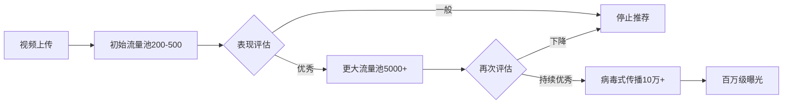

# TikTok内容创作策略：打造爆款短视频的完整方法论

## 引言

TikTok已成为全球最具影响力的短视频平台，月活用户超过15亿。掌握TikTok的内容创作策略，不仅能帮助你快速涨粉，更能开启全新的商业机遇。

## 第一章：理解TikTok算法

### 1.1 推荐算法核心机制

**算法评分因素：**

| 因素 | 权重 | 优化策略 |
|------|------|----------|
| 完播率 | ⭐⭐⭐⭐⭐ | 前3秒抓住注意力 |
| 互动率 | ⭐⭐⭐⭐⭐ | 引导点赞评论分享 |
| 重复观看 | ⭐⭐⭐⭐ | 制造悬念和反转 |
| 分享率 | ⭐⭐⭐⭐ | 情感共鸣内容 |
| 关注转化 | ⭐⭐⭐ | 展示持续价值 |
| 观看时长 | ⭐⭐⭐ | 优化视频节奏 |

**算法运作流程：**



### 1.2 内容分类与定位

**热门内容类型分析：**

```python
class TikTokContentAnalyzer:
    def __init__(self):
        self.content_categories = {
            'education': {
                'subcategories': ['技能教学', '知识科普', '生活窍门'],
                'avg_engagement': 8.5,
                'viral_potential': 'high',
                'monetization': 'course_sales'
            },
            'entertainment': {
                'subcategories': ['搞笑段子', '才艺展示', '情景剧'],
                'avg_engagement': 12.3,
                'viral_potential': 'very_high',
                'monetization': 'brand_deals'
            },
            'lifestyle': {
                'subcategories': ['美食烹饪', '时尚美妆', '旅行探店'],
                'avg_engagement': 9.7,
                'viral_potential': 'high',
                'monetization': 'affiliate_links'
            },
            'business': {
                'subcategories': ['创业经验', '职场技巧', '财务理财'],
                'avg_engagement': 6.8,
                'viral_potential': 'medium',
                'monetization': 'consulting'
            }
        }
    
    def recommend_niche(self, creator_profile):
        """推荐适合的细分领域"""
        skills = creator_profile['skills']
        interests = creator_profile['interests']
        goals = creator_profile['goals']
        
        scores = {}
        for category, data in self.content_categories.items():
            score = self.calculate_match_score(
                skills, interests, goals, data
            )
            scores[category] = score
        
        return max(scores, key=scores.get)
```

## 第二章：爆款内容创作公式

### 2.1 黄金3秒法则

**开场钩子设计：**

```javascript
// 高吸引力开场模板
const openingHooks = {
    // 1. 问题式开场
    question: [
        "你知道为什么95%的人都做错了吗？",
        "如果我告诉你这个方法能让你月入过万...",
        "大部分人不知道的秘密是..."
    ],
    
    // 2. 冲突式开场
    conflict: [
        "老板说这不可能，但我做到了",
        "所有人都说我疯了，直到他们看到结果",
        "我用这个方法，3天涨粉10万"
    ],
    
    // 3. 情感式开场
    emotion: [
        "这是我人生中最难忘的时刻...",
        "当我看到这个结果时，我哭了",
        "你们的评论改变了我的生活"
    ],
    
    // 4. 价值承诺式
    value_promise: [
        "看完这条视频，你将学会...",
        "这个方法帮我节省了80%的时间",
        "免费教你年入百万的技能"
    ],
    
    // 5. 悬念式开场
    suspense: [
        "等一下，你绝对想不到接下来发生了什么",
        "这个视频的最后有彩蛋",
        "看到30秒的人都惊呆了"
    ]
};

function selectBestHook(contentType, targetAudience) {
    // 基于内容类型和受众选择最佳开场
    const hookStrategies = {
        'education': ['value_promise', 'question'],
        'entertainment': ['conflict', 'suspense'],
        'lifestyle': ['emotion', 'value_promise'],
        'business': ['question', 'conflict']
    };
    
    return hookStrategies[contentType];
}
```

### 2.2 内容结构设计

**完整视频脚本框架：**

```python
class TikTokScriptBuilder:
    def __init__(self):
        self.optimal_duration = {
            'quick_tip': (15, 21),      # 15-21秒
            'tutorial': (30, 45),        # 30-45秒
            'story': (45, 60),           # 45-60秒
            'deep_dive': (60, 90)        # 60-90秒
        }
    
    def generate_script(self, content_type, main_idea):
        """生成视频脚本"""
        script = {
            'hook': self.create_hook(content_type, main_idea),
            'body': self.structure_body(content_type, main_idea),
            'climax': self.build_climax(main_idea),
            'cta': self.craft_cta(content_type)
        }
        
        return self.optimize_timing(script)
    
    def create_hook(self, content_type, main_idea):
        """创建吸引力开场"""
        hooks = {
            'tutorial': f"想学{main_idea}？只需3步！",
            'story': f"我永远不会忘记{main_idea}的那一天...",
            'tip': f"这个{main_idea}的技巧，99%的人不知道",
            'reveal': f"关于{main_idea}，我要说实话了..."
        }
        
        return hooks.get(content_type, f"关于{main_idea}...")
    
    def structure_body(self, content_type, main_idea):
        """构建主体内容"""
        structures = {
            'tutorial': [
                '第一步：[具体操作]',
                '第二步：[关键技巧]',
                '第三步：[验证结果]'
            ],
            'story': [
                '背景设定：建立情境',
                '冲突展开：制造张力',
                '高潮转折：意外发展'
            ],
            'comparison': [
                '错误做法：展示问题',
                '正确方法：提供解决方案',
                '结果对比：证明效果'
            ]
        }
        
        return structures.get(content_type, ['要点1', '要点2', '要点3'])
    
    def build_climax(self, main_idea):
        """构建高潮部分"""
        climax_templates = [
            f"结果让所有人都惊呆了：{main_idea}",
            f"这就是{main_idea}的秘密所在",
            f"没想到{main_idea}竟然这么简单"
        ]
        
        return climax_templates[0]
    
    def craft_cta(self, content_type):
        """设计行动号召"""
        ctas = {
            'engagement': "评论区告诉我你的想法！",
            'follow': "关注我学习更多技巧",
            'share': "分享给需要的朋友",
            'series': "第二集更精彩，记得关注"
        }
        
        return ctas
```

### 2.3 视觉呈现技巧

**拍摄与剪辑策略：**

```css
/* TikTok视频制作规范 */
.tiktok-video-specs {
    /* 技术规格 */
    resolution: 1080px × 1920px;
    aspect-ratio: 9:16;
    frame-rate: 30fps;
    max-duration: 10min;
    optimal-duration: 21-34s;
    
    /* 视觉设计 */
    composition: vertical-oriented;
    text-size: 60px+;
    text-position: center-top | center-bottom;
    safe-zone: 120px from edges;
    
    /* 色彩运用 */
    contrast: high;
    saturation: vibrant;
    color-psychology: emotion-driven;
}

.editing-techniques {
    /* 剪辑技巧 */
    cut-frequency: every 3-5s;
    transition-style: quick-cuts;
    text-animation: dynamic;
    sound-effects: strategic;
    
    /* 节奏控制 */
    tempo: fast-paced;
    beat-sync: music-aligned;
    pause-points: minimal;
}
```

**特效使用指南：**

```javascript
// TikTok特效策略
const effectsStrategy = {
    trending_effects: {
        usage: '借助热门特效获得流量',
        timing: '特效上线后24-48小时内使用',
        combination: '结合创意玩法，不要照搬'
    },
    
    transitions: {
        types: ['snap_transition', 'zoom_transition', 'swipe_transition'],
        frequency: '每5-10秒一次',
        purpose: '保持视觉吸引力'
    },
    
    text_effects: {
        font_choices: ['粗体', '手写体', '霓虹风格'],
        animation: ['弹出', '飞入', '打字效果'],
        timing: '与语音同步'
    },
    
    filters: {
        beauty_filters: '适度使用，保持真实',
        color_grading: '统一品牌色调',
        trending_filters: '跟随热点但保持个性'
    }
};
```

## 第三章：数据分析与优化

### 3.1 关键指标监控

**数据分析仪表板：**

```python
class TikTokAnalytics:
    def __init__(self, account_id):
        self.account_id = account_id
        self.key_metrics = [
            'video_views',
            'profile_views',
            'likes',
            'comments',
            'shares',
            'followers_gained',
            'avg_watch_time'
        ]
    
    def analyze_video_performance(self, video_id):
        """分析单个视频表现"""
        metrics = self.fetch_video_metrics(video_id)
        
        analysis = {
            'completion_rate': metrics['avg_watch_time'] / metrics['duration'],
            'engagement_rate': (metrics['likes'] + metrics['comments'] + metrics['shares']) / metrics['views'],
            'share_rate': metrics['shares'] / metrics['views'],
            'follow_conversion': metrics['followers_gained'] / metrics['profile_views'],
            'viral_score': self.calculate_viral_score(metrics)
        }
        
        return analysis
    
    def calculate_viral_score(self, metrics):
        """计算病毒传播分数"""
        weights = {
            'completion_rate': 0.3,
            'share_rate': 0.3,
            'engagement_rate': 0.2,
            'rewatch_rate': 0.2
        }
        
        score = sum(
            metrics[metric] * weight 
            for metric, weight in weights.items()
        )
        
        return score * 100
    
    def identify_best_posting_times(self):
        """识别最佳发布时间"""
        historical_data = self.fetch_historical_performance()
        
        time_analysis = {}
        for hour in range(24):
            posts_at_hour = [
                post for post in historical_data 
                if post['published_hour'] == hour
            ]
            
            if posts_at_hour:
                avg_performance = sum(
                    post['engagement_rate'] for post in posts_at_hour
                ) / len(posts_at_hour)
                
                time_analysis[hour] = avg_performance
        
        # 找出表现最好的3个时间段
        best_times = sorted(
            time_analysis.items(), 
            key=lambda x: x[1], 
            reverse=True
        )[:3]
        
        return best_times
```

### 3.2 A/B测试策略

**内容测试框架：**

```python
class ContentTester:
    def __init__(self):
        self.test_variables = [
            'hook_style',
            'video_length',
            'music_choice',
            'caption_style',
            'hashtag_strategy',
            'posting_time'
        ]
    
    def run_ab_test(self, video_concept, variants):
        """执行A/B测试"""
        test_plan = {
            'variant_a': {
                'hook': '问题式开场',
                'duration': 21,
                'music': '热门音乐',
                'caption': '简短疑问句',
                'hashtags': '3个热门+2个精准'
            },
            'variant_b': {
                'hook': '冲突式开场',
                'duration': 34,
                'music': '原创音效',
                'caption': '故事性描述',
                'hashtags': '5个精准小众'
            }
        }
        
        # 发布两个版本
        results = self.publish_variants(test_plan)
        
        # 48小时后分析结果
        winner = self.analyze_test_results(results)
        
        return winner
    
    def optimize_based_on_results(self, test_results):
        """基于测试结果优化"""
        insights = []
        
        if test_results['winner']['completion_rate'] > 0.8:
            insights.append({
                'finding': '高完播率',
                'action': '保持当前视频时长和节奏'
            })
        
        if test_results['winner']['share_rate'] > 0.05:
            insights.append({
                'finding': '高分享率',
                'action': '复制情感共鸣元素'
            })
        
        return insights
```

## 第四章：涨粉增长策略

### 4.1 内容矩阵规划

**7天内容日历：**

```yaml
weekly_content_matrix:
  monday:
    type: 教育类
    format: 技巧分享
    goal: 提供价值
    hashtags: ['学习', '技巧', '教程']
    
  tuesday:
    type: 互动类
    format: 问答挑战
    goal: 增强互动
    hashtags: ['挑战', '互动', '问答']
    
  wednesday:
    type: 趋势类
    format: 热点跟进
    goal: 获取流量
    hashtags: [热门话题, '跟拍', '趋势']
    
  thursday:
    type: 个人类
    format: 幕后花絮
    goal: 建立连接
    hashtags: ['日常', '分享', '真实']
    
  friday:
    type: 娱乐类
    format: 轻松搞笑
    goal: 放松娱乐
    hashtags: ['周末', '娱乐', '搞笑']
    
  saturday:
    type: 合作类
    format: 与其他创作者合作
    goal: 交叉推广
    hashtags: ['合作', '联动', '跨界']
    
  sunday:
    type: 总结类
    format: 一周回顾
    goal: 社区建设
    hashtags: ['总结', '回顾', '感谢']
```

### 4.2 话题标签策略

**标签优化系统：**

```python
class HashtagOptimizer:
    def __init__(self):
        self.hashtag_categories = {
            'mega': 1000000000,   # 10亿+浏览量
            'macro': 100000000,   # 1亿-10亿
            'mid': 10000000,      # 1千万-1亿
            'micro': 1000000,     # 100万-1千万
            'nano': 100000        # 10万-100万
        }
    
    def generate_hashtag_strategy(self, video_topic, current_followers):
        """生成标签策略"""
        if current_followers < 1000:
            # 小账号策略：避开超级热门
            strategy = {
                'mega': 0,
                'macro': 1,
                'mid': 2,
                'micro': 3,
                'nano': 4
            }
        elif current_followers < 10000:
            # 中等账号：平衡策略
            strategy = {
                'mega': 1,
                'macro': 2,
                'mid': 3,
                'micro': 2,
                'nano': 2
            }
        else:
            # 大账号：可以冲击热门
            strategy = {
                'mega': 2,
                'macro': 3,
                'mid': 2,
                'micro': 2,
                'nano': 1
            }
        
        return self.select_hashtags(video_topic, strategy)
    
    def select_hashtags(self, topic, strategy):
        """选择具体标签"""
        hashtags = {
            'branded': f"#{self.account_name}",
            'content': self.find_relevant_tags(topic),
            'trending': self.get_trending_tags(),
            'community': self.get_community_tags(topic)
        }
        
        # 根据策略组合标签
        final_hashtags = []
        for category, count in strategy.items():
            tags = self.filter_by_size(hashtags['content'], category)
            final_hashtags.extend(tags[:count])
        
        return final_hashtags
```

### 4.3 协作与联动

**KOL合作框架：**

```javascript
// 创作者合作策略
const collaborationStrategy = {
    // 找到合适的合作者
    findCollaborators(yourNiche, yourFollowers) {
        const criteria = {
            niche_alignment: '内容相关或互补',
            follower_range: yourFollowers * [0.5, 2], // 50%-200%的粉丝量
            engagement_rate: '> 5%',
            content_quality: 'high',
            audience_overlap: '< 30%' // 避免受众重复
        };
        
        return this.searchCreators(criteria);
    },
    
    // 合作形式
    collaborationFormats: {
        duet: {
            description: '对唱/反应视频',
            benefit: '双方粉丝都能看到',
            effort: 'low',
            effectiveness: 'medium'
        },
        
        stitch: {
            description: '拼接视频',
            benefit: '延伸话题讨论',
            effort: 'low',
            effectiveness: 'medium'
        },
        
        joint_video: {
            description: '共同出镜',
            benefit: '深度互动，粉丝交叉',
            effort: 'high',
            effectiveness: 'very_high'
        },
        
        challenge: {
            description: '发起联合挑战',
            benefit: '病毒式传播',
            effort: 'medium',
            effectiveness: 'high'
        },
        
        series: {
            description: '系列合作内容',
            benefit: '长期曝光，建立品牌',
            effort: 'very_high',
            effectiveness: 'very_high'
        }
    },
    
    // 合作流程
    collaborationProcess: [
        '1. 研究潜在合作者',
        '2. 私信或邮件联系',
        '3. 讨论合作创意',
        '4. 明确内容方向和分工',
        '5. 制定发布时间表',
        '6. 共同创作内容',
        '7. 同步发布并互相推广',
        '8. 分析合作效果',
        '9. 维护长期关系'
    ]
};
```

## 第五章：变现与商业化

### 5.1 TikTok变现途径

**收入来源矩阵：**

| 变现方式 | 粉丝门槛 | 收入潜力 | 难度 | 时间投入 |
|----------|----------|----------|------|----------|
| 创作者基金 | 10K+ | $50-200/月 | ⭐ | ⭐ |
| 直播打赏 | 1K+ | $100-5K/月 | ⭐⭐ | ⭐⭐⭐⭐ |
| 品牌合作 | 10K+ | $500-10K/单 | ⭐⭐⭐ | ⭐⭐⭐ |
| 联盟营销 | 5K+ | $200-2K/月 | ⭐⭐ | ⭐⭐ |
| 自有产品 | 任意 | $1K-50K/月 | ⭐⭐⭐⭐⭐ | ⭐⭐⭐⭐⭐ |
| TikTok Shop | 5K+ | $500-20K/月 | ⭐⭐⭐⭐ | ⭐⭐⭐⭐ |

### 5.2 品牌合作指南

**合作报价计算：**

```python
class BrandDealCalculator:
    def __init__(self, account_metrics):
        self.followers = account_metrics['followers']
        self.avg_views = account_metrics['avg_views']
        self.engagement_rate = account_metrics['engagement_rate']
        
    def calculate_rate_card(self):
        """计算报价卡"""
        base_rate = self.calculate_base_rate()
        
        rate_card = {
            'single_video': {
                'in_feed_post': base_rate,
                'dedicated_video': base_rate * 1.5,
                'product_review': base_rate * 2
            },
            'content_package': {
                '3_videos': base_rate * 3 * 0.85,  # 15%折扣
                '5_videos': base_rate * 5 * 0.80,  # 20%折扣
                '10_videos': base_rate * 10 * 0.75 # 25%折扣
            },
            'additional_services': {
                'instagram_cross_post': base_rate * 0.3,
                'youtube_short': base_rate * 0.4,
                'usage_rights': base_rate * 0.5,
                'exclusivity': base_rate * 1.0
            }
        }
        
        return rate_card
    
    def calculate_base_rate(self):
        """计算基础报价"""
        # 方法1：基于粉丝数
        follower_rate = self.followers * 0.01  # 每1000粉丝$10
        
        # 方法2：基于观看量
        view_rate = self.avg_views * 0.005    # 每1000观看$5
        
        # 方法3：基于互动率
        engagement_bonus = self.engagement_rate * 100
        
        # 综合计算
        base_rate = (follower_rate + view_rate) * (1 + engagement_bonus)
        
        return max(base_rate, 100)  # 最低$100
```

### 5.3 TikTok Shop运营

**电商直播策略：**

```javascript
// TikTok Shop 直播运营
const liveStreamStrategy = {
    // 直播前准备
    preparation: {
        timing: '选择高峰时段：晚7-10点',
        duration: '规划90-120分钟',
        products: '准备5-10个产品',
        script: '设计直播脚本和话术',
        promotion: '提前24-48小时预告'
    },
    
    // 直播结构
    structure: {
        opening: {
            duration: '5分钟',
            content: ['欢迎观众', '介绍主题', '福利预告']
        },
        
        main_content: {
            duration: '70分钟',
            segments: [
                {
                    product_showcase: '15分钟',
                    activities: ['产品演示', '使用场景', '优惠介绍']
                },
                {
                    interaction: '5分钟',
                    activities: ['回答问题', '抽奖互动', '感谢打赏']
                }
            ],
            repeat: '循环3-4次'
        },
        
        closing: {
            duration: '15分钟',
            content: ['总结优惠', '最后抽奖', '预告下次']
        }
    },
    
    // 转化技巧
    conversionTactics: {
        scarcity: '限时限量优惠',
        urgency: '倒计时促销',
        social_proof: '展示销量和好评',
        bundling: '组合套餐优惠',
        flash_deals: '整点秒杀',
        giveaways: '满额赠品'
    },
    
    // 互动技巧
    engagementTricks: {
        call_viewer_names: '点名互动',
        ask_questions: '提问引导评论',
        run_contests: '实时抽奖',
        show_gratitude: '感谢打赏和购买',
        create_fomo: '制造紧迫感'
    }
};
```

## 第六章：进阶技巧

### 6.1 内容系列化

**系列内容规划：**

```python
class SeriesContentPlanner:
    def __init__(self):
        self.series_types = [
            '挑战系列',
            '教程系列',
            '故事系列',
            '评测系列',
            '问答系列'
        ]
    
    def create_series_plan(self, theme, episodes):
        """创建系列内容计划"""
        series = {
            'title': f"{theme}系列",
            'episodes': [],
            'release_schedule': 'weekly',
            'cross_promotion': True
        }
        
        for i in range(1, episodes + 1):
            episode = {
                'number': i,
                'title': f"{theme} 第{i}集",
                'hook': self.create_series_hook(i, episodes),
                'content': self.plan_episode_content(theme, i),
                'cta': self.create_series_cta(i, episodes)
            }
            series['episodes'].append(episode)
        
        return series
    
    def create_series_hook(self, episode_num, total_episodes):
        """创建系列钩子"""
        if episode_num == 1:
            return "这个系列会改变你的认知，记得关注看完整版"
        elif episode_num == total_episodes:
            return "系列最终集！结局让所有人意外"
        else:
            return f"第{episode_num}集来了！错过前几集的去主页补课"
```

### 6.2 多账号矩阵

**账号矩阵策略：**

```yaml
account_matrix_strategy:
  main_account:
    purpose: 个人品牌建设
    content_type: 综合内容
    posting_frequency: 每天1-2次
    monetization_focus: 品牌合作 + 课程销售
    
  niche_account_1:
    purpose: 垂直领域深耕
    content_type: 专业教程
    posting_frequency: 每天1次
    monetization_focus: 联盟营销
    
  entertainment_account:
    purpose: 流量获取
    content_type: 轻松娱乐
    posting_frequency: 每天2-3次
    monetization_focus: 创作者基金 + 直播
    
  behind_scenes:
    purpose: 粉丝深度连接
    content_type: 幕后花絮
    posting_frequency: 每周3-4次
    monetization_focus: 会员订阅
    
cross_promotion_strategy:
  - 主账号推广垂直账号
  - 娱乐账号导流主账号
  - 幕后账号增强粉丝粘性
  - 定期联动制造话题
```

### 6.3 危机处理

**负面评论应对：**

```python
class CommentManagement:
    def __init__(self):
        self.comment_types = {
            'constructive_criticism': '建设性批评',
            'trolling': '恶意攻击',
            'spam': '垃圾信息',
            'genuine_question': '真实问题',
            'positive_feedback': '正面反馈'
        }
    
    def handle_negative_comment(self, comment):
        """处理负面评论"""
        comment_type = self.classify_comment(comment)
        
        strategies = {
            'constructive_criticism': {
                'action': 'respond_thoughtfully',
                'template': "感谢你的反馈！你说得对，我会在下期改进。"
            },
            'trolling': {
                'action': 'ignore_or_hide',
                'template': None  # 不回应
            },
            'genuine_question': {
                'action': 'answer_helpfully',
                'template': "好问题！让我详细解释一下..."
            }
        }
        
        return strategies.get(comment_type, {'action': 'review_manually'})
    
    def create_positive_community(self):
        """营造积极社区氛围"""
        tactics = [
            '置顶正面评论',
            '回复前100条评论',
            '举办粉丝互动活动',
            '表彰优质贡献者',
            '设立社区规则'
        ]
        
        return tactics
```

## 总结与行动计划

### 30天TikTok增长计划

**第1-10天：基础建设**
- [ ] 完成账号定位和视觉设计
- [ ] 发布10个测试视频
- [ ] 找到3个表现最好的内容类型
- [ ] 建立内容创作流程

**第11-20天：优化迭代**
- [ ] 基于数据优化内容策略
- [ ] 尝试2-3个热门挑战
- [ ] 开始与其他创作者互动
- [ ] 达到1000粉丝里程碑

**第21-30天：规模化增长**
- [ ] 发起自己的话题挑战
- [ ] 进行首次品牌合作
- [ ] 建立发布时间表
- [ ] 规划系列内容

### 持续学习资源

**推荐工具：**
- 数据分析：TikTok Analytics, Pentos
- 视频编辑：CapCut, InShot, VN
- 灵感来源：TikTok Creative Center

**学习社区：**
- TikTok创作者门户
- 短视频运营交流群
- 行业峰会和工作坊

---

TikTok的成功需要创意、数据和执行力的完美结合。持续创作优质内容，深入理解平台算法，积极与社区互动，你一定能在这个平台上找到属于自己的位置！

*开始你的TikTok创作之旅吧！*