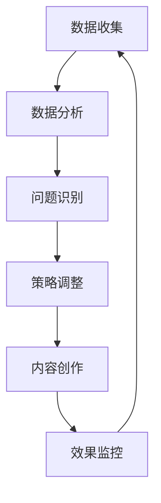

# TikTok Shop运营技巧完全指南

## 目录

1. [TikTok Shop平台概览](#tiktok-shop平台概览)
2. [店铺设置与优化](#店铺设置与优化)
3. [产品选择策略](#产品选择策略)
4. [内容营销技巧](#内容营销技巧)
5. [直播带货实战](#直播带货实战)
6. [流量获取与转化](#流量获取与转化)
7. [数据分析与优化](#数据分析与优化)
8. [常见问题解决](#常见问题解决)

---

## TikTok Shop平台概览

### 平台特点与优势

TikTok Shop作为短视频平台TikTok的电商功能，具有以下独特优势：

- **庞大用户基数**：全球超过10亿月活跃用户
- **年轻化用户群体**：Z世代和千禧一代为主要用户
- **强大算法推荐**：基于兴趣的精准内容分发
- **沉浸式购物体验**：视频+购物的无缝结合
- **社交属性强**：用户互动性和传播性强

### 市场机遇分析


| 地区 | 用户规模 | 增长率 | 主要品类 |
|------|----------|--------|----------|
| 东南亚 | 3.2亿 | +45% | 时尚、美妆、3C |
| 北美 | 1.5亿 | +32% | 家居、运动、宠物 |
| 欧洲 | 1.8亿 | +28% | 美妆、服装、配饰 |
| 拉美 | 1.1亿 | +55% | 时尚、电子、美妆 |


---

## 店铺设置与优化

### 基础设置清单

#### 1. 店铺信息完善

```markdown
✅ 店铺名称：简洁易记，体现品牌特色
✅ 店铺头像：高清品牌Logo或产品图
✅ 店铺简介：突出核心卖点和品牌故事
✅ 联系方式：完整的客服信息
✅ 营业执照：确保合规经营
```

#### 2. 店铺装修要点

- **视觉统一性**：保持品牌色调一致
- **产品分类**：清晰的商品分类结构
- **推荐商品**：精选热销或新品展示
- **品牌故事**：增加用户信任度

### 认证与权限申请

#### 官方认证流程

1. **基础资质准备**
   - 企业营业执照
   - 品牌授权书（如适用）
   - 产品质检报告
   - 银行开户许可证
2. **申请步骤**
   ```markdown
   第一步：登录TikTok Shop商家中心
   第二步：完善店铺基础信息
   第三步：上传相关资质文件
   第四步：等待平台审核（通常3-7个工作日）
   第五步：通过后激活店铺功能
   ```

---

## 产品选择策略

### 选品原则与方法

#### 1. 数据驱动选品

```javascript
// 选品评估指标
const productEvaluationCriteria = {
  marketDemand: {
    searchVolume: "高搜索量关键词",
    trendAnalysis: "上升趋势分析",
    competitorAnalysis: "竞争对手分析"
  },
  profitability: {
    costStructure: "成本结构分析",
    pricingStrategy: "定价策略",
    marginCalculation: "利润率计算"
  },
  contentPotential: {
    videoability: "视频表现力",
    storytelling: "故事性",
    virality: "传播潜力"
  }
};
```

#### 2. 热门品类分析

**美妆个护类**
- 彩妆产品：口红、眼影、粉底
- 护肤品：面膜、精华、洁面
- 个护用品：香水、身体乳、洗发水

**时尚服饰类**
- 潮流服装：连衣裙、T恤、外套
- 配饰饰品：手表、包包、首饰
- 鞋类产品：运动鞋、高跟鞋、休闲鞋

**3C数码类**
- 手机配件：保护壳、充电器、支架
- 智能设备：蓝牙耳机、智能手表
- 电脑周边：键盘、鼠标、摄像头

### 产品上架优化

#### 商品信息优化

```markdown
# 商品标题优化公式
[品牌名] + [核心关键词] + [产品特点] + [适用场景]

例如：
❌ 口红
✅ YSL圣罗兰星辰唇膏 哑光质地 持久不脱色 约会必备
```

#### 商品描述结构

1. **开头吸引**：核心卖点突出
2. **产品详情**：规格、材质、功能
3. **使用场景**：适用人群和场合
4. **售后保障**：退换货政策
5. **呼吁行动**：引导下单

---

## 内容营销技巧

### 短视频制作策略

#### 1. 内容类型规划

**产品展示类**
- 开箱视频：展示产品包装和细节
- 使用教程：演示产品使用方法
- 效果对比：使用前后对比展示

**生活方式类**
- 场景植入：自然融入日常生活
- 搭配推荐：产品与其他物品搭配
- 体验分享：真实使用感受

**娱乐互动类**
- 挑战参与：参与热门话题挑战
- 音乐结合：配合热门音乐制作
- 互动问答：与粉丝互动交流

#### 2. 视频制作技巧

```markdown
# 黄金3秒法则
前3秒内必须抓住观众注意力：
- 强烈视觉冲击
- 悬念设置
- 价值承诺
- 情感共鸣
```

**拍摄技巧**
- **光线控制**：自然光最佳，避免阴影
- **画面构图**：遵循三分法则
- **镜头运用**：多角度展示产品
- **音质保证**：清晰的声音录制

**剪辑要点**
- **节奏控制**：快节奏保持观众兴趣
- **转场自然**：流畅的镜头切换
- **字幕添加**：重要信息文字化
- **音效配合**：增强视频表现力

### 内容发布策略

#### 发布时间优化

| 地区 | 最佳发布时间 | 用户活跃高峰 |
|------|-------------|-------------|
| 北美东部 | 19:00-21:00 | 周末上午 |
| 欧洲 | 18:00-20:00 | 工作日晚间 |
| 东南亚 | 20:00-22:00 | 周末全天 |
| 中东 | 21:00-23:00 | 宗教假日 |

#### 标签策略

**标签分类**
- **品牌标签**：#品牌名 #官方账号
- **产品标签**：#产品名 #产品功能
- **趋势标签**：#热门话题 #流行元素
- **用户标签**：#适用人群 #使用场景

---

## 直播带货实战

### 直播准备工作

#### 1. 技术准备

**设备清单**
- 高清摄像设备（手机或专业摄像头）
- 稳定的网络环境（建议上传速度≥10Mbps）
- 专业补光设备
- 清晰的音频设备
- 产品展示道具

**环境布置**
```markdown
直播间布置要素：
✅ 背景简洁不杂乱
✅ 光线充足均匀
✅ 产品展示区域明确
✅ 品牌元素适度展示
✅ 互动区域预留
```

#### 2. 内容准备

**直播脚本规划**
1. **开场（5分钟）**
   - 自我介绍和品牌介绍
   - 今日直播内容预告
   - 福利活动说明
2. **产品展示（主要时间）**
   - 产品详细介绍
   - 使用演示
   - 价格优势说明
   - 限时优惠活动
3. **互动环节**
   - 回答观众问题
   - 抽奖活动
   - 用户分享
4. **收尾（5分钟）**
   - 总结重点产品
   - 最后促销机会
   - 关注提醒

### 直播技巧与互动

#### 主播表现技巧

**语言表达**
- 语速适中，吐字清晰
- 热情洋溢，感染力强
- 专业知识储备充足
- 临场应变能力强

**肢体语言**
- 手势自然配合讲解
- 表情丰富有感染力
- 产品展示动作标准
- 与镜头保持良好互动

#### 观众互动策略

```markdown
# 互动技巧清单
✅ 主动打招呼：欢迎新进入的观众
✅ 实时回复：及时回答观众问题
✅ 制造紧迫感：限时限量优惠
✅ 社交验证：分享用户好评
✅ 情感连接：分享个人使用体验
```

---

## 流量获取与转化

### 自然流量优化

#### 1. 算法机制理解

**TikTok推荐算法要素**
- **用户互动**：点赞、评论、分享、完播率
- **视频信息**：标题、标签、音乐、特效
- **设备设置**：语言偏好、地理位置
- **账号表现**：历史内容表现、粉丝质量

#### 2. 内容优化策略

**提升完播率**
```javascript
// 内容吸引力提升策略
const engagementBoostTactics = {
  opening: {
    hook: "前3秒抓住注意力",
    preview: "内容预告激发好奇心",
    question: "提出引人思考的问题"
  },
  middle: {
    pacing: "节奏控制保持兴趣",
    value: "持续提供有价值信息",
    suspense: "设置悬念维持观看"
  },
  ending: {
    cta: "明确的行动召唤",
    teaser: "下期内容预告",
    engagement: "引导点赞评论"
  }
};
```

### 付费推广策略

#### 广告类型选择

**In-Feed广告**
- 适合：品牌曝光、产品推广
- 特点：原生内容形式，用户接受度高
- 投放建议：创意要贴合平台调性

**TopView广告**
- 适合：重大活动、新品发布
- 特点：开屏第一视频位，曝光量大
- 投放建议：预算充足的重要推广

**Branded Hashtag Challenge**
- 适合：品牌互动、用户生成内容
- 特点：高参与度，病毒式传播
- 投放建议：结合热点话题设计

#### 投放优化技巧

```markdown
# 广告投放优化清单
✅ 受众定位精准化
✅ 创意素材多样化
✅ A/B测试持续化
✅ 数据监控实时化
✅ 预算分配科学化
```

---

## 数据分析与优化

### 关键指标监控

#### 1. 内容表现指标

**基础数据**
- 播放量（Views）
- 点赞数（Likes）
- 评论数（Comments）
- 分享数（Shares）
- 完播率（Completion Rate）

**深度数据**

| 指标 | 优秀标准 | 改进方向 |
|------|----------|----------|
| 完播率 | >70% | 内容结构优化 |
| 互动率 | >3% | 增强互动元素 |
| 分享率 | >1% | 提升内容价值 |
| 粉丝增长率 | >5%/月 | 内容质量提升 |


#### 2. 商业转化指标

**电商核心指标**
- 商品曝光量（Product Views）
- 点击率（CTR）
- 转化率（Conversion Rate）
- 客单价（AOV）
- 退货率（Return Rate）

### 数据分析工具

#### TikTok Analytics

**账号数据分析**
- 粉丝增长趋势
- 内容表现对比
- 观众画像分析
- 最佳发布时间

**内容数据分析**
- 单个视频表现
- 内容类型效果对比
- 话题标签效果
- 音乐使用效果

#### 第三方分析工具

```markdown
推荐分析工具：
1. **Pentos**：TikTok数据分析专业工具
2. **Analisa.io**：社交媒体综合分析
3. **Tiklytics**：TikTok账号分析
4. **Exolyt**：TikTok营销分析
```

### 优化策略实施

#### 内容优化循环



#### 持续改进方法

**周度优化**
- 回顾本周内容表现
- 分析高低表现内容差异
- 调整下周内容策略
- 优化发布时间和频率

**月度优化**
- 整体数据趋势分析
- 竞争对手表现对比
- 产品销售数据关联
- 长期策略调整

---

## 常见问题解决

### 技术问题

#### 1. 视频上传问题

**常见原因及解决方案**
```markdown
问题：视频上传失败
原因：
- 文件格式不支持 → 转换为MP4格式
- 文件过大 → 压缩视频大小
- 网络不稳定 → 更换网络环境
- 内容违规 → 检查内容合规性
```

#### 2. 直播技术问题

**直播中断处理**
- 检查网络连接稳定性
- 重启直播应用
- 更换直播设备
- 联系技术支持

### 运营问题

#### 1. 流量下降

**分析流程**
1. 检查内容质量是否下降
2. 分析发布时间是否合适
3. 查看是否有违规行为
4. 观察竞争对手动态
5. 调整内容策略

#### 2. 转化率低

**优化方向**
```markdown
产品层面：
✅ 价格竞争力检查
✅ 产品描述优化
✅ 图片视频质量提升
✅ 用户评价管理

营销层面：
✅ 目标受众精准化
✅ 内容与产品匹配度
✅ 购买流程优化
✅ 客服响应速度
```

### 合规问题

#### 内容合规指南

**禁止内容类型**
- 暴力血腥内容
- 成人色情内容
- 虚假误导信息
- 侵犯知识产权
- 危险行为展示

**产品合规要求**
- 产品信息真实准确
- 价格标示清晰
- 售后政策明确
- 资质证件齐全

---

## 总结与展望

### 成功要素总结

**核心成功因素**
1. **内容为王**：优质内容是基础
2. **用户思维**：以用户需求为导向
3. **数据驱动**：基于数据做决策
4. **持续优化**：不断测试和改进
5. **合规经营**：遵守平台规则

### 未来发展趋势

**技术发展方向**
- AI内容创作工具普及
- AR/VR购物体验升级
- 直播技术进一步优化
- 个性化推荐算法完善

**市场发展趋势**
- 全球化电商加速发展
- 社交电商占比持续提升
- 短视频营销成为主流
- 品牌与创作者合作深化

通过本指南的学习和实践，相信您能够在TikTok Shop平台上取得更好的运营效果。记住，成功需要持续的努力和不断的学习优化。祝您的TikTok Shop运营之路顺利！

---

*本文档将持续更新，以反映TikTok Shop平台的最新变化和最佳实践。*