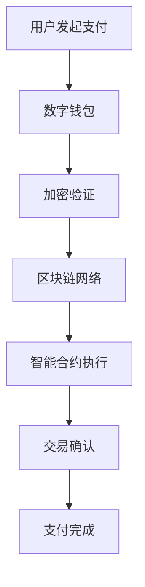

# 虚拟支付完全指南：数字货币与跨境支付革命

## 引言

随着数字化转型的深入推进，虚拟支付正在重塑全球金融格局。从比特币到央行数字货币（CBDC），从移动支付到Web3钱包，虚拟支付技术正在为跨境电商带来前所未有的机遇和挑战。

## 虚拟支付概述

### 定义与分类

虚拟支付是指通过数字化手段进行的非现金支付方式，主要包括：

1. **加密货币支付**
   - 比特币（Bitcoin）
   - 以太坊（Ethereum）
   - 稳定币（USDT、USDC等）

2. **央行数字货币（CBDC）**
   - 数字人民币（e-CNY）
   - 数字欧元（未来推出）
   - 其他国家CBDC项目

3. **移动支付平台**
   - 支付宝
   - 微信支付
   - Apple Pay
   - Google Pay

### 技术基础



## 虚拟支付的优势

### 1. 降低交易成本

传统跨境支付通常涉及多个中介机构：
- 发卡银行费用：1-3%
- 收单机构费用：0.5-2%
- 汇率转换费：2-4%

虚拟支付可将费用降至：
- 加密货币转账：0.1-1%
- 稳定币支付：0.05-0.5%

### 2. 提升交易速度

| 支付方式 | 到账时间 | 工作日限制 |
|---------|---------|----------|
| 传统电汇 | 3-5个工作日 | 是 |
| 信用卡 | 1-3个工作日 | 否 |
| 加密货币 | 几分钟到1小时 | 否 |
| 稳定币 | 1-10分钟 | 否 |

### 3. 增强资金安全

```javascript
// 智能合约示例：条件支付
contract ConditionalPayment {
    function executePayment(
        address buyer,
        address seller,
        uint256 amount,
        bool goodsReceived
    ) public {
        require(goodsReceived, "Goods not received");
        token.transfer(seller, amount);
        emit PaymentCompleted(buyer, seller, amount);
    }
}
```

## 跨境电商中的应用

### 1. B2B批发支付

**案例：纺织品批发商的数字化转型**

某中国纺织品供应商通过USDT支付系统：
- 缩短回款周期：从15天降至1天
- 降低汇率风险：锁定美元价格
- 减少银行费用：年节省8万美元

### 2. B2C零售支付

**实施步骤：**

1. **集成数字钱包**
```html
<!-- MetaMask集成示例 -->
<button onclick="connectWallet()">连接钱包支付</button>
<script>
async function connectWallet() {
    if (typeof window.ethereum !== 'undefined') {
        const accounts = await ethereum.request({
            method: 'eth_requestAccounts'
        });
        console.log('钱包已连接:', accounts[0]);
    }
}
</script>
```

2. **支付流程优化**
   - 一键支付体验
   - 多币种支持
   - 实时汇率转换

### 3. 供应链金融

利用区块链技术实现：
- 供应商融资
- 应收账款管理
- 信用评估自动化

## 风险管理与合规

### 1. 监管合规

**主要关注点：**
- KYC（了解你的客户）要求
- AML（反洗钱）法规
- 税务申报义务
- 外汇管制政策

### 2. 技术风险

**防范措施：**
```python
# 风险控制代码示例
class PaymentRiskManager:
    def validate_transaction(self, amount, user_id, destination):
        # 检查交易限额
        if amount > self.get_daily_limit(user_id):
            return False, "超出日限额"
        
        # 检查地址白名单
        if not self.is_whitelisted_address(destination):
            return False, "目标地址未验证"
        
        # 反欺诈检测
        if self.fraud_detection.is_suspicious(user_id, amount):
            return False, "交易存在风险"
        
        return True, "验证通过"
```

### 3. 市场风险

**对冲策略：**
- 使用稳定币降低波动性
- 设置止损机制
- 分散化投资组合

## 实践案例分析

### 案例1：跨境电商平台的USDT支付集成

**背景：** 某跨境电商平台月交易额2000万美元

**实施方案：**
1. **技术架构**
   ```
   用户端 -> 支付网关 -> USDT合约 -> 商户钱包
   ```

2. **业务流程**
   - 用户选择USDT支付
   - 系统生成付款地址
   - 用户转账确认
   - 自动到账处理

**效果评估：**
- 支付成功率：98.5%
- 平均到账时间：8分钟
- 手续费节省：65%

### 案例2：B2B供应链的数字人民币应用

**场景：** 汽车零部件供应链

**优势：**
- 央行背书，信用度高
- 支持离线支付
- 可编程特性支持智能合约

## 未来发展趋势

### 1. 技术演进

**Layer 2解决方案：**
- Lightning Network（比特币）
- Polygon（以太坊）
- 降低交易费用和提升速度

### 2. 监管框架完善

**预期变化：**
- 全球统一监管标准
- 数字资产分类明确
- 跨境监管协调加强

### 3. 商业模式创新

**新兴模式：**
- DeFi借贷服务
- 收益聚合器
- 自动化做市商

## 实施建议

### 1. 技术准备

**基础设施要求：**
```yaml
# 系统架构配置
blockchain_nodes:
  - ethereum_mainnet
  - polygon_network
  - bsc_network

wallets:
  - metamask_integration
  - walletconnect_support
  - hardware_wallet_support

security:
  - multi_signature
  - cold_storage
  - smart_contract_audit
```

### 2. 合规准备

**必要步骤：**
- 获取相关支付许可
- 建立AML/KYC流程
- 制定风险管理制度
- 建立客户服务体系

### 3. 运营策略

**分阶段实施：**
1. **试点阶段**：选择低风险场景测试
2. **扩展阶段**：逐步增加支付方式
3. **优化阶段**：持续改进用户体验

## 总结

虚拟支付作为金融科技的重要分支，正在深刻改变跨境电商的支付格局。企业应该：

1. **积极拥抱技术变革**，但要注意风险控制
2. **关注监管动态**，确保合规经营
3. **以用户体验为中心**，提供便捷安全的支付服务
4. **建立完善的风控体系**，保障资金安全

随着技术的不断成熟和监管框架的完善，虚拟支付将在跨境电商中发挥越来越重要的作用，成为推动全球贸易数字化转型的重要力量。

---

*本文仅供参考，投资和使用虚拟支付产品需谨慎，请根据当地法规进行操作。*