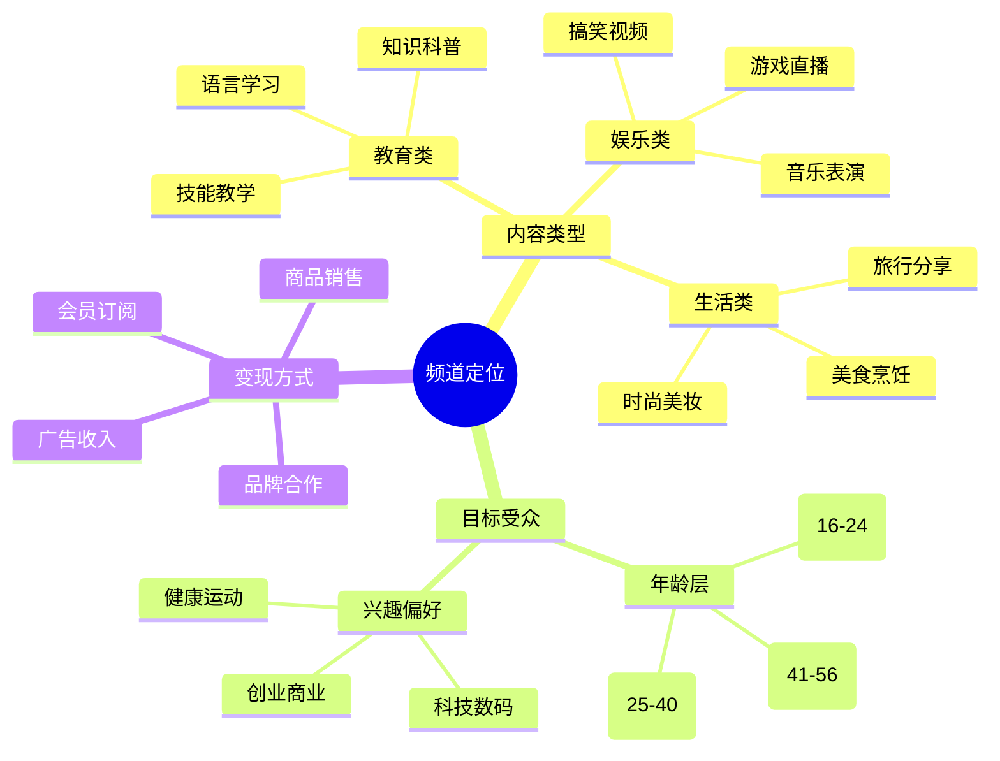
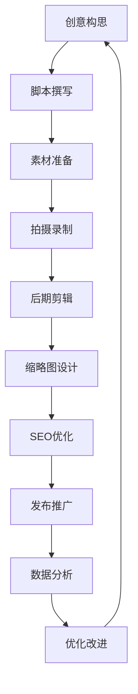

# YouTube频道运营完全指南：从0到100万订阅者的实战攻略

## 前言

YouTube作为全球最大的视频平台，每月活跃用户超过26亿。对于内容创作者而言，YouTube不仅是展示才华的舞台，更是实现商业价值的重要渠道。本指南将从零开始，全面解析YouTube频道运营的各个环节。

## 第一章：频道定位与策略规划

### 1.1 找准你的细分领域

**成功案例分析：**

| 频道类型 | 代表频道 | 订阅数 | 成功要素 |
|----------|----------|--------|----------|
| 科技评测 | Marques Brownlee | 1700万 | 专业深度 + 早期布局 |
| 生活方式 | Emma Chamberlain | 1200万 | 真实个性 + 年轻化 |
| 教育内容 | Crash Course | 1400万 | 系统化 + 高质量制作 |
| 游戏娱乐 | PewDiePie | 1.1亿 | 互动性 + 持续创新 |

**定位策略框架：**



### 1.2 竞争对手分析

**分析工具清单：**

```python
# YouTube数据分析工具
import pandas as pd
from youtube_analytics_api import YouTubeAnalytics

class CompetitorAnalysis:
    def __init__(self, api_key):
        self.api = YouTubeAnalytics(api_key)
        
    def analyze_competitor(self, channel_id):
        """分析竞争对手数据"""
        data = {
            'channel_info': self.get_channel_stats(channel_id),
            'top_videos': self.get_top_videos(channel_id, limit=20),
            'upload_frequency': self.analyze_upload_pattern(channel_id),
            'engagement_rate': self.calculate_engagement(channel_id)
        }
        return data
    
    def get_content_gaps(self, competitor_channels):
        """识别内容空缺"""
        all_topics = []
        for channel in competitor_channels:
            topics = self.extract_video_topics(channel)
            all_topics.extend(topics)
        
        # 分析话题热度和竞争密度
        topic_analysis = pd.DataFrame(all_topics).value_counts()
        return self.identify_opportunities(topic_analysis)
```

### 1.3 内容日历规划

**内容规划模板：**

```javascript
// 内容日历管理系统
class ContentCalendar {
    constructor() {
        this.calendar = new Map();
        this.contentPillars = [
            '教程类', // 40%
            '评测类', // 30%
            '个人分享', // 20%
            '行业资讯' // 10%
        ];
    }
    
    planWeeklyContent() {
        const week = {
            monday: {
                type: '教程类',
                title: '零基础学习系列',
                keywords: ['新手', '教程', '入门'],
                duration: '10-15分钟'
            },
            wednesday: {
                type: '评测类',
                title: '产品深度评测',
                keywords: ['评测', '对比', '推荐'],
                duration: '8-12分钟'
            },
            friday: {
                type: '个人分享',
                title: '一周总结与思考',
                keywords: ['个人', '分享', '感悟'],
                duration: '5-8分钟'
            },
            sunday: {
                type: '行业资讯',
                title: '本周热点解读',
                keywords: ['新闻', '趋势', '分析'],
                duration: '6-10分钟'
            }
        };
        
        return week;
    }
    
    generateContentIdeas(topic, audience) {
        // AI辅助内容创意生成
        const ideas = this.brainstormIdeas(topic, audience);
        return ideas.map(idea => ({
            ...idea,
            seoScore: this.calculateSEOPotential(idea),
            viralPotential: this.assessViralPotential(idea)
        }));
    }
}
```

## 第二章：视频制作与优化

### 2.1 视频制作工作流

**制作流程图：**



**脚本模板结构：**

```markdown
# 视频脚本模板

## 基本信息
- 标题：[吸引人的标题]
- 时长：[预计时长]
- 目标关键词：[主要SEO关键词]

## 开场（前15秒）
- Hook：抓住观众注意力
- 预告：告诉观众将学到什么
- 自我介绍：简短的个人/频道介绍

## 主体内容
### 第一部分：[核心观点1]
- 要点：
- 例子：
- 视觉素材：

### 第二部分：[核心观点2]
- 要点：
- 例子：
- 视觉素材：

### 第三部分：[核心观点3]
- 要点：
- 例子：
- 视觉素材：

## 结尾（最后30秒）
- 总结：核心要点回顾
- CTA：订阅、点赞、评论
- 预告：下期内容预告
```

### 2.2 技术设备配置

**入门级设备清单：**

| 设备类型 | 推荐产品 | 价格区间 | 用途说明 |
|----------|----------|----------|----------|
| 摄像设备 | iPhone 14 Pro / Sony A7S III | $1000-3000 | 4K录制，稳定画质 |
| 音频设备 | Rode PodMic / Shure SM7B | $200-400 | 清晰音质录制 |
| 照明设备 | Godox SL-60W / Aputure AL-M9 | $150-300 | 专业打光效果 |
| 剪辑软件 | Final Cut Pro / Adobe Premiere | $300/年 | 专业视频剪辑 |

**进阶设备配置：**

```yaml
# 专业级工作室配置
video_equipment:
  camera:
    primary: "Sony FX6"
    secondary: "Canon EOS R5"
    action: "GoPro Hero 11"
  
  audio:
    microphone: "Sennheiser MKH 416"
    recorder: "Zoom F6"
    monitoring: "Sony MDR-7506"
  
  lighting:
    key_light: "Aputure 300D II"
    fill_light: "Godox SL-150II"
    background: "Nanlight Pavotube 15C"
  
  accessories:
    tripod: "Manfrotto 502AH"
    slider: "Rhino ROV Pro"
    gimbal: "DJI RS 3 Pro"

post_production:
  editing: "Adobe Premiere Pro 2023"
  color_grading: "DaVinci Resolve 18"
  motion_graphics: "After Effects 2023"
  audio_editing: "Adobe Audition"
```

### 2.3 缩略图设计策略

**高点击率缩略图要素：**

```css
/* 缩略图设计规范 */
.thumbnail-design {
    dimensions: 1280px × 720px;
    aspect-ratio: 16:9;
    file-size: max 2MB;
    format: JPG, PNG, GIF;
}

.design-principles {
    contrast: high; /* 高对比度 */
    text-size: 30px+; /* 大字体 */
    face-expression: exaggerated; /* 夸张表情 */
    color-scheme: bright; /* 鲜艳配色 */
    composition: rule-of-thirds; /* 三分法构图 */
}
```

**A/B测试框架：**

```python
class ThumbnailOptimizer:
    def __init__(self):
        self.test_variants = []
        self.performance_metrics = ['ctr', 'impressions', 'clicks']
    
    def create_ab_test(self, video_id, thumbnail_variants):
        """创建缩略图A/B测试"""
        test = {
            'video_id': video_id,
            'variants': thumbnail_variants,
            'test_duration': 48, # 48小时
            'traffic_split': 0.5 # 50/50分流
        }
        
        return self.launch_test(test)
    
    def analyze_results(self, test_id):
        """分析测试结果"""
        results = self.get_test_data(test_id)
        
        winner = max(results['variants'], 
                    key=lambda x: x['click_through_rate'])
        
        confidence = self.calculate_statistical_significance(results)
        
        return {
            'winning_variant': winner,
            'confidence_level': confidence,
            'improvement': winner['ctr'] - results['baseline']['ctr']
        }
```

## 第三章：YouTube SEO与算法优化

### 3.1 关键词研究与优化

**SEO优化清单：**

```python
class YouTubeSEO:
    def __init__(self):
        self.keyword_tools = ['TubeBuddy', 'VidIQ', 'YouTube自动补全']
        
    def optimize_video_metadata(self, video_data):
        """优化视频元数据"""
        optimized = {
            'title': self.optimize_title(video_data['title']),
            'description': self.create_description(video_data),
            'tags': self.generate_tags(video_data['topic']),
            'thumbnail': self.optimize_thumbnail(video_data['thumbnail'])
        }
        
        return optimized
    
    def optimize_title(self, title):
        """标题优化策略"""
        strategies = [
            '数字化标题：10个技巧...',
            '疑问式标题：如何在30天内...',
            '对比式标题：A vs B：哪个更好？',
            '时效性标题：2023年最新...',
            '情感化标题：令人震惊的...'
        ]
        
        # 结合关键词密度和可读性
        return self.apply_title_formula(title, strategies)
    
    def create_description(self, video_data):
        """描述优化模板"""
        description = f"""
        🎯 本视频将教你：{video_data['learning_points']}
        
        ⏰ 时间戳：
        00:00 开场介绍
        01:30 {video_data['chapter1']}
        05:45 {video_data['chapter2']}
        12:20 {video_data['chapter3']}
        
        🔗 相关资源：
        {video_data['resources']}
        
        📱 关注我们：
        Instagram: @{video_data['social']['instagram']}
        Twitter: @{video_data['social']['twitter']}
        
        🏷️ 标签：
        #{video_data['tags'][0]} #{video_data['tags'][1]} #{video_data['tags'][2]}
        """
        
        return description
```

### 3.2 算法友好的发布策略

**最佳发布时间分析：**

```javascript
// 观众行为分析
const analyzeAudienceActivity = {
    // 基于地区的最佳发布时间
    optimalTimes: {
        'US_EST': ['19:00', '20:00', '21:00'], // 晚间黄金时间
        'EU_CET': ['18:00', '19:00', '20:00'], // 欧洲晚间
        'ASIA_JST': ['20:00', '21:00', '22:00'] // 亚洲晚间
    },
    
    // 每日发布策略
    weeklySchedule: {
        monday: 'motivational_content', // 周一正能量
        tuesday: 'tutorial_content',    // 周二教程
        wednesday: 'news_analysis',     // 周三资讯
        thursday: 'deep_dive',          // 周四深度
        friday: 'entertainment',        // 周五娱乐
        saturday: 'lifestyle',          // 周六生活
        sunday: 'planning_prep'         // 周日规划
    },
    
    // 发布频率优化
    calculateOptimalFrequency(channelSize, contentType) {
        const baseFrequency = {
            'education': { small: 2, medium: 3, large: 5 },
            'entertainment': { small: 3, medium: 5, large: 7 },
            'lifestyle': { small: 2, medium: 3, large: 4 }
        };
        
        const channelTier = this.getChannelTier(channelSize);
        return baseFrequency[contentType][channelTier];
    }
};
```

### 3.3 用户互动策略

**提升参与度的技巧：**

```python
class EngagementBooster:
    def __init__(self):
        self.interaction_triggers = [
            '提问引导评论',
            '投票互动',
            '挑战活动',
            '用户内容征集',
            '实时回复评论'
        ]
    
    def create_engagement_hooks(self, video_content):
        """创建互动钩子"""
        hooks = {
            'opening_question': self.craft_opening_question(video_content),
            'mid_video_poll': self.create_poll_question(video_content),
            'comment_prompt': self.generate_comment_prompt(video_content),
            'call_to_action': self.design_cta(video_content)
        }
        
        return hooks
    
    def craft_opening_question(self, content):
        """开场提问设计"""
        questions = [
            f"在开始之前，{content['topic']}对你来说最大的挑战是什么？",
            f"你对{content['topic']}有什么疑问？在评论区告诉我！",
            f"如果你只能学会{content['topic']}的一个技巧，你希望是什么？"
        ]
        
        return self.select_best_question(questions, content['audience'])
    
    def respond_to_comments(self, video_id):
        """评论回复策略"""
        comments = self.fetch_comments(video_id)
        
        for comment in comments[:50]:  # 优先回复前50条
            if self.is_genuine_question(comment):
                response = self.generate_helpful_response(comment)
                self.post_reply(comment['id'], response)
            elif self.is_positive_feedback(comment):
                response = self.generate_appreciation_response(comment)
                self.post_reply(comment['id'], response)
```

## 第四章：变现策略与商业模式

### 4.1 多元化收入结构

**收入来源分析：**

| 变现方式 | 开启门槛 | 收入潜力 | 实施难度 | 推荐指数 |
|----------|----------|----------|----------|----------|
| YouTube广告 | 1K订阅+4K小时观看 | ⭐⭐⭐ | ⭐ | ⭐⭐⭐⭐⭐ |
| 品牌合作 | 5K-10K订阅 | ⭐⭐⭐⭐⭐ | ⭐⭐⭐ | ⭐⭐⭐⭐ |
| 会员订阅 | 1K订阅 | ⭐⭐⭐⭐ | ⭐⭐ | ⭐⭐⭐⭐ |
| 商品销售 | 无门槛 | ⭐⭐⭐⭐ | ⭐⭐⭐⭐ | ⭐⭐⭐ |
| 在线课程 | 专业知识 | ⭐⭐⭐⭐⭐ | ⭐⭐⭐⭐⭐ | ⭐⭐⭐⭐ |
| 咨询服务 | 行业专长 | ⭐⭐⭐⭐⭐ | ⭐⭐⭐ | ⭐⭐⭐⭐ |

### 4.2 品牌合作策略

**合作提案模板：**

```markdown
# 品牌合作提案

## 频道概览
- 频道名称：[Your Channel Name]
- 订阅者数：[Subscriber Count]
- 月均观看：[Monthly Views]
- 目标受众：[Target Demographics]

## 受众分析
### 地理分布
- 美国：35%
- 欧洲：25%
- 亚洲：30%
- 其他：10%

### 年龄分布
- 18-24岁：20%
- 25-34岁：45%
- 35-44岁：25%
- 45+岁：10%

### 兴趣偏好
- 科技产品：80%
- 在线购物：65%
- 创业投资：45%

## 合作方案
### 方案A：产品评测视频
- 视频时长：8-12分钟
- 制作周期：7-10个工作日
- 包含内容：开箱、使用体验、优缺点分析
- 投放时间：[具体日期]

### 方案B：品牌整合营销
- 多视频系列：3-5期
- 深度产品体验：30天使用周期
- 社交媒体配合：Instagram、Twitter推广
- 用户互动：评论区答疑、直播展示

## 报价说明
- 单条视频：$[Amount]
- 系列合作：$[Amount] (包含制作、推广、数据报告)
- 额外服务：社交媒体推广 $[Amount]

## 成功案例
[Previous collaboration examples and results]
```

### 4.3 数字产品开发

**在线课程创建流程：**

```python
class OnlineCourseCreator:
    def __init__(self):
        self.platforms = ['Teachable', 'Thinkific', 'Kajabi', '自建平台']
        
    def design_course_structure(self, topic):
        """设计课程结构"""
        course = {
            'title': f"{topic}实战训练营",
            'modules': self.create_modules(topic),
            'pricing_strategy': self.calculate_pricing(topic),
            'marketing_plan': self.create_marketing_plan(topic)
        }
        
        return course
    
    def create_modules(self, topic):
        """创建课程模块"""
        modules = [
            {
                'name': f"{topic}基础入门",
                'lessons': 5,
                'duration': '2小时',
                'content_type': ['视频', '文档', '练习']
            },
            {
                'name': f"{topic}进阶技巧",
                'lessons': 8,
                'duration': '4小时',
                'content_type': ['视频', '案例分析', '实操项目']
            },
            {
                'name': f"{topic}高级应用",
                'lessons': 6,
                'duration': '3小时',
                'content_type': ['视频', '专家访谈', '作业点评']
            },
            {
                'name': '实战项目指导',
                'lessons': 4,
                'duration': '2小时',
                'content_type': ['一对一指导', '项目评估', '证书颁发']
            }
        ]
        
        return modules
    
    def calculate_pricing(self, topic):
        """定价策略"""
        base_price = 297  # 基础价格
        
        pricing_tiers = {
            'basic': {
                'price': base_price,
                'includes': ['核心课程', '社群访问', '基础支持']
            },
            'premium': {
                'price': base_price * 1.5,
                'includes': ['核心课程', '一对一咨询', '项目反馈', '终身访问']
            },
            'vip': {
                'price': base_price * 2,
                'includes': ['所有内容', '私人指导', '定制方案', '优先支持']
            }
        }
        
        return pricing_tiers
```

## 第五章：数据分析与增长优化

### 5.1 关键指标监控

**核心KPI仪表板：**

```javascript
// YouTube Analytics 数据监控
class YouTubeAnalyticsDashboard {
    constructor(channelId) {
        this.channelId = channelId;
        this.kpis = {
            growth: ['subscribers', 'views', 'watch_time'],
            engagement: ['likes', 'comments', 'shares', 'ctr'],
            monetization: ['revenue', 'rpm', 'cpm'],
            audience: ['retention', 'demographics', 'traffic_sources']
        };
    }
    
    async generateWeeklyReport() {
        const data = await this.fetchAnalyticsData('7days');
        
        const report = {
            summary: this.calculateGrowthMetrics(data),
            topVideos: this.getTopPerformingVideos(data, 5),
            audienceInsights: this.analyzeAudienceBehavior(data),
            recommendations: this.generateOptimizationTips(data)
        };
        
        return this.formatReport(report);
    }
    
    calculateGrowthMetrics(data) {
        return {
            subscriberGrowth: {
                current: data.subscribers.current,
                change: data.subscribers.current - data.subscribers.previous,
                growthRate: ((data.subscribers.current - data.subscribers.previous) / data.subscribers.previous * 100).toFixed(2)
            },
            viewsGrowth: {
                current: data.views.current,
                change: data.views.current - data.views.previous,
                growthRate: ((data.views.current - data.views.previous) / data.views.previous * 100).toFixed(2)
            },
            engagementRate: {
                current: ((data.likes + data.comments) / data.views * 100).toFixed(2),
                benchmark: this.getIndustryBenchmark('engagement')
            }
        };
    }
    
    analyzeAudienceBehavior(data) {
        return {
            avgWatchTime: data.watchTime.average,
            retentionRate: data.retention.average,
            dropOffPoints: this.identifyDropOffPoints(data.retention.curve),
            peakEngagementTime: this.findPeakEngagement(data.retention.curve)
        };
    }
}
```

### 5.2 A/B测试与优化

**内容测试框架：**

```python
class ContentOptimizer:
    def __init__(self):
        self.test_variables = [
            'title_variations',
            'thumbnail_designs',
            'video_length',
            'content_structure',
            'call_to_action_placement'
        ]
    
    def run_title_test(self, base_title, audience_segment):
        """标题A/B测试"""
        variations = [
            f"如何{base_title}：完整指南",
            f"{base_title}的5个秘诀",
            f"为什么{base_title}如此重要？",
            f"{base_title}：你需要知道的一切"
        ]
        
        test_config = {
            'test_duration': 72,  # 72小时
            'sample_size': 1000,  # 每个变体1000次展示
            'success_metric': 'click_through_rate'
        }
        
        return self.execute_test(variations, test_config)
    
    def analyze_content_performance(self, video_id):
        """内容表现分析"""
        metrics = self.fetch_video_metrics(video_id)
        
        analysis = {
            'performance_score': self.calculate_performance_score(metrics),
            'audience_retention': self.analyze_retention_curve(metrics['retention']),
            'engagement_quality': self.assess_engagement_quality(metrics),
            'optimization_opportunities': self.identify_improvements(metrics)
        }
        
        return analysis
    
    def generate_optimization_plan(self, analysis_results):
        """生成优化建议"""
        recommendations = []
        
        if analysis_results['performance_score'] < 70:
            recommendations.append({
                'priority': 'high',
                'area': 'content_quality',
                'action': '提升内容价值密度，减少冗余信息'
            })
        
        if analysis_results['audience_retention']['avg_view_duration'] < 0.4:
            recommendations.append({
                'priority': 'high',
                'area': 'hook_optimization',
                'action': '优化开场15秒，增强内容吸引力'
            })
        
        return recommendations
```

### 5.3 增长黑客技巧

**病毒式传播策略：**

```python
class ViralGrowthEngine:
    def __init__(self):
        self.viral_factors = [
            'emotional_trigger',
            'social_currency',
            'practical_value',
            'public_visibility',
            'story_narrative'
        ]
    
    def design_viral_content(self, topic, target_audience):
        """设计病毒式内容"""
        viral_elements = {
            'hook': self.create_emotional_hook(topic),
            'shareability': self.maximize_shareability(topic),
            'community_building': self.foster_community_engagement(topic),
            'cross_platform_strategy': self.plan_cross_platform_distribution(topic)
        }
        
        return viral_elements
    
    def create_emotional_hook(self, topic):
        """创建情感钩子"""
        emotional_triggers = {
            'curiosity': f"你绝对不知道的{topic}秘密",
            'surprise': f"{topic}的意外真相让所有人震惊",
            'controversy': f"为什么专家都在抵制{topic}？",
            'aspiration': f"如何用{topic}改变你的人生",
            'fear': f"不了解{topic}，你可能错过的机会"
        }
        
        return emotional_triggers
    
    def implement_growth_loops(self, content_strategy):
        """实施增长循环"""
        loops = {
            'referral_loop': {
                'trigger': '优质内容消费',
                'action': '用户主动分享',
                'reward': '社交认可',
                'retention': '持续价值提供'
            },
            'content_loop': {
                'trigger': '用户参与互动',
                'action': '生成用户内容',
                'reward': '平台展示机会',
                'retention': '社区归属感'
            },
            'collaboration_loop': {
                'trigger': '频道合作',
                'action': '交叉推广',
                'reward': '受众增长',
                'retention': '互惠关系维护'
            }
        }
        
        return self.execute_growth_loops(loops)
```

## 第六章：频道品牌建设

### 6.1 视觉识别系统

**品牌设计规范：**

```css
/* YouTube 频道品牌规范 */
:root {
    /* 主色调 */
    --primary-color: #FF0000; /* YouTube红 */
    --secondary-color: #282828; /* 深灰 */
    --accent-color: #065FD4; /* 蓝色 */
    
    /* 字体系统 */
    --title-font: 'Roboto', sans-serif;
    --body-font: 'Open Sans', sans-serif;
    --mono-font: 'Fira Code', monospace;
    
    /* 尺寸规范 */
    --logo-size-large: 800px × 800px;
    --logo-size-medium: 400px × 400px;
    --logo-size-small: 200px × 200px;
    --banner-size: 2560px × 1440px;
}

.brand-guidelines {
    /* Logo使用规范 */
    logo-clearspace: min(logo-height * 0.5);
    logo-min-size: 32px;
    logo-color-variations: [full-color, white, black, single-color];
    
    /* 色彩使用 */
    primary-usage: [logo, cta-buttons, highlights];
    secondary-usage: [text, backgrounds, borders];
    accent-usage: [links, interactive-elements];
    
    /* 字体层级 */
    h1-size: 32px;
    h2-size: 24px;
    h3-size: 20px;
    body-size: 16px;
    caption-size: 14px;
}
```

### 6.2 内容风格统一

**风格指南制定：**

```yaml
# 内容风格指南
content_style_guide:
  tone_of_voice:
    personality: ["专业", "友好", "诚恳", "幽默"]
    communication_style: "对话式，平易近人"
    language_level: "通俗易懂，偶尔使用专业术语并解释"
  
  visual_style:
    color_palette:
      primary: "#FF6B6B"
      secondary: "#4ECDC4"
      neutral: "#45B7D1"
      background: "#F7F9FC"
    
    typography:
      headers: "Montserrat Bold"
      body: "Source Sans Pro Regular"
      accent: "Playfair Display"
    
    imagery:
      style: "现代简约，明亮配色"
      composition: "遵循三分法则"
      subjects: "真实人物，避免过度修图"
  
  content_structure:
    intro_length: "15-30秒"
    main_content: "结构化，使用清晰的段落划分"
    conclusion: "总结要点，明确的行动号召"
    
  engagement_tactics:
    opening_hooks: ["问题引入", "惊人数据", "个人故事"]
    interaction_prompts: ["评论提问", "投票互动", "挑战发起"]
    closing_ctas: ["订阅提醒", "相关视频推荐", "社交媒体关注"]
```

### 6.3 社区建设策略

**粉丝社区管理：**

```python
class CommunityManager:
    def __init__(self, channel_id):
        self.channel_id = channel_id
        self.community_platforms = ['YouTube社区', 'Discord', 'Reddit', 'Facebook群组']
        
    def create_community_hub(self):
        """建立社区中心"""
        hub_structure = {
            'welcome_area': {
                'purpose': '新成员介绍与指导',
                'content': ['频道介绍', '社区规则', 'FAQ', '资源链接']
            },
            'discussion_zones': {
                'general_chat': '日常交流讨论',
                'video_feedback': '视频内容反馈',
                'collaboration': '成员间合作项目',
                'resources_sharing': '资源分享区'
            },
            'exclusive_content': {
                'behind_scenes': '幕后花絮',
                'early_access': '抢先观看',
                'live_qa': 'Q&A直播',
                'member_spotlights': '成员聚焦'
            }
        }
        
        return hub_structure
    
    def implement_engagement_programs(self):
        """实施用户参与计划"""
        programs = {
            'user_generated_content': {
                'monthly_challenges': '月度挑战赛',
                'feature_submissions': '作品展示',
                'testimonial_sharing': '经验分享'
            },
            'recognition_system': {
                'member_levels': ['新手', '活跃', '专家', '导师'],
                'achievement_badges': ['首次评论', '热心帮助', '内容贡献'],
                'spotlight_features': '每月优秀成员'
            },
            'exclusive_events': {
                'live_workshops': '在线工作坊',
                'networking_sessions': '社交聚会',
                'expert_interviews': '专家访谈'
            }
        }
        
        return self.execute_programs(programs)
```

## 第七章：危机管理与风险控制

### 7.1 内容合规管理

**合规检查清单：**

```python
class ContentComplianceChecker:
    def __init__(self):
        self.youtube_policies = [
            '社区准则',
            '版权政策',
            '货币化政策',
            '广告友好准则'
        ]
        
    def review_content(self, video_content):
        """内容合规审查"""
        compliance_report = {
            'copyright_check': self.check_copyright_issues(video_content),
            'community_guidelines': self.verify_community_standards(video_content),
            'monetization_eligibility': self.assess_monetization_suitability(video_content),
            'brand_safety': self.evaluate_brand_safety(video_content)
        }
        
        return compliance_report
    
    def check_copyright_issues(self, content):
        """版权检查"""
        potential_issues = []
        
        # 音乐版权检查
        if 'background_music' in content:
            music_status = self.verify_music_licensing(content['background_music'])
            if not music_status['licensed']:
                potential_issues.append({
                    'type': 'music_copyright',
                    'severity': 'high',
                    'recommendation': '使用免版权音乐或获取授权'
                })
        
        # 视觉素材检查
        if 'stock_footage' in content:
            footage_status = self.verify_footage_licensing(content['stock_footage'])
            if not footage_status['licensed']:
                potential_issues.append({
                    'type': 'footage_copyright',
                    'severity': 'medium',
                    'recommendation': '替换为免版权素材'
                })
        
        return potential_issues
    
    def create_compliance_workflow(self):
        """创建合规工作流"""
        workflow = {
            'pre_production': [
                '内容策划合规性评估',
                '素材版权预检',
                '敏感话题风险评估'
            ],
            'production': [
                '拍摄内容实时监控',
                '访谈内容合规确认',
                '品牌展示合规检查'
            ],
            'post_production': [
                '最终内容合规审查',
                'AI辅助内容检测',
                '人工最终确认'
            ],
            'publication': [
                '发布前最后检查',
                '元数据合规验证',
                '社区准则确认'
            ]
        }
        
        return workflow
```

### 7.2 危机应对预案

**公关危机处理：**

```python
class CrisisManagement:
    def __init__(self):
        self.crisis_levels = ['轻微', '中等', '严重', '灾难性']
        self.response_timeline = {
            'immediate': '1小时内',
            'short_term': '24小时内',
            'medium_term': '1周内',
            'long_term': '1个月内'
        }
    
    def assess_crisis_level(self, incident):
        """评估危机等级"""
        factors = {
            'audience_impact': incident.get('affected_subscribers', 0),
            'media_attention': incident.get('media_coverage', 0),
            'brand_damage': incident.get('reputation_impact', 0),
            'financial_impact': incident.get('revenue_loss', 0)
        }
        
        severity_score = sum(factors.values()) / len(factors)
        
        if severity_score < 2:
            return '轻微'
        elif severity_score < 5:
            return '中等'
        elif severity_score < 8:
            return '严重'
        else:
            return '灾难性'
    
    def create_response_plan(self, crisis_level):
        """制定应对方案"""
        plans = {
            '轻微': {
                'response_time': '4小时内',
                'actions': [
                    '社区帖子澄清',
                    '评论区积极回应',
                    '私信重点用户'
                ],
                'stakeholders': ['核心粉丝', '活跃评论者']
            },
            '中等': {
                'response_time': '2小时内',
                'actions': [
                    '正式声明视频',
                    '多平台统一回应',
                    '主动联系媒体',
                    '内部团队会议'
                ],
                'stakeholders': ['全体粉丝', '合作伙伴', '媒体']
            },
            '严重': {
                'response_time': '1小时内',
                'actions': [
                    '紧急直播澄清',
                    '律师团队咨询',
                    'PR公司合作',
                    '危机沟通策略'
                ],
                'stakeholders': ['所有利益相关者', '法律团队', 'PR专家']
            }
        }
        
        return plans.get(crisis_level, plans['严重'])
```

## 第八章：未来发展趋势

### 8.1 新兴技术应用

**AI辅助内容创作：**

```python
class AIContentAssistant:
    def __init__(self):
        self.ai_tools = {
            'script_writing': 'GPT-4',
            'thumbnail_generation': 'Midjourney',
            'voice_synthesis': 'ElevenLabs',
            'video_editing': 'Runway ML',
            'translation': 'DeepL Pro'
        }
    
    def generate_content_ideas(self, topic, audience_data):
        """AI生成内容创意"""
        prompt = f"""
        基于以下信息生成10个YouTube视频创意：
        主题：{topic}
        目标受众：{audience_data['demographics']}
        内容偏好：{audience_data['interests']}
        竞争分析：{audience_data['competitor_gaps']}
        
        每个创意需包含：
        1. 吸引人的标题
        2. 视频大纲
        3. 预估观看时长
        4. SEO关键词
        5. 病毒传播潜力评分
        """
        
        return self.query_ai_model(prompt)
    
    def optimize_thumbnail_design(self, video_topic, brand_colors):
        """AI优化缩略图设计"""
        design_prompt = f"""
        为YouTube视频创建缩略图设计：
        视频主题：{video_topic}
        品牌色彩：{brand_colors}
        设计要求：
        - 高点击率优化
        - 移动端友好
        - 品牌一致性
        - 情感吸引力
        """
        
        return self.generate_thumbnail_variations(design_prompt)
    
    def automate_video_editing(self, raw_footage):
        """AI自动化视频剪辑"""
        editing_pipeline = {
            'scene_detection': self.detect_scene_changes(raw_footage),
            'highlight_extraction': self.extract_key_moments(raw_footage),
            'auto_cuts': self.generate_optimal_cuts(raw_footage),
            'color_correction': self.apply_auto_color_grading(raw_footage),
            'audio_enhancement': self.optimize_audio_quality(raw_footage)
        }
        
        return self.execute_editing_pipeline(editing_pipeline)
```

### 8.2 平台生态演进

**多平台内容策略：**

```javascript
// 全平台内容分发策略
const multiPlatformStrategy = {
    // 平台特性分析
    platformCharacteristics: {
        youtube: {
            format: 'long-form video',
            audience: 'all demographics',
            optimization: 'SEO + retention',
            monetization: 'ads + memberships'
        },
        tiktok: {
            format: 'short-form vertical',
            audience: 'Gen Z + Millennials',
            optimization: 'algorithm + trends',
            monetization: 'creator fund + live gifts'
        },
        instagram: {
            format: 'mixed content',
            audience: 'visual-oriented',
            optimization: 'hashtags + stories',
            monetization: 'brand partnerships'
        },
        linkedin: {
            format: 'professional content',
            audience: 'business professionals',
            optimization: 'thought leadership',
            monetization: 'consulting + courses'
        }
    },
    
    // 内容适配策略
    adaptContentForPlatform(originalContent, targetPlatform) {
        const adaptations = {
            youtube_to_tiktok: {
                duration: 'extract 15-60s highlights',
                format: 'vertical 9:16 ratio',
                hook: 'first 3 seconds crucial',
                text_overlay: 'add engaging captions'
            },
            youtube_to_instagram: {
                duration: 'create 60s preview',
                format: 'square or vertical',
                stories: 'behind-the-scenes content',
                posts: 'key insights + carousel'
            },
            youtube_to_linkedin: {
                duration: 'extract professional insights',
                format: 'native video + article',
                tone: 'more formal approach',
                cta: 'drive to full video'
            }
        };
        
        return adaptations[`youtube_to_${targetPlatform}`];
    },
    
    // 跨平台增长策略
    crossPlatformGrowth: {
        content_funnel: [
            'TikTok/Instagram → discover creator',
            'YouTube Shorts → sample content',
            'YouTube Long-form → deep engagement',
            'Newsletter/Course → monetization'
        ],
        
        audience_journey: {
            awareness: 'short-form viral content',
            interest: 'educational snippets',
            consideration: 'full tutorials',
            conversion: 'premium offerings'
        }
    }
};
```

### 8.3 创作者经济发展

**新兴变现模式：**

```python
class CreatorEconomyTrends:
    def __init__(self):
        self.emerging_models = [
            'NFT内容销售',
            '虚拟活动举办',
            '个人品牌授权',
            'AI克隆服务',
            '元宇宙内容创作'
        ]
    
    def analyze_web3_opportunities(self):
        """Web3时代的机遇分析"""
        opportunities = {
            'nft_content': {
                'potential': 'exclusive content tokenization',
                'market_size': '$2.5B+ (2023)',
                'implementation': 'limited edition video NFTs',
                'audience': 'crypto-native followers'
            },
            'dao_membership': {
                'potential': 'community governance tokens',
                'market_size': 'emerging',
                'implementation': 'fan-owned content decisions',
                'audience': 'engaged community members'
            },
            'metaverse_presence': {
                'potential': 'virtual world content creation',
                'market_size': '$800B projected (2030)',
                'implementation': 'VR/AR educational content',
                'audience': 'tech-forward users'
            }
        }
        
        return opportunities
    
    def predict_industry_evolution(self, current_year=2023):
        """预测行业发展趋势"""
        timeline = {
            '2024': [
                'AI工具普及化',
                '短视频主导地位加强',
                '直播电商融合深化'
            ],
            '2025': [
                '虚拟主播技术成熟',
                '个性化内容推荐优化',
                '跨平台账户互通'
            ],
            '2026': [
                'Web3社区治理模式',
                '沉浸式内容体验',
                '创作者经济规模化'
            ],
            '2027+': [
                '脑机接口内容创作',
                '完全虚拟化创作者',
                '去中心化内容分发'
            ]
        }
        
        return timeline
```

## 总结与行动计划

### 成功要素总结

1. **内容为王**：始终专注于为观众提供价值
2. **持续优化**：基于数据不断改进内容策略
3. **社区建设**：培养忠实的粉丝群体
4. **多元变现**：建立多样化的收入来源
5. **品牌建设**：打造独特的个人品牌形象

### 90天启动计划

**第一个月：基础建设**
- [ ] 完成频道定位和视觉设计
- [ ] 制作并发布5-8个高质量视频
- [ ] 建立内容制作工作流
- [ ] 开始SEO优化实践

**第二个月：增长加速**
- [ ] 实施A/B测试优化策略
- [ ] 开展第一次品牌合作
- [ ] 建立社区互动机制
- [ ] 扩展到其他社交平台

**第三个月：商业化启动**
- [ ] 申请YouTube合作伙伴计划
- [ ] 推出第一个数字产品
- [ ] 建立邮件营销系统
- [ ] 制定长期发展战略

### 持续学习资源

**推荐工具：**
- 分析工具：YouTube Analytics, VidIQ, TubeBuddy
- 制作工具：Final Cut Pro, Adobe Premiere, Canva
- 营销工具：Mailchimp, Hootsuite, Buffer

**学习社区：**
- Creator Economy Report
- YouTube Creator Insider
- VidSummit Conference

**关键书籍：**
- 《The YouTube Formula》by Derral Eves
- 《Crushing YouTube》by Joseph Hogue
- 《YouTube Secrets》by Sean Cannell

---

YouTube频道运营是一个需要长期投入和持续学习的过程。成功的关键在于为观众创造真正的价值，同时不断适应平台和市场的变化。记住，每个成功的YouTuber都从零开始，关键是要开始行动，在实践中不断改进和成长。

*祝你在YouTube创作之路上取得成功！*